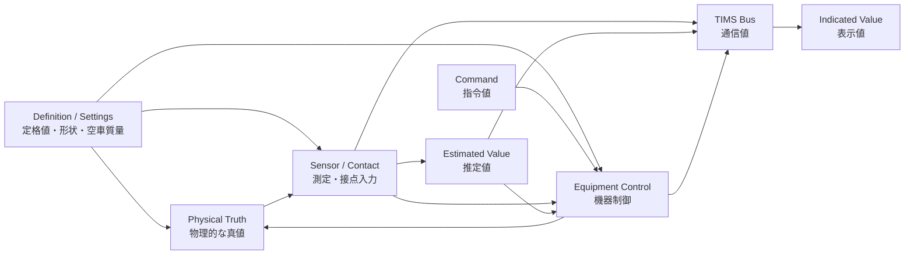
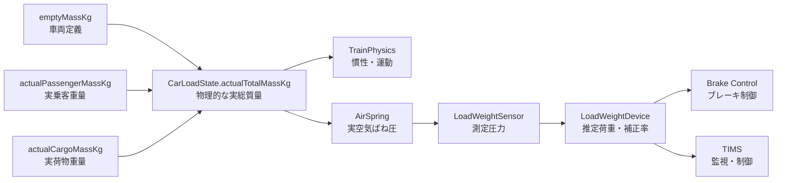

# 物理的な真値と機器が扱う値の分離方針

## 目的

列車シミュレーションでは、同じ単位の値でも意味が異なる。

- 実際に車両へ作用している物理的な値
- センサーや接点を通して機器が取得した値
- 機器が測定値から推定した値
- 制御装置が出した指令値
- 計器が運転士へ表示した値

これらを同じ変数や共有状態で扱うと、センサーの誤差・遅延・故障を再現できず、
制御装置がシミュレーション上の真値を直接参照する構造になる。

本資料では、現在の実装を基準に値の所有者、データの流れ、命名方法を定める。

## 結論

物理的な真値は `Simulation` または物理挙動を持つ装置だけが所有し、
制御装置と TIMS は、実車で取得できる測定値・接点入力・通信データだけを使用する。



依存方向は原則として左から右の一方向とする。TIMS や表示器から物理的な真値を
書き換えたり、制御装置がセンサーを飛び越えて真値を参照したりしない。

## 値の分類

| 分類 | 意味 | 所有者の例 | 命名例 |
| --- | --- | --- | --- |
| 定義値 | 車種・装置ごとに固定された仕様 | `DefinitionAsset`, `Settings` | `emptyMassKg`, `ratedPowerW` |
| 指令値 | 目標として要求された値 | TIMS、制御装置 | `targetPressureKPa`, `commandedForceN` |
| 物理的な真値 | 現在、実際に存在・作用している値 | 物理シミュレーション、アクチュエータ | `actualTotalMassKg`, `actualVelocityMps` |
| 測定値 | センサー・入力回路が観測した値 | センサー、接点入力 | `measuredSpeedMps`, `sensedPressureKPa` |
| 推定値 | 測定値から装置が算出した値 | 応荷重装置、VVVF など | `estimatedLoadMassKg`, `estimatedTractionForceN` |
| 表示値 | 丸め・平滑化後に表示している値 | 計器、画面 | `indicatedSpeedKmh`, `displayedSpeedKmh` |

単位サフィックス（`Kg`, `N`, `KPa`, `Mps`, `A`, `V`）は現在と同様に必ず付ける。
`current` は「現在値」という時間的な意味しか持たないため、真値か測定値かの区別には
使わない。

## 現在の実装

### 既に分離できている部分

- [`CarDefinitionAsset`](../../Assets/Nakatetsu/Train/Consist/Definitions/Scripts/CarDefinitionAsset.cs) の
  `emptyMassKg` は定義値として保持されている。
- [`TrainPhysicsState`](../../Assets/Nakatetsu/Train/Simulation/Physics/TrainPhysicsContext.cs) の
  `signedVelocityMps` と `signedAcceleration` は、列車物理の真値に相当する。
- [`BrakeCylinderContext`](../../Assets/Nakatetsu/Train/Equipment/Brake/Cylinder/Scripts/BrakeCylinderContext.cs) は、
  `targetPressureKPa`（指令）、`currentPressureKPa`（シリンダの物理状態）、
  `actualForceN`（物理的な出力）を別々に保持している。
- [`BrakeControlDevice`](../../Assets/Nakatetsu/Train/Equipment/Brake/ControlDevice/Scripts/BrakeControlDevice.cs) と
  [`VvvfController`](../../Assets/Nakatetsu/Train/Equipment/Traction/Vvvf/Scripts/VvvfController.cs) は、
  TIMS 指令をアダプター経由で受けるため、TIMS との直接依存が限定されている。
- [`TimsSpeedMeter`](../../Assets/Nakatetsu/Train/Equipment/Tims/Display/SpeedMeter/Scripts/TimsSpeedMeter.cs) は、
  TIMS バスの値をさらに平滑化して `displayedSpeedKmh` として保持している。

### 現在、意味が曖昧または未接続の部分

| 箇所 | 現状 | 今後の扱い |
| --- | --- | --- |
| `TrainCarSimulationInput.massKg` | `emptyMassKg` だけが入り、乗客・荷物の実重量は未実装 | 車両ごとの実総質量を渡す |
| `TimsBrakeCarInput.massKg` | 真値か応荷重装置の推定値か名前から判別できない | `estimatedLoadMassKg` などへ明確化する |
| `TimsTractionInput.speedMps` | 測定値か物理速度か不明で、入力元も未接続 | TIMS には速度センサーの測定値を渡す |
| `TimsTractionInput.currentBCPressureKPa` | シリンダ真値か圧力センサー値か不明 | `measuredBCPressureKPa` として入力する |
| `VvvfInput.vehicleSpeedMps` | 列車物理の速度を直接受け、物理結合と制御用検出値が混在している | 物理計算用回転数と制御用測定値を分ける |
| `TimsTractionBusSource.ActualTractionForceN` | 装置の物理出力をそのまま通信へ公開している | 実車相当の値なら推定値を公開し、真値はデバッグ用途に限定する |
| `Train.SpeedKmh` | 表示側の読み取りはあるが、バスへ書く測定元が存在しない | 速度センサーと BusSource を追加する |
| `LoadWeightDevice` | Context、Logic、Controller が空 | 物理荷重の所有者にはせず、測定・推定を担当させる |

`TimsBrakeController` と `TimsTractionController` の Context は現時点では外部から値を設定する
形で、物理状態から測定値へ変換する取得層がまだ存在しない。今後はこの取得層をセンサーまたは
専用アダプターとして追加する。

## Context の使い分け

現在採用している `Settings / Input / State / Output` はそのまま使用できる。ただし、これらは
値の意味ではなく、コンポーネントから見た役割を表す。

- `Settings`: 時間で変化しない定義値、定格値、校正値
- `Input`: 外部から受け取る物理入力、測定値、指令値
- `State`: そのコンポーネントが所有する時間変化する状態
- `Output`: 他コンポーネントへ渡す物理出力、測定値、推定値、指令値

したがって `State` だから物理的な真値、`Output` だから測定値、とは限らない。
フィールド名で `actual`、`measured`、`estimated`、`target` を明示する。

例としてブレーキシリンダでは次の意味になる。

```text
Input.targetPressureKPa       = 制御装置からの指令
State.actualPressureKPa       = シリンダ内に実在する圧力
Output.actualBrakeForceN      = 車輪へ作用する物理的な制動力
PressureSensor.measured...    = 圧力センサーが検出した値
```

既存の `currentPressureKPa` は物理状態として機能しているため、将来センサーを追加する際に
測定値として流用しない。

## コンポーネント間の規則

### 1. 真値の所有者を一つにする

同じ物理量を複数の装置が独自に保持しない。例えば列車速度は `TrainPhysicsState`、
ブレーキシリンダ圧は `BrakeCylinderState`、モータの発生トルクは `MotorOutput` を真値の
所有者とする。

### 2. 測定値は真値のコピーではなく、別の状態として生成する

最初は誤差ゼロでも、センサーは独立した出力を持つ。これにより後から次を追加できる。

- 応答遅延とサンプリング周期
- オフセット、倍率誤差、ノイズ、量子化
- 上下限、飽和
- 断線、固着、無効、最終値保持

### 3. 制御装置は実車で取得可能な経路だけを見る

TIMS、VVVF の制御部、ブレーキ制御部は、実車でセンサーや通信を介して得る値について、
物理シミュレーションを直接参照しない。物理モデル内の拘束条件や力学計算だけが真値を使う。

### 4. 物理シミュレーションは指令値ではなく実出力を受け取る

現在の `TrainSimulationController` が `ActualTractionForceN` と `ActualBrakeForceN` を集めて
`TrainPhysicsController` へ渡す流れは維持する。センサーが誤測定しても物理法則が直接変化する
のではなく、その誤測定によって変化した装置の実出力が物理へ戻る。

### 5. 測定不能をゼロで表さない

測定値には最低限 `value` と `isValid` を持たせる。必要になった段階で `Normal`、`Stale`、
`OutOfRange`、`Failed` などの状態を追加する。ゼロは正常な測定結果になり得るため、故障値として
兼用しない。

TIMS バスでは無効時に値タグを削除し、必要な機器では別の状態タグも公開する。
読み手は現在の `TryGet...` の失敗を測定不能として扱う。

### 6. TIMS は真値の保管場所にしない

TIMS バスは、各装置が通信へ公開したスナップショットと指令を運ぶ。装置同士が同一車両内で
直接配線される接点や信号は、TIMS を経由させない。TIMS が監視する場合だけ BusSource を追加する。

## 代表的なデータフロー

### 乗客重量と応荷重装置



初期実装では空気ばねモデルを省略し、`actualSupportedMassKg` をセンサーへ入力してもよい。
ただし、応荷重装置の出力用に別の `estimatedLoadMassKg` を必ず生成し、参照先を分離する。

- `TrainPhysics` は `actualTotalMassKg` を使う。
- `LoadWeightDevice` は測定入力から `estimatedLoadMassKg` と
  `brakeCompensationRatio` を算出する。
- ブレーキ制御と TIMS は応荷重装置の出力を使い、`actualTotalMassKg` を直接見ない。

これにより、満員状態の実質量と、故障によって空車相当を出力する応荷重装置を同時に再現できる。

### 速度

```text
TrainPhysics.actualVelocityMps
  -> SpeedSensor.measuredSpeedMps
  -> TimsBus Train.MeasuredSpeedKmh
  -> TimsSpeedMeter.indicatedSpeedKmh
```

駆動系の物理拘束には実速度または実車輪回転数を使い、定速制御、保安装置、速度計には
測定速度を使う。将来空転を扱う場合は、車体速度と車輪回転数を別の真値として持つ。

### ブレーキ圧

```text
BrakeControlDevice.targetPressureKPa
  -> BrakeCylinder.actualPressureKPa
  -> BrakeCylinder.actualBrakeForceN -> TrainPhysics
  -> BCPressureSensor.measuredPressureKPa -> TIMS / インターロック
```

### スイッチと直接接続された接点

```text
PositionSwitch.actualPosition
  -> PositionSwitchContact.isClosed
  -> 直接接続された装置の入力
  -> 必要な場合のみ TimsBusSource -> TIMS
```

受信装置は機械的なレバー位置ではなく、実際に配線された接点状態を読む。接点不良やチャタリングを
再現する場合も、レバー位置を変更せず接点側へ実装できる。現在の
`CabActivationSwitchTimsBusSource` はスイッチ位置を直接公開しているため、接点定義を統合する際に
接点入力を公開する方式へ寄せる。

## 1 フレームの更新順

既存の `ISimulationController` の `CollectInput -> Calculate -> ApplyOutput` を基礎に、全体の順番を
次のように固定する。

1. 前フレーム終了時点の物理状態をセンサーと接点がサンプリングする。
2. TIMS と各制御装置が測定値、接点、通信指令を収集する。
3. TIMS と各制御装置が新しい指令値を計算する。
4. VVVF、モータ、ブレーキシリンダなどのアクチュエータが物理状態と実出力を更新する。
5. `TrainSimulationController` が各車の実質量、実牽引力、実制動力、外力を収集する。
6. `TrainPhysicsController` が列車の速度と加速度を更新する。

同一フレーム内で物理更新後の値を制御へ即時に戻す循環は作らない。センサーのサンプリング位置を
明示することで、更新順による隠れた依存を防ぐ。

## 推奨する境界インターフェース

具体的な型は各装置で定義するが、物理状態を読む口と測定結果を読む口を分ける。

```csharp
public interface ICarLoadPhysicalSource
{
    float ActualSupportedMassKg { get; }
}

public interface ILoadWeightMeasurementSource
{
    bool TryGetEstimatedLoadMassKg(out float estimatedLoadMassKg);
    bool TryGetBrakeCompensationRatio(out float brakeCompensationRatio);
}
```

制御装置へ `TrainPhysicsController` や `CarLoadState` 自体を渡さず、必要な意味だけを持つ小さい
インターフェースを渡す。Unity のコンポーネント参照を解決するアダプターは、現在の
`ITractionCommandSource`、`IBrakeCommandSource`、`ITimsBusSource` と同じ位置付けにする。

## 移行順

1. 車両ごとの実荷重を所有する `CarLoadState` 相当を追加し、`TrainCarSimulationInput.massKg` へ
   実総質量を渡す。
2. 空の `LoadWeightDevice` に、物理入力、測定状態、推定荷重、補正率、測定可否を実装する。
3. `TimsBrakeCarInput.massKg` を応荷重装置由来の名前へ変更し、ブレーキ制御の参照先を統一する。
4. 速度センサーと TIMS BusSource を追加し、`TimsTractionInput.speedMps` と速度計へ測定値を渡す。
5. BC 圧力センサーを追加し、TIMS の `currentBCPressureKPa` 系入力を測定値へ置き換える。
6. VVVF の物理回転入力と制御用速度検出入力を分ける。
7. TIMS の牽引力テレメトリを、物理的な真値、装置推定値、デバッグ専用値のどれにするか決め、
   タグ名へ反映する。

各段階のテストでは、真値と測定値を意図的に異ならせ、制御は測定値へ反応し、物理計算は真値を
維持することを確認する。
