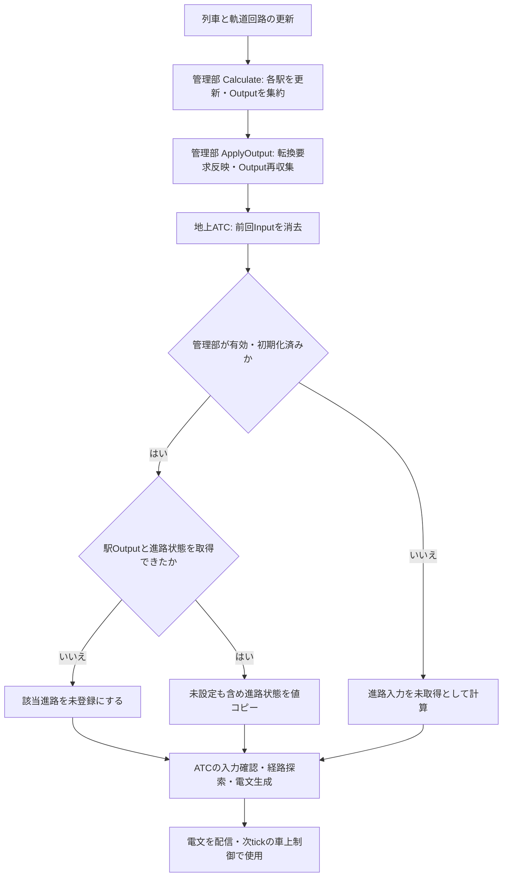

# 地上ATC 全体処理仕様

本書は、地上ATCのリファクタリングで採用する処理順、各工程の入出力とStateの担当を定める。[issue #67](https://github.com/neko3141592/Nakatetsu/issues/67)の進路未設定時の無信号化は、今回の地上工程1〜6で修正する。進路解放後の車上側のORP保持・開扉時解除は、第5節の仕様に従い実装済みである。

Context・Input・State・Outputと工程2〜6のLogicは、`Assets/Nakatetsu/Track/Atc/Scripts`の`Nakatetsu.Track.Atc`名前空間に実装する。既存の`Nakatetsu.Track.Atc.TrackAtcController`コンポーネントが入力収集・新しい親Logicの呼び出し・電文配信を担当する。静的Graphと外部向けの電文型は既存の型を使用する。

## 1. 全体の処理順（確定）

Controllerが工程1の入力収集を完了し、親Logicが工程2〜5を順に呼んで今回の結果を確定する。最後に工程6で外部向けのOutputを生成する。子Logic同士は呼び合わない。

| 順番 | 工程 | 役割 | 入口 |
| --- | --- | --- | --- |
| 1 | 入力をスナップショット | シミュレーション時刻・軌道回路の占有・連動進路の状態などを、今回の更新で使用する入力として取り込む | `TrackAtcController.CollectInput` |
| 2 | 入力・Graphを確認 | 入力の取得可否と基本的な正常性、GraphのID・接続を確認し、探索用辞書を準備する | `TrackAtcValidationLogic.UpdateValidation` |
| 3 | 送信Edgeを選び、経路・停止限界を決定 | 回路ごとの選択Edgeを起点に進路の使用条件・接続・次回路の占有に従って探索し、経路・停止限界・終了理由を求める | `TrackAtcPathLogic.UpdatePath` |
| 4 | 防護方式を確定 | 探索の終了理由と終端進路から、停止限界に適用するNormal・Restricted・Noneを決める | `TrackAtcProtectionModeLogic.UpdateProtectionMode` |
| 5 | 回路ごとの送信内容・有効性を確定 | 各計算結果を軌道回路ごとに集約し、送信対象と電文の有効性を確定する | `TrackAtcTelegramLogic.UpdateTelegram` |
| 6 | Outputを生成 | 確定したStateから、発行時刻・有効フラグ・Edgeと方向ごとの経路情報を持つ電文を生成する | `TrackAtcOutputLogic.UpdateOutput` |

`TrackAtcLogic.Calculate`が工程2〜6を呼ぶ。工程5の後でGraph・時刻・各回路の確定結果を集約し、全体Stateの`isAtcHealthy`を更新する。全体が不正常でも、工程6とControllerの配信を省略しない。

## 2. 各工程の扱い

連動管理部との接続は[TrackAtcManagementTests](../../../Assets/Nakatetsu/Track/Interlocking/Management/Tests/TrackAtcManagementTests.cs)で、公開Outputの値コピー、2駅の電文生成、未設定と取得不能の区別、古い入力の消去、管理部の計算・出力反映後の同ステップ参照を検証する。2026-10-11に追加19件を含む連動・地上ATCのEditModeテスト182件がすべて成功した。

### 1. 入力をスナップショット

今回の更新で使用する時刻・占有・連動進路の状態を取り込む。連動進路は未設定のものも含めて状態を取り込み、確認できた未設定と、状態の取得失敗を区別する。取得できなかった値を、空き・未設定・過走防護なしの正常値に置き換えない。

`TrackInterlockingManagementController.Context.Output.StationsById`から駅別・進路別の公開スナップショットを読む。管理部が未設定・無効・未初期化の場合は進路入力を空にする。駅の`IsInitialized && HasOutput`と進路の`IsAvailable`を満たす状態だけを、連動進路IDをキーとして`RoutesById`へコピーする。地上ATCは各駅連動装置を直接参照せず、状態照会APIも呼ばない。

確認済みの未設定は`IsRouteSet = false`、防護だけが残る場合も含む設定レコードは`IsRouteSet = true`とする。駅のOutput欠損・未初期化・進路の取得不能は入力未取得とし、`RoutesById`へ未設定として登録しない。毎回入力辞書を消去して取り直し、前回の進路入力を残さない。進路IDはコンパイル時と同様、地上ATCが参照する駅全体で一意とする。

世界tickでは、列車・軌道回路の更新後に管理部の`Calculate`で各駅を1回更新して集約し、`ApplyOutput`で転換要求を反映して公開値を再収集する。その後に地上ATCの入力収集・計算・配信を行い、同じtickで確定した管理部Outputを読む。車上は配信済み電文を次tickで使用する。

#### 読み書きする情報

| 区分 | 読み書き | 必要な情報・更新結果 |
| --- | --- | --- |
| その他の参照 | 読む | シミュレーション時計：今回の発行時刻を取得する |
| その他の参照 | 読む | 軌道回路の占有状態：回路IDごとの取得結果と占有・空きを取得する |
| その他の参照 | 読む | 連動管理部の駅別・進路別Output：各進路の取得結果、新規進入許可、開通・鎖錠、取消、防護方式を取得する |
| その他の参照 | 設定する | `Context.Graph`：今回参照するコンパイル済みGraph。Graphの定義自体は書き換えない |
| Input | 更新する | `simulationTimeSeconds`：車上と共通のシミュレーション時刻[s]。取得できない場合は正常な発行時刻として扱わない |
| Input | 更新する | `OccupiedByCircuitId`：取得できた回路IDと占有状態。キーがない回路は取得失敗・不明とし、空きと区別する |
| Input | 更新する | `RoutesById`：取得できた連動進路IDと`TrackAtcRouteInput`。未設定の進路も登録し、キーがない場合は取得失敗・不明とする |
| Input | 更新する | `RoutesById`内の`IsRouteSet`：設定中の状態を取得できた場合は`true`、確認済みの未設定は`false`。未登録・`null`の入力とは区別する |
| Input | 更新する | `RoutesById`内の`ProceedAllowed`・`PathEstablished`・`RouteLocked`・`CancelPending`：進路の使用条件を判断するための今回の状態 |
| Input | 更新する | `RoutesById`内の`OverrunMode`：連動が確定した過走防護方式。停止限界に対応する方式の採用は工程4で行う |
| State | 読み書きしない | 入力の確認結果と計算結果は工程2以降で更新する |
| Output | 読み書きしない | 外部向けの電文は工程6で生成する |

本進路と過走防護の転轍機実位置の照査は連動側が担当し、地上ATCはその結果である`PathEstablished`を使用する。転轍機実位置だけから進路を推測しない。

### 2. 入力・Graphを確認

GraphのID・接続・進路定義を確認し、探索用辞書とEdgeごとの進路定義上の進行方向を準備する。方向は進路の設定状態に依存させず、BlockはEdgeの定義、Interlockingは静的な進路定義の順序付きEdge列から求める。同じ方向を使う複数進路は`HashSet`でまとめ、両方向の進路定義があれば両方向を残す。Interlockingの単一Edge停止結果を両方向へ用意する処理は工程3で行う。

入力の取得可否と基本的な正常性の結果は`State.validation`へ保持する。個別の入力欠落は後続工程へ明示し、必要な経路でその入力を使う際に計算失敗として扱う。Graph全体を使用できない場合は、探索用辞書の前回値や生成途中の値を使用しない。

#### 読み書きする情報

| 区分 | 読み書き | 必要な情報・更新結果 |
| --- | --- | --- |
| Input | 読む | `simulationTimeSeconds`：発行時刻を取得でき、有限かつ0以上であるか確認する |
| Input | 読む | `OccupiedByCircuitId`：Graphに必要な回路の占有状態を取得できたか確認する |
| Input | 読む | `RoutesById`：Graphの連動進路IDに対応する状態を取得できたか確認する。進路未設定を入力不正にしない |
| その他の参照 | 読む | `Graph.atcEdge`・`atcNode`・`routes`：IDの一意性、所属回路、端点、相互の接続、進路のEdge列を確認する |
| State | 更新する | `validation.isGraphValid`：今回のGraphを探索に使用できるか |
| State | 更新する | `validation.isSimulationTimeValid`：今回の時刻を有効電文の発行時刻に使用できるか |
| State | 更新する | `validation.atcEdgesById`・`atcNodesById`：確認済みのEdge・Nodeを取得するための辞書 |
| State | 更新する | `validation.atcRoutesById`：ATC進路IDをキーとする静的進路定義の辞書。Inputの連動進路IDとは区別する |
| State | 更新する | `validation.directionsByAtcEdgeId`：Edgeごとの進路定義上の進行方向。未設定の進路定義からも求め、重複する方向はまとめる。単一Edge停止結果の双方向化によって、逆方向の進路延伸を許可しない |
| State | 更新する | `validation.hasCircuitInputById`・`hasRouteInputById`：回路・連動進路ごとの入力取得可否 |
| State | 更新する | `validation.failureReason`：Graphや時刻を使用できない理由。取得できなかった個別IDは取得可否の結果に保持する |
| Output | 読み書きしない | 確認結果を後続へ渡し、電文は工程6で生成する |

### 3. 送信Edgeを選び、経路・停止限界を決定

各回路の送信対象Edgeを選んでから、そのEdgeを探索起点とする。成立した連動進路から選択し、進路解放後に回路が占有されている間は前回選択を維持する。初回・非占有時に進路がない転轍機回路は、既存Connectionの確定した接続から選択する。単一Edgeの回路はそのEdgeを使う。計算結果は`TrackAtcEdgeKey`でEdge ID・方向を区別し、Blockは定義された方向、Interlockingは`AtoB`・`BtoA`の両方向で計算する。別の起点からの探索で通過したことを理由に、そのEdge自身を起点とする計算を省略しない。

Interlockingの進路未設定時には、静的な進路定義が一方向だけでも、反対方向を含む両方向の単一Edge・`None`停止結果を用意する。設定済み進路に沿って次Edgeへ延ばせるのは、進路の順序付きEdge列から求めた方向と使用条件が一致する場合だけとする。反対方向の停止結果を用意したことを、その方向の進路が設定されたことへ読み替えない。

進路の使用条件・接続・次回路の占有に従って経路を探索し、結果を`State.path`へ保持する。進路の使用条件の判定はこの工程内で行い、独立したRouteState・RouteLogicは設けない。

各結果には、次EdgeのID・方向を表す`nextEdgeKey`と、その起点に対する停止限界・終了理由を保存する。起点ごとに停止限界までの全Edge列・方向列を保存しない。探索中の現在Edge・採用進路・index・訪問済み集合はローカルの作業データとして扱う。電文に必要な全Edge列は、工程6で確定済みの次Edge参照から組み立てる。

#### 読み書きする情報

| 区分 | 読み書き | 必要な情報・更新結果 |
| --- | --- | --- |
| Input | 読む | `OccupiedByCircuitId`：工程2で取得を確認した占有状態。異なる回路へ進む際の次回路の占有を照査する |
| Input | 読む | `RoutesById`内の`IsRouteSet`・`ProceedAllowed`・`PathEstablished`・`RouteLocked`・`CancelPending`：確認済みの未設定と設定済み進路を区別し、新規進入と進路内継続を分けて判定する |
| State | 読む | `validation.isGraphValid`・探索用辞書：今回のGraphを使用できるかと、Edge・Node・進路の定義 |
| State | 読む | `validation.directionsByAtcEdgeId`：進路の設定状態に依存しない定義上の方向。Interlockingの反対方向は単一Edge停止結果として追加する |
| State | 読む | `validation.hasCircuitInputById`・`hasRouteInputById`：必要な入力を使用できるか。基本的な取得確認を再実行しない |
| State | 更新する | `path.selectedEdgeByCircuitId`：回路ごとの今回の選択Edge。占有中の進路解放後も選択を維持する |
| State | 更新する | `path.resultsByKey`：探索起点のEdge IDと方向に対応する計算結果。前回更新の結果は採用しない |
| State | 更新する | 各結果の`isPathValid`・`failureReason`：正常な探索終了か、入力欠落・接続不整合・方向不明・探索上限到達などの失敗か |
| State | 更新する | 各結果の`nextEdgeKey`：次EdgeのIDとそのEdge上の方向の組。次Edgeがなければ`null`とする。全Edge列は保存しない |
| State | 更新する | 各結果の`stopAtcEdgeId`・`stopTravelDirection`：停止限界のEdgeと、そのEdge上の方向。停止限界は進行方向の退出端とする |
| State | 更新する | 各結果の`endReason`・`terminalAtcRouteId`：`TrackAtcPathEndReason`で表す探索終了の理由と、停止限界に対応する終端進路。初期値は未判定の`Unspecified`とし、終端進路が対応しない正常停止も区別する |
| State | 更新する | 各結果の`affectedCircuitIds`：計算失敗時に無効化する、探索で関係した軌道回路IDの`HashSet`。初期状態・正常終了時は空とし、同じ回路IDを重複させない。失敗途中の経路を使用可能な結果にしない |
| Output | 読み書きしない | 経路・停止限界をStateに保持し、電文は工程6で生成する |

#### 探索の規則（確定）

- 設定済み進路による新規進入には`IsRouteSet && ProceedAllowed && PathEstablished && !CancelPending`を要求する。
- 設定済み進路内を起点とする探索では`IsRouteSet && PathEstablished && RouteLocked && !CancelPending`を使用する。通常の進入による`ProceedAllowed`の低下だけで打ち切らない。採用した進路とEdgeのindexを探索中に引き継ぐ。
- Blockから新規進入して進路の先頭Edgeへ到達した後は、その進路内の継続条件を適用する。`RouteLocked`を確認できなければ、先頭Edgeから次Edgeへ延ばさない。
- 進路末尾から後続進路へ切り替える際には、新規進入許可を照査する。共有Edgeを重複追加せず、そのEdge上の進行方向も一致させる。
- 前進路の終端Edgeが後続進路の先頭Edgeと共有されている場合は、既にそのEdgeへ到達しているため、後続進路の次Edgeへ延ばす前に、新規進入条件に加えて進路内継続条件も照査する。
- 起点Edge自身の占有では止めない。同一回路内の遷移は占有を理由に禁止せず、異なる回路へ進む場合だけ次回路の占有を照査する。
- 進路未設定、後続進路未開通、既知の次回路の占有は正常な停止条件とする。先へ進めない場合は次Edgeを追加せず、現在Edgeの退出端を停止限界にする。
- 進路未設定・取消後の起点にほかの有効な進路がない場合は、起点Edgeの1本だけを経路とする。同一回路内でも、許可されていない枝へ探索を延ばさない。
- Interlockingの進路未設定時の単一Edge停止結果は両方向に生成する。Graph・必要な入力を確認できたことを前提とし、入力欠落をこの結果へ置き換えない。
- 必要な入力欠落、方向を確定できない状態、複数の使用可能な枝を一意に選べない状態、Graph不整合、探索上限到達は計算失敗とする。未対応のYardも正常な進路未設定とは区別する。
- 全起点の結果を確定した後、次Edge参照を辿って各起点の停止限界まで経路を組み立てられることを確認する。参照欠落・循環・停止限界への未到達や、採用した進路と参照先の不整合は、この工程の計算失敗として扱う。

### 4. 防護方式を確定

各計算結果の停止限界に適用するNormal・Restricted・Noneを確定し、`State.protectionMode`へ保持する。終端まで辿った設定済み進路が停止限界に対応する場合は、その連動進路の`OverrunMode`を使用する。

`terminalAtcRouteId`を`validation.atcRoutesById`で解決し、その静的定義の`interlockingRouteId`をキーに`Input.RoutesById`の`OverrunMode`を読む。ATC進路IDをInputのキーとして使わない。必要な終端進路入力の欠落・未設定・方式の不正は、方式の確定失敗として扱う。

進路未設定で終端進路が対応しない正常停止には`None`を指定する。後続進路が未設定という理由だけで、到達済みの終端進路の方式を`None`へ変更しない。

#### 読み書きする情報

| 区分 | 読み書き | 必要な情報・更新結果 |
| --- | --- | --- |
| Input | 読む | `RoutesById`内の`OverrunMode`：停止限界に対応する設定済み終端進路の方式 |
| State | 読む | `path.resultsByKey`内の`isPathValid`・`endReason`：経路が正常に確定したかと、終了理由 |
| State | 読む | 各結果の`terminalAtcRouteId`・`stopAtcEdgeId`・`stopTravelDirection`：停止限界と、方式を取得する終端進路 |
| State | 読む | `validation.atcRoutesById`・`hasRouteInputById`：ATC進路IDに対応する連動進路IDと、その状態の取得可否 |
| State | 更新する | `protectionMode.resultsByKey`：経路の計算結果と同じキーに対応する方式の確定結果 |
| State | 更新する | 各結果の`isProtectionModeKnown`・`overrunProtectionMode`：方式を確定できたかと、今回送信する方式。方式の保持先はこのStateだけとする |
| State | 更新する | 各結果の`failureReason`：必要な終端進路入力の欠落、不正な方式など、方式を確定できない理由 |
| Output | 読み書きしない | 確定した方式を工程5・6へ渡す |

`None`は過走防護なしという正常な指定であり、取得失敗を表す値にしない。工程4で失敗しても、PathStateやValidationStateの結果を直接書き換えない。車上側でのORP保持・開扉時解除は第5節に定める。

### 5. 回路ごとの送信内容・有効性を確定

経路と防護方式の結果を軌道回路ごとに集約し、送信対象と電文の有効性を`State.telegram`へ保持する。次Edge参照・停止限界はPathState、方式はProtectionModeStateから参照し、TelegramStateへ同じ内容を重複して保存しない。

使用できるGraphに属する全回路を送信対象にし、成功した計算結果のキーを`routeKeys`へ登録する。計算結果が一つも使用できない回路も、送信対象から消さず無効電文の対象として保持する。

#### 読み書きする情報

| 区分 | 読み書き | 必要な情報・更新結果 |
| --- | --- | --- |
| Input | 直接読まない | 工程2〜4で確認・確定した結果を使用する |
| State | 読む | `validation.isGraphValid`・`isSimulationTimeValid`：Graphを使用できるかと、有効な発行時刻を使用できるか |
| State | 読む | `validation.atcEdgesById`：計算結果の起点Edgeに対応する軌道回路ID |
| State | 読む | `path.resultsByKey`：経路・停止限界の計算結果、起点のキー、失敗時の関係回路 |
| State | 読む | `protectionMode.resultsByKey`：各計算結果の防護方式の確定結果 |
| State | 更新する | `telegram.circuitsById`：今回の送信対象となる軌道回路ごとの集約結果 |
| State | 更新する | 各回路の`routeKeys`：その回路へ送るEdge・方向ごとの計算結果への対応。次Edge参照や停止限界は複製しない |
| State | 更新する | 各回路の`isValid`・`failureReasons`：回路全体の有効性と、無効にした理由 |
| Output | 読み書きしない | 送信内容と有効性をStateで確定し、電文の生成は工程6で行う |

同じ更新内で計算失敗があった回路は、別経路の成功で有効へ戻さない。正常な進路未設定の停止結果は失敗に含めず、同じ回路に属するほかのEdgeの電文も無効化しない。

Graphが使用不可で送信対象を確定できない場合は、今回の送信対象を空にする。Graphと送信対象を確定できても時刻が不正な場合は、有効電文を生成しない。探索結果や方式を確定できなかった回路については、無効電文の送信対象として保持する。

### 6. Outputを生成

確定したStateから、外部向けの電文を生成する。経路探索、防護方式の選択、回路の有効性の再判定は行わない。今回の送信結果でOutputを置き換え、前回だけ存在した電文を残さない。

各`routeKey`を起点に、工程3で確認済みの`nextEdgeKey`を辿って`atcEdgePath`を組み立てる。停止限界は最初の起点結果の`stopAtcEdgeId`・`stopTravelDirection`に固定し、そのEdgeを追加したところで終了する。途中の結果が持つ停止限界へ置き換えない。共有Edge自身を起点とすれば後続進路内を進める場合でも、上流の起点からその進路への新規進入を許可していない場合は、上流の停止限界を越えて連結しない。

#### 読み書きする情報

| 区分 | 読み書き | 必要な情報・更新結果 |
| --- | --- | --- |
| Input | 読む | `simulationTimeSeconds`：工程2・5で有効性を確認した今回の発行時刻。取得できていない時刻で有効電文を作らない |
| State | 読む | `telegram.circuitsById`：今回の送信対象、回路ごとの有効性、採用する計算結果のキー |
| State | 読む | `path.resultsByKey`：送信経路を組み立てる次Edge参照と、各起点の停止限界・終端方向 |
| State | 読む | `protectionMode.resultsByKey`：送信する計算結果の防護方式 |
| State | 書き換えない | 工程5までに確定した検証・経路・方式・回路の集約結果を維持する |
| Output | 更新する | `telegrams`：軌道回路IDをキーとする今回の電文。送信対象が空の場合も前回の電文を消去する |
| Output | 更新する | 各電文の`issuedAtSeconds`・`isValid`：今回の発行時刻と、工程5で確定した回路全体の有効性 |
| Output | 更新する | 各電文の`routeAtoB`・`routeBtoA`：選択Edgeを起点とする各進行方向の経路情報 |
| Output | 更新する | 各経路情報の`atcEdgePath`・`stopAtcEdgeId`・`overrunProtectionMode`：起点から停止限界までのEdge列、終端Edge、適用する防護方式 |

Outputの書き換え可能な経路リストは、各経路情報ごとに新しく生成し、ほかの電文と共有しない。失敗した計算途中の経路を有効な経路情報として出力しない。

内部の`TrackEdgeTravelDirection`は、外部電文の`TrackAtcTravelDirection`へ明示的に変換する。通常の有効性は工程5の結果に従うが、工程間の不整合で次Edge参照を停止限界まで変換できない場合は、Stateを変更せず、そのOutput電文を無効・経路情報空として生成する。無効電文へ一部の成功経路だけを残さない。

`TrackAtcController.ApplyOutput`は、このOutputを軌道回路へ配信する。計算失敗や送信対象なしの場合も配信し、前回の電文を取り下げる。ATCの無効化時にも取り下げる。アプリの更新順は列車・占有・連動・地上ATCとし、今回生成した電文は次tickの車上制御で使用する。

## 3. 処理全体で守る事項（確定）

- 回路ごとに送信対象Edgeを一つ選択し、そのEdgeを探索起点とする。内部の探索結果だけをEdge ID・方向で区別し、外部電文にその辞書を持たせない。
- Inputは工程1で取り込み、後続のLogic・Helperから変更しない。更新途中にSceneや連動の現在状態を読み直さない。
- 入力の取得可否と基本的な正常性は工程2で確認し、各工程で初めて分かる失敗は担当するStateの結果として渡す。
- 進路未設定と入力欠落を区別する。正常な停止を無信号・計算失敗にしない。
- 経路・防護方式・電文は毎更新で計算する。回路の占有中に進路が解放された場合の選択Edgeだけは、次の成立進路による選択まで維持する。
- Graph・入力・計算の失敗を理由にOutput生成と配信を省略しない。
- Outputは工程6だけが生成し、前段の探索や探索済み判定には使用しない。
- 地上は停止限界の退出端を送り、距離計算・停止余裕の適用・許容速度の計算は車上側に置く。
- 地上ATCに列車ID別の追跡、ORP保持、開扉操作や駅停車状態を持たせない。

## 4. Context・State・Logicの分割

共通のInput・State・Output・Graphを`TrackAtcContext`にまとめる。工程ごとに独立したContext・Input・Outputは作らない。

新実装のStateと`TrackAtcEdgeKey`で扱う進行方向は、`TrackEdgeTravelDirection`に統一する。全体State直下の`isAtcHealthy`は親Logicだけが更新する。

| 工程 | State | 子Logic | 保持・更新する情報 |
| --- | --- | --- | --- |
| 2 | `TrackAtcValidationState` | `TrackAtcValidationLogic` | Graph・入力の確認結果、探索用辞書、進路定義上の方向 |
| 3 | `TrackAtcPathState` | `TrackAtcPathLogic` | Edge・方向ごとの次Edge参照、停止限界、終了・失敗結果 |
| 4 | `TrackAtcProtectionModeState` | `TrackAtcProtectionModeLogic` | 計算結果ごとの防護方式と確定結果 |
| 5 | `TrackAtcTelegramState` | `TrackAtcTelegramLogic` | 回路ごとの送信対象、計算結果への対応、有効性 |
| 6 | 専用Stateなし | `TrackAtcOutputLogic` | Outputのみ |

各子Stateは`TrackAtcState`にまとめる。子Logicが変更できるのは対応するStateだけとし、他のStateは参照のみとする。各Stateが持つ配列・オブジェクトの参照を通した変更も行わない。OutputLogicはStateを変更しない。

子Logicの呼び出しは`TrackAtcLogic`に集約し、子Logic同士は呼び合わない。独立した`static class`とし、`partial`で分割しない。子Logicの入口は`internal`、同じクラス内の補助関数は`private`とする。対応するHelperだけを使用し、HelperへContextを渡さない。文法・改行・更新担当とHelperの詳細規則は、[機器Logicの分割と実装ルール](../../Architecture/EquipmentLogicImplementationRules.md)と[共通実装ルール](../../Architecture/ImplementationRules.md)に従う。車上側と共通のATCの構成は、[車上ATC 全体処理仕様](../../Train/Atc/TrainAtcProcessingFlow.md)を参照する。

静的なGraphコンパイルは、今回の更新フローとは別に扱う。

## 5. issue #67と車上側のORP保持・解除（確定）

### 進路未設定でも有効な停止電文を送る

[issue #67](https://github.com/neko3141592/Nakatetsu/issues/67)は、進路未設定のInterlocking Edgeが探索されず、正常なホーム停車中にも車上側が無信号・使用不可へ移る問題である。今回の地上工程1〜6では、回路ごとに選択したEdgeを起点とする探索と、進路未設定時の両方向の有効な停止電文の生成により、この地上側の原因を修正する。

進路解放後、起点Edgeに対応する進路が未設定と確認できる場合は、起点Edgeだけの経路と`None`を有効な停止電文として送る。場内進路が解放され、1RTの出発進路も未設定の場合は、静的進路の定義方向によらず`AtoB`・`BtoA`の両方向に次の電文を生成する。

| 項目 | 値・意味 |
| --- | --- |
| `isValid` | `true`。進路未設定と確認できた正常な停止とする |
| `issuedAtSeconds` | 今回のシミュレーション時刻 |
| 経路情報 | `routeAtoB`と`routeBtoA`。どちらも選択した1RTのEdgeを起点とする |
| `atcEdgePath` | `[1RTのEdge ID]` |
| `stopAtcEdgeId` | 1RTのEdge ID。停止限界はその方向の退出端 |
| `overrunProtectionMode` | `None`。停止限界に対応する設定済み終端進路がない場合の指定 |

必要な入力の欠落、Graph不整合、方向不明をこの正常停止へ置き換えない。後続進路が成立した場合は、次回の地上更新で経路・停止限界を延ばす。取消時には、ほかの有効な進路がなければ起点Edgeの退出端へ短縮する。

本進路が設定されたまま過走防護だけが解放される場合の送信方式は、進路未設定時とは別の条件として確認する。

### 未成立時の新規進入と進入済みの扱い

21の進路が未成立なら、20Tからの経路は20Tで終わり、21T_N・21T_Rへ入る手前で停止する。すでに21Tの選択Edge内にいる列車には、そのEdgeを起点とする単一Edge電文を送り、転轍機を越えてそのEdgeの終端まで進行させる。次Edgeへの新規進入を、このEdge内の進行と混同しない。

車上は共通部分なら選択されたEdge上の同じ位置へ対応できる。分岐後に他方の枝へ位置を付け替えない。

### 車上の防護方式決定でORPを保持し、開扉で解除する

以下の車上側の保持・解除は、`TrainAtcProtectionModeLogic`・`TrainAtcProtectionModeState`と、TIMSの開扉操作番号の入力に実装している。地上ATCには保持状態を追加しない。

ORPを使用して到着した列車に対し、進路解放後に進路未設定となり、地上から`None`が送られた直後に通常パターンへ切り替えると、停止限界の100m以内で常用停止保持が働く。この切り替えは、車上側の防護方式を決める工程5に保持・解除規則を追加して扱う。

進路解放後に進路未設定となった場合、開扉後に古いORP保持が残らないことを必要条件とする。地上は単一Edge・`None`の有効電文を送り、車上の工程5は開扉で以前の保持を解除して受信した`None`を採用する。その後、有効な`Normal`・`Restricted`を新たに受信した場合は、同じ終点・方向でも受信方式の保持を開始してよい。

保持・解除は`TrainAtcProtectionModeLogic`と`TrainAtcProtectionModeState`で扱う。受信電文・Inputを書き換えず、実際に使用する防護方式をProtectionModeStateで確定する。保持するキーは停止限界のEdge IDと、その終端Edge上の進行方向とする。現在Edgeの方向や経路の先頭Edgeの変化だけでは解除しない。

保持対象の照合では、受信した`stopAtcEdgeId`が経路の末尾Edgeと一致することと、経路の接続から終端方向を確定できることを確認する。不整合な停止限界や経路を、過去のORP保持で使用可能にしない。

| 契機・条件 | 車上側の扱い |
| --- | --- |
| 有効な`Normal`・`Restricted`を採用 | 受信した方式・停止限界のEdge ID・終端方向を保存する。同じ対象でも新しい受信方式へ更新する。表示の点灯状態だけで保持を判断しない |
| 防護方式保持中に、保存した停止限界・終端方向と同じ`None`を受信 | 保存したNormal・Restrictedを使用する。開扉操作ではこの以前の保持を解除する |
| 停止限界または終端方向が変化 | 以前のORP保持を解除し、今回の指定方式を採用する。新しい指定が`Normal`・`Restricted`なら新しい方式と対象を保持する |
| 新しい開扉操作番号を確認 | ORP保持を解除し、今回の受信方式を採用する。受信中の方式が`None`なら、通常パターンを生成する。停車速度や全閉状態は解除条件にしない |
| 開扉による解除後に`None`を受信 | 以前の保持を復活させず、`None`を採用する。開扉状態が続くことだけで毎tick解除・パターン消去を繰り返さない |
| 開扉による解除後、次tick以降に有効な`Normal`・`Restricted`を受信 | 同じ停止限界・終端方向でも受信した方式を採用し、ORP保持を開始してよい。開扉を確認したtickで再保持せず、以後の再採用を禁止する状態は設けない |
| キー切・レバーサ中立 | 既存の有効条件に従って照査とパターンを停止する。開扉がなければORP保持対象を維持し、新しい開扉操作があれば解除する |
| 無信号・無効電文・入力不正 | 既存の採用・保持・使用不可の判定に従い、新しい開扉操作は受信状態にかかわらず処理する。無信号猶予中はORP保持対象を解除しても既存パターンと方式を維持し、次の有効なNone受信時にNoneを採用する。ORP保持情報だけで使用可能にしない |

保持するのは防護方式とその対象である。有効な新しい電文を採用した場合は、今回の経路を使用し、確定した防護方式でパターンを生成する。最初から`None`しか受信していない列車は、通常どおり`None`を使用する。

#### 車上側で必要な情報と更新担当

以下は車上側で使用する情報であり、地上ATCのInput・Stateへは追加しない。

| 区分 | 読み書き | 必要な情報・更新結果 |
| --- | --- | --- |
| 車上Input | 読む | `hasDoorOpeningOperation`・`doorOpeningOperationRevision`：TIMSで受け付けた開扉操作番号の取得可否と値。全閉未確認や取得失敗を開扉操作に置き換えない |
| 車上State | 読む | `State.validation`の採用・保持・使用不可の結果と、確認した受信経路・方式 |
| 車上State | 読む | 現在位置・照査方向・Graph：受信経路の停止限界と終端Edge上の方向を求める |
| 車上State | 読む・更新する | `State.protectionMode.hasHeldOrp`・`heldStopAtcEdgeId`・`heldStopTravelDirection`：ORP保持の有無と停止限界Edge ID・終端方向。開扉で以前の保持を解除し、有効な`Restricted`で再設定できる |
| 車上State | 読む・更新する | `State.protectionMode.doorOpeningOperationRevision`：処理済みの開扉操作番号。同じ番号は再処理しない |
| 車上State | 更新する | `State.protectionMode.isProtectionModeKnown`・`overrunProtectionMode`：保持・解除を反映した今回使用する防護方式 |
| 車上Output | 直接変更しない | 確定した方式から、既存のパターン生成・ブレーキ判定・Output生成で反映する |

TIMSは最新の開扉操作番号をMasterBusへ送り、閉扉操作ではこの番号を変えない。開扉と閉扉がATCの入力収集の間に続いても、番号の変化から開扉操作を確認できる。親Logicは工程5の後、パターン生成前に`TrainAtcValidationLogic.ValidateProtectionSettings`を呼び、ORP保持・解除を反映した使用方式の設定を確認する。保持対象と解除の情報の更新はProtectionModeLogicが担当し、他の子Stateを変更しない。

### 開扉後の常用保持と後続進路成立後の緩解

開扉時に全パターンを使用不可へする専用の駅停車待ち状態は追加しない。ORP保持を解除し、受信した`None`を採用して通常パターンを生成する。

停止限界の100m以内で停車している場合は、`None`の常用パターンが0となり、既存の停止保持で常用最大になる。閉扉だけでは停止限界も常用パターンも変わらないため、常用保持を継続する。後続進路成立で停止限界が延び、新しいパターンが緩解条件を満たした場合に、全閉確認後の通常のブレーキ判定で緩解する。

この保持は既存の`None`パターンと停止保持条件を満たす停車位置を前提とする。地上側から固定の0速度を送ったり、車上で現示だけを0へ固定したりしない。開扉中の転動防止は独立して継続し、進路成立だけでは解除しない。

### 修正時に確認するシナリオ

| シナリオ | 確認する結果 |
| --- | --- |
| 場内進路解放・出発進路未設定 | 両方向に単一Edge・`None`の有効な停止電文があり、車上が無信号にならない |
| Interlockingの静的進路定義が一方向だけ | 反対方向にも単一Edge・`None`の有効な停止電文がある。設定済み進路による延伸は定義された方向だけで行う |
| ORP使用中に同じ終端・方向の`None`を受信 | 開扉まではORPを保持し、進路解放だけで100m手前の通常停止保持へ切り替わらない |
| 停止限界の100m以内で停車後に開扉 | ORP保持を解除して`None`を採用し、既存の常用停止保持が働く |
| 開扉後、同じ終端・方向に有効な`Normal`・`Restricted`を受信 | 受信方式を再採用できる。解放済み設備に対する古い保持が残った状態と区別する |
| 閉扉済み・出発進路未設定 | `None`の常用停止保持を継続する |
| 出発進路成立 | 電文の経路・停止限界が延び、全閉かつパターンの緩解条件を満たせば常用Brが緩解する |
| 経路の先頭だけが変化／終端方向が変化 | 先頭の変化だけではORPを解除せず、終端方向の変化では今回の指定方式を採用する |
| 進路取消／共有Edgeに別の有効進路がある | 前者では停止限界を短縮し、後者では別の進路に従って継続する |
| 入力欠落・Graph不整合・方向不明 | 正常な停止電文やORP保持で異常を隠さない |

## 6. 詳細仕様との関係

- [地上側ATC 基本仕様](TrackAtcGroundSpecification.md)：地上・車上の責務、占有、進路の接続・取消の規則。
- [ATC Graphのコンパイル](TrackAtcGraphCompilation.md)：静的なGraphと合法な方向を求めるための進路定義。
- [車上ATC 全体処理仕様](../../Train/Atc/TrainAtcProcessingFlow.md)：車上の工程、State・Logicの分割と実装ルール。車上工程5には、本書第5節のORP保持・解除規則を実装している。
- [車上ATC ブレーキパターン仕様](../../Train/Atc/TrainAtcBrakePatternSpecification.md)：パターン生成、常用・非常、停止保持と緩解の詳細。
