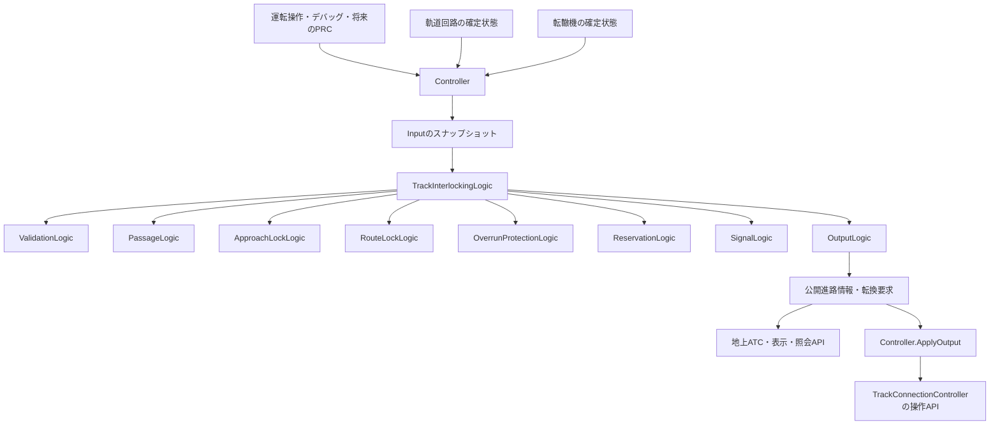

# 連動装置 全体処理とリファクタリング構成案

本書は、連動装置を車上ATC・地上ATCと同じInput・工程別State・Logic・Outputの構成へ整理するための設計案である。毎tickの更新に加え、進路要求・取消・照会APIの入口、処理順、状態の更新担当を定める。**設計案のみであり、本書に記載する新しい型・API・定義項目は未実装。C#、Scene、Prefab、Assetは変更しない。**

参照基準は`main`の`fc624a3b6398f58360d0fc22ebcae26dacc6b573`（PR #68）。構成は[車上ATC 全体処理仕様](../../Train/Atc/TrainAtcProcessingFlow.md)、[地上ATC 全体処理仕様](../Atc/TrackAtcProcessingFlow.md)、[機器Logicの分割と実装ルール](../../Architecture/EquipmentLogicImplementationRules.md)に合わせる。

[issue #66](https://github.com/neko3141592/Nakatetsu/issues/66)には、設定時の空き照査と後端通過による本進路解錠の対象を分けて対応する。[issue #67](https://github.com/neko3141592/Nakatetsu/issues/67)の進路未設定時の停止電文は、基準コミットの地上ATCに実装されている。その入力契約を維持し、本進路解錠後も正常な停止電文へ接続できる構成にする。issueの完了や実走検証済みを意味するものではない。

## 1. 構成の基本方針

連動装置全体に一つの`TrackInterlockingContext`を置き、共通のInput・Settings・State・Outputをまとめる。工程ごとのContext・Input・Outputは作らない。

- Controllerは外部の回路・転轍機の状態を値として取り込み、親Logicを呼び、確定したOutputを公開・反映する。
- 親`TrackInterlockingLogic`がAPIとtickの工程順を管理する。子Logic同士は呼び合わない。
- 各子Logicは対応するStateだけを更新する。初期化、予約受付、取消、削除でも例外を作らない。
- 設定要求の成功は**本進路と選択した防護設備の予約受付**を意味する。転換完了・開通・進行許可を意味しない。
- APIの受付とtickによる時間進行を分ける。APIを何回呼んでも接近・過走防護の時素は進まない。
- 本進路の鎖錠、接近鎖錠、過走防護の保持、開通状態、新規進入許可を別の情報として管理する。
- 予約競合の判定と設備の保持台帳はReservationLogicへ集約する。保持理由の解消を決めるのは、それぞれの鎖錠・防護を所有するLogicである。
- 進路未設定・設定待ち・正常な取消と、入力不明・定義不整合を区別する。



図の各子Logicは自分のStateのみを所有する。他工程の結果は読み取り専用で参照する。ConnectionのStateはConnection側のLogicだけが更新する。

## 2. 全体の処理順

### 2.1 毎tickの処理

Controllerが工程1を行い、親Logicが工程2〜11を順に呼ぶ。進路辞書の列挙順へ依存しないよう、各工程で対象進路全体を更新してから次の工程へ進む。

| 順番 | 工程 | 入口案 | 更新先 |
| --- | --- | --- | --- |
| 1 | 入力をスナップショット | `TrackInterlockingController.CollectInput` | Input |
| 2 | 定義・入力の使用可否を確認 | `TrackInterlockingValidationLogic.UpdateValidation` | `State.validation` |
| 3 | 当該予約の通過・到着候補を観測 | `TrackInterlockingPassageLogic.UpdatePassage` | `State.passage` |
| 4 | 接近鎖錠の時素・保持を更新 | `TrackInterlockingApproachLockLogic.UpdateApproachLock` | `State.approachLock` |
| 5 | 本進路の解錠を判定 | `TrackInterlockingRouteLockLogic.UpdateRouteLock` | `State.routeLock` |
| 6 | 過走防護の成立・到着・時素・解放を更新 | `TrackInterlockingOverrunProtectionLogic.UpdateOverrunProtection` | `State.overrunProtection` |
| 7 | 解消した保持理由を設備台帳へ反映 | `TrackInterlockingReservationLogic.UpdateReservations` | `State.reservation` |
| 8 | 開通・新規進入許可・転換要求を確定 | `TrackInterlockingSignalLogic.UpdateSignal` | `State.signal` |
| 9 | 全体状態を集約 | `TrackInterlockingLogic`内の集約処理 | 全体State直下 |
| 10 | 終了した予約の内部状態を整理 | 親Logicから各ownerの`RemoveReleasedReservation` | 各ownerのStateのみ |
| 11 | Outputを生成 | `TrackInterlockingOutputLogic.UpdateOutput` | Outputのみ |

工程3は工程5より前に行う。同じtickに「到着回路への進入」と「本進路解錠」が成立しても、工程6が当該tickの到着事実を読めるようにする。工程10の削除は全ownerの利用が終わってから行う。

工程2の失敗でも、後続工程とOutput生成を一律に省略しない。各ownerが不明入力に対応する保持・許可抑止を行い、前回の許可Outputを放置しない。失敗した入力を必要としない別進路の結果は、進路ごとの有効性で扱う。

### 2.2 APIの処理

| API | 呼び出し順の概要 | 即時の効果 | tickへ残す処理 |
| --- | --- | --- | --- |
| `TryInitialize` | 定義の値コピー → 検証 → 各owner初期化 → 入力確認・Output生成 | 初期化状態を公開。入力を確認できた進路は確認済み未設定 | 通常更新 |
| `TryRequestRoute` | 入力収集 → 候補作成・競合照査 → 各ownerの予約初期化 → Output生成 | 本進路＋選択防護を一括予約 | 転換要求の反映、実位置照査、開通 |
| `TryCancelRoute` | 重複取消確認 → 入力収集 → 取消記録 → 接近鎖錠開始 → 許可撤回 → Output生成 | `CancelPending=true`、新規進入許可と未送信転換要求を撤回 | 接近時素、転換完了待ち、本進路・防護解錠 |
| `TryGetRouteStatus` | 公開済みOutputの照会 | 変更なし | なし |
| `TryGetCircuitPassage` | 公開済み通過情報の照会 | 変更なし | なし |
| `CanRequestTurnoutPosition` | 最新の入力値と予約結果を読み取り専用で照査 | 変更なし。転換命令の発行権を予約しない | 実行時にも条件を照査 |
| `EvaluateRouteRequest`（将来のPRC向け） | ローカルInputで要求候補を評価して戻り値を生成 | 変更なし。仮予約もしない | 実要求時に再照査 |

APIはControllerから親Logicを呼び、親Logicから各ownerへ処理を配る。Controllerから子Logicを直接呼ばない。戻り値・エラー理由の集約は親Logicが行い、Outputを書き換える場合はOutputLogicを呼ぶ。

### 2.3 APIとtickの境界

操作APIとtickはUnityの同一実行系列で直列に実行し、処理途中の再入を禁止する。同時要求の並びは受付順に固定する。今回の案では、要求を自動的に次tickへ送る非同期キューやWaiting状態を追加しない。

処理単位を`updateKind = Tick / Request / Cancel / Initialize`で区別する。Inputには当該処理の`sampleId`を付け、tickには`tickId`と`deltaTimeSeconds`も付ける。APIの`deltaTimeSeconds`は0とするが、0秒tickとAPIは`updateKind`で区別する。

**APIでは既存予約の通過履歴を進めない。** 新規予約の履歴初期化だけを行う。取消APIで新しい在線を観測した場合も、その値は即時の許可抑止・接近照査に使用し、通過イベントと到着イベントは次tickの工程3・6が扱う。これにより、APIが到着イベントを先に消費することや、複数APIで同じ到着を重複処理することを避ける。

API後のSignal更新では、既存の許可を現在入力に従って取り下げることはできるが、新たな開通・進行許可へ引き上げない。新規予約の`PathEstablished`・`ProceedAllowed`はfalseで公開し、次tickの実位置照査を待つ。地上ATCの電文再計算と車上での採用は、後述の世界tickの順序に従う。

入力を収集した操作では、要求成功・要求拒否・初回取消失敗のいずれでも、ValidationLogicの今回入力の確認を行い、最後に**全定義進路へ**`SignalLogic.UpdateAfterOperation`を実行してから公開する。有効なA進路の要求を受け付けた際に、今回入力で不明になったB進路の古い許可を残さない。通過・時素・解錠はこの共通後処理へ混ぜない。入力収集前に終了する重複取消等の経路は、Outputの`sampleId`を新しく見せず既存結果を維持する。

## 3. ファイルとContextの構成案

既存の`Nakatetsu.Track.Interlocking`名前空間を維持する。別のNewInterlockingを恒久的に併設せず、将来の実装時に既存Controllerと参照元を段階的に差し替える。

```text
Assets/Nakatetsu/Track/Interlocking/
  TrackInterlockingAsset.cs                    既存の編集用Asset
  TrackInterlockingDefinition.cs               編集用定義。回路用途を分離
  Scripts/
    Controller/
      TrackInterlockingController.cs          既存Controllerを移設する案
    Context/
      TrackInterlockingContext.cs
      TrackInterlockingInput.cs
      TrackInterlockingSettings.cs
      TrackInterlockingState.cs
      TrackInterlockingOutput.cs
      TrackInterlockingOperationResult.cs      API結果と理由
      TrackInterlockingReservationKey.cs       routeIdと予約世代
      State/
        TrackInterlockingValidationState.cs
        TrackInterlockingPassageState.cs
        TrackInterlockingApproachLockState.cs
        TrackInterlockingRouteLockState.cs
        TrackInterlockingOverrunProtectionState.cs
        TrackInterlockingReservationState.cs
        TrackInterlockingSignalState.cs
    Logic/
      TrackInterlockingLogic.cs
      TrackInterlockingValidationLogic.cs
      TrackInterlockingPassageLogic.cs
      TrackInterlockingApproachLockLogic.cs
      TrackInterlockingRouteLockLogic.cs
      TrackInterlockingOverrunProtectionLogic.cs
      TrackInterlockingReservationLogic.cs
      TrackInterlockingSignalLogic.cs
      TrackInterlockingOutputLogic.cs
    Helper/                                    必要な工程のHelperだけ追加
  Tests/                                       既存テストを移行・拡張
  Editor/                                      定義の検証・移行支援
```

このツリーは提案であり、今回は作成・移動しない。将来の移設では既存Controllerの`.meta`とGUIDを維持し、Scene・Prefab・asmdef参照を確認する。小さな進路別レコードやenumは対応するInput・State・Outputのファイルへまとめ、名前合わせの空ファイルを増やさない。

| Contextの要素 | 内容 | 更新担当 |
| --- | --- | --- |
| `Input` | 1回のtickまたは操作で固定する外部入力 | Controllerの入力収集 |
| `Settings` | 初期化時にコピーした進路・設備・時素の不変定義 | 初期化境界でControllerが用意。運転中は不変 |
| `State` | 全体状態と7工程のState | 親Logic・各owner |
| `Output` | 公開進路状態、通過照会値、転換要求、診断 | OutputLogicのみ |

最初から専用Workspaceは設けない。要求候補・削除対象・集合演算の一時値はローカル変数で扱う。継続的なキャッシュが必要になった場合だけ、所有者と無効化条件を定めて追加する。

### 3.1 Stateと唯一の更新担当

各工程Stateは全進路をまとめるコンテナとする。Passage・ApproachLock・RouteLock・OverrunProtectionのレコードは`TrackInterlockingReservationKey`で保持し、キーは`routeId + generation`とする。同じ進路IDを再設定しても前回の通過履歴・到着ラッチ・転換要求を引き継がない。

ValidationとSignalは予約がない進路も扱うため、全定義の`routeId`をキーにする。Signalは現在の予約キーを任意の参照値として持ち、予約終了時は予約固有の結果だけを初期化し、その進路の入力取得可否・公開可否のレコードは残す。Reservationは設備IDをキーに、予約キー付きの保持理由集合を持つ。この区別によって、未設定進路の公開可否をOutputLogicが再判定する必要をなくす。

| State | 子Logic | 唯一の保持内容 |
| --- | --- | --- |
| `TrackInterlockingValidationState` | `TrackInterlockingValidationLogic` | 定義検証結果、回路・転轍機の入力取得可否、時刻・時間の確認結果、進路ごとの入力不正理由 |
| `TrackInterlockingPassageState` | `TrackInterlockingPassageLogic` | 当該予約の回路別`NotEntered / Occupied / Passed`、進入済みラッチ、今回の初回進入イベント |
| `TrackInterlockingApproachLockState` | `TrackInterlockingApproachLockLogic` | 接近鎖錠の有無、残り時間、取消時の接近観測結果 |
| `TrackInterlockingRouteLockState` | `TrackInterlockingRouteLockLogic` | 予約の登録、取消要求、本進路鎖錠、解錠理由 |
| `TrackInterlockingOverrunProtectionState` | `TrackInterlockingOverrunProtectionLogic` | 選択方式、phase、到着ラッチ、残り時間、自動解錠停止ラッチ |
| `TrackInterlockingReservationState` | `TrackInterlockingReservationLogic` | 設備ごとの予約者・保持理由・要求転轍位置、台帳整合性の結果 |
| `TrackInterlockingSignalState` | `TrackInterlockingSignalLogic` | 開通、新規進入許可、転換候補と禁止理由、外部公開の使用可否 |

親Logicが更新できるのは`TrackInterlockingState`直下の`isInitialized`、`isInterlockingHealthy`、`isExecutionFaulted`、`stateRevision`、予約世代の採番などの全体状態だけとする。`routeLock.cancelPending`や他の子Stateへ直接代入しない。

**不変条件**：SignalLogicはRouteLockedを直さず、PassageLogicはORPの到着ラッチを立てず、ReservationLogicは解錠条件を満たしたことにしない。必要な処理は親Logicへ結果を返し、親が担当Logicを呼ぶ。

## 4. InputとSettings

### 4.1 共通Input

| 項目案 | 内容・取得可否 | 使用先 |
| --- | --- | --- |
| `updateKind`・`sampleId` | 今回の操作種別とスナップショット識別子 | 親Logic、検証、公開整合性 |
| `tickId`・`deltaTimeSeconds` | tickの識別子、シミュレーション経過時間[s]。APIは時間を進めない | 接近・防護時素 |
| `hasCircuitSource` | 回路状態の供給元を使用できるか | 検証・API受付 |
| `circuitsById` | 取得できた回路ID → `isOccupied`。キー欠落は不明 | 空き照査、通過、解錠、てっ査鎖錠 |
| `hasConnectionSource` | 転轍機状態の供給元が初期化済みで使用できるか | 検証・API受付 |
| `connectionsById` | 取得できた接続ID → `actualPosition`・`isMoving` | 定義照査、開通、取消時の停止確認 |
| `operation` | Request／Cancelの対象`routeId`。Tickでは操作なし | API処理 |
| `applyResults` | 前回反映時の転換要求ID・受付結果・拒否理由の値 | 診断、次回の転換可否判定 |

回路・転轍機のDictionary、State、Definition Assetへの可変参照はInputへ入れない。Controllerが必要な値をコピーし、Logicの実行中は同一スナップショットを読む。`Unknown`転轍位置と`isMoving=true`も明示的な値として取り込む。

Inputの収集対象は全定義進路の設定照査・解錠・接近・防護回路と、全必要転轍機・てっ査鎖錠回路の和集合とする。設定済み進路だけから対象を作ると、未設定進路のAPI照査に必要な入力が欠けるためである。

### 4.2 回路の用途を分ける定義

`InterlockingRoute.routeLockTrackCircuitIds`の兼務を解消し、次の二つを明示する。独立した予約回路Listは増やさず、本案の本進路回路予約は`routeClearTrackCircuitIds`から作る。

| 項目案 | 役割 | 自動解錠との関係 |
| --- | --- | --- |
| `routeClearTrackCircuitIds` | 設定受付・新規進入許可で空きを要求し、本進路として予約する回路 | すべての後端通過を要求しない |
| `routeReleaseTrackCircuitIds` | 列車後端通過による本進路の一括解錠を照査する回路 | 全対象が既知の空きかつPassedになったとき解錠候補 |
| `requiredTurnouts` | 本進路が保持する転轍機と要求位置 | 本進路の保持理由が残る間は保持 |
| `approachLock.trackCircuitIds` | 取消時の接近照査 | 独立した接近時素の開始条件 |
| `overrunProtection.release.triggerTrackCircuitId` | 当該予約の到着イベントを検出する回路 | 解錠対象とは独立。ホームを解錠対象から外しても残す |
| `turnoutTrackCircuitLocks` | 転換を禁止するてっ査鎖錠の回路 | 進路解錠後も、実際の転換には空き確認が必要 |

観測集合はSettingsのコンパイル時に`routeClearTrackCircuitIds ∪ routeReleaseTrackCircuitIds ∪ 到着トリガ`から導出する。第1段階では解錠集合と到着トリガを設定照査集合の部分集合に制約するため、実際の観測集合は設定照査集合と一致するが、用途は区別する。接近回路や防護用回路を、本進路への進入履歴へ混ぜない。

### 4.3 定義の検証と移行

- 両Listはnull・空を禁止し、空ID・重複ID・未知の回路を拒否する。空の解錠集合を「すぐ解錠」と解釈しない。
- 解錠集合は設定照査集合の部分集合にする。到着トリガも設定照査集合に含めるが、解錠集合に含める必要はない。
- 本進路が保持する各転轍機のてっ査鎖錠回路のうち、本進路の列車が通過する回路を解錠集合が確実に覆うようにする。第1段階は各転轍機のてっ査鎖錠回路をすべて含める保守的な検証とし、例外が必要な配線では別途、通過範囲の定義を設計する。
- 発点・着点だけから解錠集合を推測しない。`destinationTrackCircuitId`の一律除外は禁止する。
- Normal／Restrictedの設備定義、要求転轍位置の矛盾、接近・防護時素の負値・NaN・∞を検証する。通常用追加設備の定義不備をRestrictedへの切替理由にしない。
- 既存データの移行では旧Listを両Listへコピーして挙動を維持し、その後、場内進路の解錠集合を路線定義として明示的に修正する。旧・新項目を運転中に二重参照するフォールバックは残さない。
- Settingsは初期化時に深くコピーして固定する。AssetのInspector変更を運転中の予約へ即時適用しない。

| NtLineの進路 | 設定照査・本進路回路予約 | 本進路解錠照査 | 理由 |
| --- | --- | --- | --- |
| `21T-1RT` | `[21T, 1RT]` | `[21T]` | 1RT停車中でも21Tの転轍機区間を後端が抜けたら解錠 |
| `21T-2RT` | `[21T, 2RT]` | `[21T]` | 同じ考え方で本進路と2RT停車を分離 |
| `1RT-22T` | `[22T]` | `[22T]` | 始発ホーム1RTの在線を許容し、22Tの転轍機上では解錠しない |
| `2RT-22T` | `[22T]` | `[22T]` | 22Tの後端通過を要求 |

現在のNtLineでは`21T-1RT`に過走防護定義はなく、`21T-2RT`には`WithRouteRelease`の定義がある。本書のTimedAfterArrivalの例は、別のテスト用定義で確認する。今回Asset自体は変更しない。

## 5. 各工程の処理と読み書き

### 5.1 入力・定義の確認

| 区分 | 読み書き | 内容 |
| --- | --- | --- |
| Input・Settings | 読む | 取得可否、ID対応、列挙値、時素・経過時間、必要な参照 |
| ValidationState | 更新する | 静的な定義検証結果、今回の入力可否と進路別の理由 |
| 他State・Output | 更新しない | 全体正常性・予約・許可の変更は各担当へ委ねる |

静的検証は初期化時に行う。毎tickは固定済み定義を使い、今回の入力可否を更新する。APIの引数不正・競合拒否と、設備入力の故障は結果の種類を分ける。正常な予約拒否だけで装置全体を故障扱いにしない。

取得可否は全定義の入力について記録するが、実行可否は今回使う設備で判定する。Restricted採用後に使わない通常用追加回路が不明であることだけで、必要入力をすべて確認できたRestricted進路をUnavailableにはしない。未取得の値自体を空きへ変換するわけではない。正常な未設定を公開する場合も、未設定であることを確認できる進路定義・装置状態と、その公開に必要な入力の可否を区別する。

`deltaTimeSeconds`は有限かつ0以上の場合だけ時素へ使う。不正な時間は加算・減算せず、時間入力の異常として公開する。入力不明は`false`・`None`・未設定に置き換えない。

### 5.2 通過・到着候補の観測

| 区分 | 読み書き | 内容 |
| --- | --- | --- |
| Input | 読む | 確認済み回路の現在在線 |
| Settings | 読む | 設定照査・解錠・到着トリガから導出した観測集合 |
| RouteLockState | 読む | 工程開始時の予約世代と本進路鎖錠 |
| PassageState | 更新する | 回路別通過履歴、`hasEntered`、`firstOccupiedCircuitIds`と観測tick |

予約受付時に全対象を`NotEntered`に初期化する。既知の在線で`Occupied`、その後の既知の空きで`Passed`とする。空きのままの`NotEntered`をPassedにしない。回路が不明なら履歴を維持し、架空の進入・通過イベントを作らない。

本進路保持中の再在線は`Passed → Occupied`として再度解錠を抑止するが、`firstOccupiedCircuitIds`には最初の`NotEntered → Occupied`だけを記録する。`hasEntered`は当該予約で一度でも進入を観測したことを示し、空きに戻ってもfalseへ戻さない。

本進路解錠後はその予約の本進路通過履歴を凍結する。当該tickのイベントは工程6まで保持し、次tickのイベント集合は空にする。後から来た別列車の在線を、旧予約の進入・ORP到着として採用しない。到着イベントがないまま本進路が先に解錠された場合、TimedAfterArrivalは開始せず防護を保持する。これを避けるためにも、解錠集合と到着トリガの配置を移行テストで確認する。

PassageLogicは`RouteLocked`、ORPの`arrivalDetected`、防護phaseを書き換えない。

### 5.3 接近鎖錠

| 区分 | 読み書き | 内容 |
| --- | --- | --- |
| Input・ValidationState | 読む | 取消時の接近回路の在線・不明、tickの経過時間 |
| Settings・RouteLockState | 読む | 接近時素の設定、取消済みか |
| ApproachLockState | 更新する | `approachLocked`・`remainingSeconds`・取消時の観測結果 |

初回の取消受付で、接近回路が在線または不明なら接近鎖錠を開始する。接近回路がすべて既知の空きなら開始しない。同じ予約への再取消では状態を変更せず、時素を再開始しない。

時素は後続の正しいtickでだけ減算する。満了後は接近鎖錠を解除するが、それだけで本進路・防護を解錠しない。各ownerが本進路回路の既知の空き、進入履歴、転換停止などを別途照査する。設定時の進路予約を、取消の時点で解放しない。

### 5.4 本進路鎖錠と取消の管理

| 区分 | 読み書き | 内容 |
| --- | --- | --- |
| Input・ValidationState | 読む | 解錠回路の既知の空き、取消時の転轍機停止確認 |
| Settings | 読む | 解錠集合、設定照査集合、本進路転轍機 |
| PassageState・ApproachLockState | 読む | 通過履歴・進入済み・接近鎖錠 |
| RouteLockState | 更新する | 予約の登録・世代、`cancelPending`・`routeLocked`・`releaseReason` |

予約受付で`routeLocked=true`とする。同じ予約世代でfalseになった値を、回路の在線だけでtrueへ戻さない。新しいtrueは、旧予約の終了後に新しい設定要求を受け付けた場合だけ作る。

**通常の自動解錠**は、接近鎖錠がなく、`routeReleaseTrackCircuitIds`の全回路が既知の空きかつPassedの場合に行う。到着ホームなど、解錠集合にない設定照査回路の在線は、この判定を妨げない。解錠は第1段階では本進路一括とし、区分単位の順次解錠は追加しない。

**未進入取消の解錠**は別条件とする。`cancelPending=true`、接近鎖錠なし、PassageStateが未進入、設定照査集合の全回路が既知の空き、本進路の転轍機が転換中でなくNormal／Reverseの確定位置に停止していることを要求する。解錠集合だけを見て「未進入」と判断すると、ホーム側だけに在線する場合を見落とすため禁止する。取消時には要求位置への再転換を求めない。

進入済み取消は未進入取消へ戻さず、通常の後端通過条件を待つ。解錠後もORP・接近鎖錠・設備保持が残れば予約レコードを保持する。レコードの存在と`routeLocked`を同じ意味にしない。

### 5.5 過走防護

| 区分 | 読み書き | 内容 |
| --- | --- | --- |
| Input・Settings・ValidationState | 読む | 選択方式の防護回路・転轍機、解放方式、時素、入力可否 |
| PassageState | 読む | 当該予約の初回到着イベントと進入履歴 |
| RouteLockState・ApproachLockState | 読む | 本進路解錠・取消・接近鎖錠 |
| ReservationState | 読む | 設定受付で確保済みの自分の設備保持理由 |
| OverrunProtectionState | 更新する | `selectedMode`・`phase`・`arrivalDetected`・`remainingSeconds`・`automaticReleaseBlocked` |

| phase | 意味・遷移 |
| --- | --- |
| `None` | 防護定義なし。選択方式もNone |
| `Setting` | 選択設備は予約済み、成立待ち。必要回路の空き・実位置等を確認してEstablishedへ |
| `Established` | 防護成立。WithRouteReleaseの解放条件、または初回到着を待つ |
| `ReleaseTiming` | 有効な初回到着により時素開始。開始tickでは経過時間を減算しない |
| `Released` | 当該予約の防護保持理由が解消。旧予約内で再取得・再開始しない |

SettingからEstablishedへ進めるには、防護設備の空き・要求位置だけでなく、本進路が鎖錠中、非取消、未進入、本進路の設定照査集合がすべて既知の空きであることも要求する。Setting中に列車が進入した場合は、その後転換が完了しても防護成立へ進めず、進行許可を出さない。これは現行の成立条件を維持するための条件である。

Normalは共通設備＋通常用追加設備、Restrictedは共通設備、Noneは防護設備なしとする。方式の候補選択はAPIで一度だけ行い、同一予約内でNormalからRestrictedへ降格しない。RestrictedからNormalへの自動昇格も本案の第1段階には含めない。

TimedAfterArrivalでは、工程3開始時点の防護phaseがEstablishedで、当該予約の到着トリガに初回進入イベントがある場合だけ、ORP ownerが`arrivalDetected`を立てて時素を開始する。Setting中の進入や、後で既に在線している値から到着を捏造しない。工程5で同tickに本進路が解錠されても、今回のイベントは有効である。

時素満了後も、接近鎖錠なし、防護回路が既知の空き、選択防護の転轍機が要求位置で停止していることを確認して解放する。本進路がまだ鎖錠中でも、TimedAfterArrivalの防護だけ先に解放できる。WithRouteReleaseは本進路・接近鎖錠の解除と防護設備の照査を待つ。

成立後の防護回路への在線または状態不明は`automaticReleaseBlocked`へラッチする。その後の空き・時素満了・取消だけでは解除しない。防護成立前の空き待ちとは区別する。手動復旧APIとその安全確認は別仕様とし、一般の初期化APIを復旧の代用にしない。

未進入取消では、本進路解錠・接近鎖錠解除・防護回路の空き・防護転轍機の転換停止を待つ。要求位置への転換を新たに開始せず、確定位置での停止を確認する。進入後取消は本来の防護解放条件を継続する。

`selectedMode`は予約時に選択した方式の記録であり、Released後も削除までは維持する。ATCへ渡す方式との扱いは第8節に定める。

### 5.6 設備の予約と解放

| 区分 | 読み書き | 内容 |
| --- | --- | --- |
| Settings・Input・ValidationState | 読む | 要求候補の設備・位置、空き・取得可否、絶対競合 |
| RouteLockState・ApproachLockState・OverrunProtectionState | 読む | 保持理由を継続・解消する各ownerの確定結果 |
| ReservationState | 更新する | 回路・転轍機ごとの保持理由、予約競合結果、台帳整合性 |

台帳は設備IDから、`reservationKey / reason / requiredPosition`の集合を引ける形にする。`reason`は`MainRoute / OverrunCommon / OverrunNormalAdditional`を区別する。同一予約内で本進路と防護が同じ設備を使う場合も理由を潰さず、片方の解除で他方を失わない。

RouteLockStateの鎖錠は「当該予約がまだ解錠条件を満たしていないこと」、ReservationStateの保持理由は「実際にどの設備が他の要求を拒むか」を表す。独立した解除判断を二重に持たせない。台帳はownerの確定結果からだけ更新し、不整合を検出した場合は既存保持を捨てず許可を抑止して診断する。

各鎖錠・防護Stateに設備ごとの予約者リストを複製せず、台帳にも別の`RouteLocked`・防護phase・時素・選択方式を保存しない。競合照査は台帳、保持理由の解消判断は各ownerという参照方向を維持する。

| 保持理由 | 予約する設備 | 解消条件 |
| --- | --- | --- |
| MainRoute | 設定照査集合の回路＋本進路転轍機 | 本進路解錠かつ接近鎖錠なし |
| OverrunCommon | 共通防護の回路・転轍機 | ORPがReleased |
| OverrunNormalAdditional | Normalで採用した追加回路・転轍機 | ORPがReleased |

設備の保持理由が一つでも残れば、その設備を未予約として扱わない。異なる進路の同じ転轍位置要求は現行の互換条件に従って共存可能だが、回路予約の重複は第1段階では拒否する。逆位置要求は拒否する。`conflictRouteIds`の絶対競合は相互方向から確認し、本進路・接近鎖錠を保持する進路との成立を拒否する。ORPのみ残る進路との競合は保持中の防護設備で判定する。

要求候補の照査には副作用のない`EvaluateCandidate`を用いる。受付可能という評価を台帳へ仮登録せず、全工程の準備が成功した後に`CommitReservation`で一括反映する。tickの`UpdateReservations`は保持理由の解消だけを反映し、新規予約を勝手に追加しない。

### 5.7 開通・進行許可・転換要求

| 区分 | 読み書き | 内容 |
| --- | --- | --- |
| Input・ValidationState | 読む | 回路の取得・空き、転轍機の実位置・転換中、反映結果 |
| Settings | 読む | 進路と防護の転轍位置、てっ査鎖錠 |
| 他の各工程State | 読む | 本進路鎖錠、進入済み、取消、ORP成立、設備保持 |
| SignalState | 更新する | `pathEstablished`・`proceedAllowed`・転換候補・公開可否と理由 |

`PathEstablished`は本進路が鎖錠中で、本進路の必要回路を確認でき、本進路転轍機が要求位置で停止し、保持中の防護が成立・照査済みであることを表す。進入後の既知の在線だけではfalseにしない。防護Released後は解放済み防護設備の実位置を開通条件へ要求しない。

`ProceedAllowed`は新規進入許可である。開通に加え、非取消、当該予約が未進入、設定照査集合がすべて既知の空きであることを要求する。進入したらfalseとし、同じ予約で再点灯しない。取消中の`PathEstablished`は物理的な開通の照査結果として残せるが、地上ATCは`CancelPending`によって使用を拒む。

転換候補は、本進路と保持中防護が要求する転轍機だけから生成する。少なくとも本進路鎖錠中・未進入・非取消、設定照査回路と必要防護回路の既知の空き、自動解錠停止なし、対象のてっ査鎖錠回路の既知の空きを要求する。既に転換中、または要求位置にある転轍機へ重複要求を出さない。

取消や入力不明を反映した際は、前回の転換候補を持ち越さない。Connection APIが要求を拒否しても、SignalLogic以外から開通結果を直接書き換えない。受付結果を次回Inputへ戻し、実位置は次の入力収集で照査する。

### 5.8 全体正常性・削除・Output

親Logicは各工程の結果を集約して`isInterlockingHealthy`を更新する。未設定、正常な競合拒否、転換待ち、進入済みによる許可低下、正常な取消だけでは故障としない。入力欠損、台帳不整合、ORPの自動解錠停止等は、その進路の公開可否・診断へ反映する。単一の全体boolで取得失敗と未設定を代用しない。

削除候補は、本進路・接近鎖錠・防護保持がすべて終了し、設備保持理由も残らず、進行許可がなく、他から参照されていない予約だけとする。親Logicは候補キーをローカル値として固定し、各ownerの削除入口を呼ぶ。SignalLogicは予約固有の結果を初期化するが、全定義進路の公開可否レコードは残す。最後にRouteLockLogicが予約登録を取り除く。Dictionaryの`Clear`・`Remove`もそのowner以外は行わない。

OutputLogicは確定済み結果を値としてコピーする。定義照査・競合判定・時素更新・解錠判断・経路探索を再実行しない。

| Output項目案 | 意味 |
| --- | --- |
| `stateRevision`・`sampleId` | どの完了済み操作の結果か |
| `routesById` | 全定義進路の公開値。未設定も含める |
| 各進路の`availability` | Available／Unavailableと理由。未設定との区別 |
| 各進路の`isRouteSet` | 当該進路の予約レコードが存在するか。ORPのみ残る場合もtrue |
| `routeLocked`・`cancelPending`・`approachLocked` | 各ownerの確定結果の写し |
| `pathEstablished`・`proceedAllowed` | SignalStateの確定結果の写し |
| `overrunMode`・`overrunPhase`・時素・停止理由 | 防護ownerの結果の写し。方式の意味は第8節を参照 |
| `passageByCircuitId` | デバッグ・照会用の通過履歴の写し |
| `turnoutCommands` | 予約世代、対象接続、要求位置、Output世代を持つ転換要求 |

Outputは内部StateのDictionaryや可変レコードを共有しない。読み取り専用ラッパーだけで可変要素を漏らすことも禁止する。公開後のOutputを次回計算で書き換えず、新しい完了済みスナップショットへ差し替える。

## 6. APIの詳細と原子性

### 6.1 初期化

Controllerが編集用定義を値としてコピーし、親LogicがValidationLogicの検証結果を確認する。成功時に各ownerの初期化入口を呼び、全体の`isInitialized=true`を確定する。初期入力の検証・Signal更新後に初期Outputを作る。回路供給がまだ始まっていなければ、その必要入力を確認できるまで公開値をUnavailableとし、初期化成功だけで空きや正常な未設定入力を捏造しない。定義検証の失敗時は、途中まで構築した定義・予約を使用しない。

既存実装の`TryInitialize`は予約辞書も消去するが、本案では**予約・保持理由が残る運転中の再初期化を拒否する**。これは状態消去による解錠を避けるための明示的なAPI契約変更である。シナリオ再開始での全消去は、停止した世界を再構築する別のライフサイクルとし、通常の取消や異常復旧から呼ばない。

### 6.2 進路要求

受付前の候補は`RequestPlan`等のローカル値で表す。Stateへ採用されていない候補を保存しない。親Logic内の順序を次に固定する。

1. 初期化、対象ID、重複予約、定義、必要入力を確認する。ORPだけ残る同一進路への要求も既存予約ありとして拒否する。
2. RouteLockLogicが本進路候補を作る。OverrunProtectionLogicがNone、またはNormal／Restrictedの設備候補を作る。各候補は読み取り専用の値を返し、まだStateを変更しない。
3. ReservationLogicが本進路＋各防護候補の空き、絶対競合、回路予約、転轍位置競合を評価する。同じ競合計算を別LogicのHelperへ複製しない。
4. OverrunProtectionLogicが評価結果から選択方式を返す。本進路・共通設備を確保できなければ拒否。通常用追加回路の在線・予約競合・運用上の取得不能でNormalを確保できなければ、その追加設備を使わないRestrictedを候補にする。現行互換として追加回路だけの取得不能からの切替を維持するが、理由は入力不明のまま残し、既知の在線や空きへ置き換えない。定義不備、回路供給元全体の欠落、本進路・共通設備の入力不明、必要転轍機の参照欠落は候補切替で補わず拒否する。
5. 親Logicが結果を集約し、受付可能なら新しい予約キーで各ownerの初期レコードを準備する。割当・検証など失敗し得る準備は公開Stateへの書込み前に終える。
6. ReservationLogicが全保持理由を採用し、RouteLock・Passage・ApproachLock・OverrunProtection・Signalの各Logicが自分のレコードを登録する。全登録を一つの直列処理内で完了する。
7. SignalLogicが全定義進路へ`UpdateAfterOperation`を行い、新規予約は未開通とし、既存進路も今回入力で必要な許可抑止を行う。親Logicが世代を確定し、OutputLogicがOutputを生成する。Controllerが公開後に成功を返す。

子Logicは兄弟の初期化・確保関数を呼ばない。たとえばReservationLogicが方式を選択したことにしてORP Stateへ書く、親Logicが全レコードのプロパティを代入する、という実装は禁止する。

通常の拒否では予約、通過履歴、タイマー、既存設備保持を変更しない。ValidationStateの当該操作の診断更新は予約成立と区別する。新しい入力から既存進路の許可を安全側へ取り下げる必要があれば、SignalLogicとOutputLogicで公開を更新する。APIの競合拒否そのものを理由に既存許可を落とさない。

「一括」は、複数ownerを一つのLogicが直接変更する意味ではなく、**途中状態を照会・別操作・外部反映へ公開しない**という意味である。Commitには追加の業務照査・外部呼出しを入れず、準備済みの値の採用だけを置く。通常の入力不正・競合は必ず準備段階で戻り値として処理する。

予期しない内部例外を正常な受付失敗として処理続行しない。親Logicが自身の全体Stateに`isExecutionFaulted=true`を記録し、公開入口は以前のOutputもUnavailableとして取得を拒否し、`ApplyOutput`も未送信要求を実行しない。単に再配信を止めて古い許可を読める状態にはしない。保持設備を自動解放せず、通常の取消・再要求で復旧しない。

### 6.3 取消

初回取消は、有効な予約と回路供給元を確認してから、親Logicが次を呼ぶ。

1. `RouteLockLogic.RequestCancel`：自分の`cancelPending`を立てる。本進路鎖錠を解かない。
2. `ApproachLockLogic.BeginCancellation`：取消時の接近入力から、自分の鎖錠・満額の時素を設定する。
3. `SignalLogic.UpdateAfterOperation`：新規進入許可と未送信の転換候補を撤回する。APIによる新規開通は認めない。
4. 親Logicの世代更新、`OutputLogic.UpdateOutput`、Controllerによる公開。

取消受付は解錠完了ではない。初回取消で回路供給元そのものを取得できなければ、現行APIに合わせて失敗を返して予約を維持する。ただし今回入力の不明は共通後処理でSignalと公開値へ反映し、古い許可を残さない。個別の接近回路が不明な場合は接近鎖錠を開始する。既に取消済みの予約への再取消は、その後入力が欠けても成功を返し、時素を再開始しない。

取消中に新規設定を暗黙に再試行しない。取消後の解錠・削除が終わってから、別の新規要求として設定する。

### 6.4 照会とAPI結果

新しい`TryGetRouteStatus`は内部Stateではなく公開値を返す。既知の未設定進路も成功として返し、`isRouteSet=false`とする。未知の進路、未初期化、当該公開値がUnavailableの場合は、理由を伴う取得失敗にする。旧`TryGetRouteState`の「予約がなければfalse」と同じ意味ではないため、ATC・デバッグ・テストの呼び出し側を移行する。

`TryGetCircuitPassage`は予約世代と回路の照会値を返す。未設定・未観測・入力不明を`Passed`や`NotEntered`の正常値だけで返さず、取得可否を付ける。`CanRequestTurnoutPosition`は照会時点の可否であり、後の転換実行まで保証しない。

操作結果は`Accepted / AlreadyRequested / NotRequested / Conflict / Occupied / InvalidInput / InvalidDefinition / NotInitialized / Busy`などの結果種別と対象ID・理由を持つ値にする。既存`bool + out error`の入口を残す場合は、その結果の変換に限定する。未実装のPRC待ち行列を示す`Waiting`を成功値へ混ぜない。

将来の`EvaluateRouteRequest`はControllerがローカルに作ったInputと完了済みStateを使い、ValidationState・Outputも変更しない純粋な評価とする。評価結果を後の確保許可証にはせず、`TryRequestRoute`で現在の入力・予約から再評価する。

## 7. Controllerと世界tickへの接続

基準コミットの世界更新順は次のとおりである。最初のtickでは、列車更新前にも初期配置から占有を作る。

```text
列車を更新（前tickで配信された地上電文を使用）
→ 軌道回路の占有を更新
→ 連動装置の入力収集・計算・Output反映
→ 地上ATCの入力収集・電文計算・配信
→ 次tickの列車がその電文を使用
```

現行`ISimulationController`は`Calculate`と`ApplyOutput`の2メソッドである。第1段階では既存契約を維持し、連動Controllerの`Calculate`冒頭から専用の`CollectInput`を一度呼んでInputを固定し、親Logicへ渡す。全装置のInterface変更は本リファクタリングの前提にしない。将来、共通の3段階契約へ移る場合も、同じ入力収集を上位の収集工程へ移す。

`ApplyOutput`はOutputの転換要求を`TrackConnectionController.TryRequestPosition`へ渡す。LogicからConnectionのContext・Stateを変更しない。転換が即時完了する設定でも、API受付結果だけで`PathEstablished`をtrueにせず、次tickで実位置を取り込んで確認する。

### 古い転換要求の反映を防ぐ

各要求に予約世代とOutput世代を付ける。`ApplyOutput`は現在のOutputだけを対象にし、保持していた古いOutput参照を後から反映しない。取消API成功時には世代が更新され、旧要求は失効する。

反映直前にも、Controllerが最新の回路・転轍機値をローカルInputへコピーし、親Logic経由の読み取り専用照査で、予約世代・非取消・未進入・必要な空き・てっ査鎖錠を確認する。この照査は許可を取り下げるだけとし、新しい要求の作成・時素更新・State変更をしない。同一バッチ内でも、前の要求で変わり得る転轍機実位置は次要求の直前に確認する。

転換要求に失敗した場合は結果をControllerが記録し、次回Inputへ渡す。ControllerがStateへエラーフラグを代入しない。公開進路状態を読んでいた地上ATCは、次の収集で最新の完了済みOutputを読む。

## 8. issue #66・#67をつなぐ公開契約

### 8.1 場内進路の本進路解錠

`21T-1RT`の解錠集合は`[21T]`なので、次の状態を許可する。

```text
21T = Passed・既知の空き
1RT = Occupied
接近鎖錠なし
    → 本進路RouteLocked = false
    → 本進路の設備保持理由を解消
    → PathEstablished = false / ProceedAllowed = false
    → ORPがある別の定義では、その保持・時素は独立して継続
```

到着ホームの占有は、別進路の設定受付時の空き照査には引き続き使う。本進路解錠によってホームを空き扱いにしない。`1RT-22T`では解錠集合`[22T]`を維持し、22Tが在線中の間は本進路を解錠しない。いずれもその進路IDだけを特別扱いする分岐は作らない。

### 8.2 地上ATCへ渡す進路情報

ATC側のAdapter／Controllerは、全定義進路の公開値を次のように変換する。

| 連動の状態 | ATCの`RoutesById` | ATCへ渡す状態 |
| --- | --- | --- |
| 初期化済み・Available・予約なし | キーあり | `IsRouteSet=false` |
| 設定受付済み、転換・開通待ち | キーあり | `IsRouteSet=true`、開通・新規進入許可false |
| 本進路開通・未進入 | キーあり | 各ownerの値。新規進入条件を満たせばProceedAllowed=true |
| 本進路に進入済み | キーあり | `RouteLocked=true`、実位置正常ならPathEstablished=true、ProceedAllowed=false |
| 取消中 | キーあり | `CancelPending=true`、ProceedAllowed=false。保持中でもATC経路として使用しない |
| 本進路解錠、ORPのみ保持 | キーあり | `IsRouteSet=true`、RouteLocked・PathEstablished・ProceedAllowed=false |
| 予約全体が終了・削除済み | キーあり | `IsRouteSet=false` |
| 未初期化・連動参照欠落・当該進路の公開がUnavailable | キーを登録しない | 取得失敗。未設定に置き換えない |

`IsRouteSet`は互換のため「予約レコードが存在する」という意味を維持する。ORPだけ保持する進路を、地上ATCの継続可能な本進路と解釈しない。

新規進入は`IsRouteSet && ProceedAllowed && PathEstablished && !CancelPending`、進路内継続は`IsRouteSet && PathEstablished && RouteLocked && !CancelPending`という現行地上仕様を維持する。連動は電文、ATC Edge列、停止限界、車上パターンを生成しない。

### 8.3 ホーム停車中の正常な停止

場内本進路が解錠され、出発進路が未設定なら、地上ATCがそのEdgeを起点とする有効な停止電文を生成する。連動の予約レコードがORP保持のため残っていても、旧本進路は使用条件を満たさない。

```text
isValid = true
atcEdgePath = [現在のホームEdge]
stopAtcEdgeId = 現在のホームEdge
overrunProtectionMode = None
```

現在の地上仕様に合わせ、Interlocking EdgeではAtoB・BtoAの両方向に単一Edgeの停止結果を用意する。設定進路による延伸は静的定義で許可された方向だけとする。Graph不整合、必要入力欠落、方向解決失敗を正常な停止結果で隠さない。

出発進路の受付だけでは停止限界を延ばさない。連動の開通確認後、地上更新で延伸し、次tickの車上へ渡す。取消後は地上更新で短縮する。地上が固定の速度0を直接送るのではなく、停止限界に対する速度・停止余裕の計算は車上ATCが行う。

### 8.4 ORP方式と既存車上仕様の境界

`selectedMode`は予約時の選択方式を一箇所に保持し、Outputの`overrunMode`はその写しとする。**第1段階では、ORPが先にReleasedになっても本進路が残るケースの送信方式を、現行挙動どおり維持する。** この場合は地上が継続可能な本進路の方式を採用するため、Noneへは自動変更しない。

一方、本進路が先に解錠された場合は、地上が旧進路を終端進路へ採用しなくなるため、進路未設定の停止結果にNoneを指定する。この二つの順序を同一視しない。防護phase・設備保持の有無と選択方式の履歴は意味が異なる。

ORP解放後の公開方式をNoneへ変える案は、将来の挙動変更として別途扱う。その場合も方式選択の履歴を書き換えず、現在有効な公開方式をORP ownerが決め、地上・車上の期待結果を同時に定める必要がある。本書の構造変更へ暗黙に含めない。

地上ATC処理仕様には、車上の「Restrictedを使用して到着後、同じ終端・方向に対する方式を開扉まで保持し、開扉で解除する」仕様があるが、基準コードでは未実装である。連動にドア入力や車上ORP保持Stateを追加しない。#66・#67の地上連携試験と、車上のORP保持・開扉・常用保持の実装／試験は区別する。

## 9. 将来拡張を妨げない境界

[連動装置・過走防護・PRC連携 追加仕様](InterlockingOverrunProtectionSpecification.md)には、後続進路との共同保持、方式の自動昇格、PRC待ち行列、順次解錠が含まれる。本案ではその将来分を、現行の構造分割と#66の修正へ一括で追加しない。

設備台帳を単一の`ownerRouteId`にせず保持理由の集合にすることで、共同保持へ拡張できる。たとえばAが`22T・23T・P12`を防護として持ち、合法な後続進路Bが`22T・P12`を使用する将来の構成では、22T・P12にAとB双方の理由、23TにAの理由を残す。Bの成立・通過・取消だけでA全体を解放する`Transferred`フラグは作らない。

共同保持を有効にする段階では、ReservationLogicが接続・方向・同一番線・位置一致・残余防護の条件を判定し、成立済み後続進路による共有区間の正当な通過だけをORP ownerが読み取れる契約を追加する。共有していない23T、成立前、取消後の在線を正常通過の例外にしない。相互参照中の予約世代を削除・再利用しない。それまでは回路重複を拒否する。

順次解錠はRouteLockStateの解錠区分とReservationStateの保持理由へ拡張する。PassageStateやSignalStateへ解錠の所有権を移さない。PRCは希望する進路の要求と照会を行い、安全成立や防護方式をStateへ直接設定しない。

## 10. 異常・保持・リセットの一覧

| 条件 | 本進路・通過 | 接近・防護 | 許可・公開 |
| --- | --- | --- | --- |
| 正常な未設定 | 予約なし。履歴を新規作成しない | 保持なし | Available・IsRouteSet=false |
| 定義不正・初期化失敗 | 新規予約を受け付けない | 部分初期化を採用しない | 未初期化・Unavailable |
| 必要回路が不明 | Passedを生成せず、必要な解錠を止める | 成立後の防護回路不明は自動解錠停止をラッチ | 該当公開値Unavailable、許可・転換なし |
| 転轍機が既知の転換中 | 予約を保持。未進入取消も停止まで待つ | 防護解放も必要な停止確認を待つ | ActualPositionがUnknownでも、既知のIsMoving=trueは正常な待ち。Available・未開通 |
| 転換中でない転轍機位置がUnknown、または状態取得不能 | 予約を保持 | 成立・解放の照査失敗 | 正常未設定へ変換せずUnavailable |
| 負・NaN・∞の経過時間 | 偽の通過を作らない | 時素を進めない | 時間入力不正を公開 |
| 過走防護回路の成立後在線 | 本進路の保持条件を継続 | 自動解錠停止をラッチし、空き復帰でも保持 | 許可・転換を抑止、理由を公開 |
| 正常な予約競合 | 既存の予約・履歴を変更しない | 既存方式・時素を変更しない | API拒否。既存許可へ副作用なし |
| 台帳とownerの不整合 | 保持を勝手に解消しない | 同左 | 該当許可を抑止、異常を公開 |
| 予約全体の終了 | 各ownerが自分のレコードだけを削除 | 同左 | 次の公開値は確認済み未設定 |
| 運転中の再初期化要求 | 保持中は拒否 | リセットによる解錠をしない | APIに理由を返す |

`isInterlockingHealthy`がfalseでも、StateとOutputの更新担当は変えない。親LogicやControllerから全子Stateへ一括でfalseを代入する処理は作らない。

## 11. 移行手順と確認項目

### 11.1 実装する際の段階

1. 現行API・ライフサイクルの回帰テストを固定する。#66・#67を再現する入力列を追加する。
2. Input・Settingsの値コピーと、読み取り専用のOutput／照会契約を導入する。C#実装時は呼び出し側も同時に更新する。
3. 状態所有者を分割し、初期化・要求・取消・削除を親からownerへ配る。既存の単一Stateに対する旧経路と新経路の二重更新を残さない。
4. ReservationLogicへ競合と保持台帳を集約し、要求の事前照査・一括確保・取消後の保持を検証する。
5. 定義の旧Listを二つへ移行し、まず同一集合で互換確認後、NtLine場内進路の解錠集合を変更する。
6. ATC Controller・デバッグ表示を公開値へ移行し、#66から#67につながる一連の状態を確認する。
7. Unityで更新順、転換要求、場内到着・ホーム停車・出発・取消を確認し、旧コード・互換入口の不要部分を整理する。

#66の挙動変更と構造移行は別の差分として確認できるようにする。再初期化の拒否、公開Stateの取得契約、欠損時のUnavailable公開も、現行から変わる契約として呼び出し元テストを更新する。

### 11.2 構造・APIの受入条件

| ID | シナリオ | 期待結果 |
| --- | --- | --- |
| A01 | 各子Logicを単独実行し他Stateの前後を比較 | 自分のState以外の値・List・Dictionaryは変化しない |
| A02 | 初期化・要求・取消・削除・異常経路を確認 | 通常tickと同じ所有権規則。OutputはOutputLogicだけが生成 |
| A03 | 競合・不正入力で設定要求を拒否 | 部分予約なし。既存の設備・方式・時素・通過履歴を維持 |
| A04 | 連続する競合要求 | 先に成功した予約が後の評価に見え、二重確保しない |
| A05 | 設定受付直後、転換が即時完了 | 受付は成功しても開通は次tickの入力照査後 |
| A06 | 同一予約へ取消を反復 | 一度だけ取消・時素開始。残り時間を延長しない |
| A07 | APIを多数呼び、一時停止・早送りと比較 | APIでは時素が進まない。同じtick入力列で同じ結果 |
| A08 | 計算後・反映前に取消、古いOutputを保持 | 旧転換要求を送らず、Connection Stateを直接変更しない |
| A09 | 公開値の配列・レコードを呼出側で保持 | 内部Stateと共有せず、後の更新で過去Outputが変わらない |
| A10 | ORPのみ保持中の同一進路を再要求 | 重複として拒否。旧世代終了後の再要求だけ新規受付 |
| A11 | APIで現在在線を読み、次tickで到着を観測 | APIは進行許可を抑止し、到着イベントはtickで一度だけ処理 |
| A12 | 運転中再初期化・読取専用Evaluate | 前者は保持中に拒否、後者は全State・Outputを変更しない |
| A13 | Aの要求成功／初回取消失敗時、Bの入力が新たに不明 | Bの古い許可・転換候補も撤回し、現在sampleIdの公開へ更新 |
| A14 | Commit途中の予期しない例外 | 既存Outputも取得不可、反映不可。部分保持を勝手に解放しない |

### 11.3 本進路・過走防護の受入条件

| ID | シナリオ | 期待結果 |
| --- | --- | --- |
| L01 | 21T-1RTで21T Passed、1RT Occupied | 本進路解錠。1RTは占有のまま。#66 |
| L02 | 1RT-22Tで22T Occupied | 本進路鎖錠を維持し、22T Passed・空きで解錠。#66 |
| L03 | 解錠対象がNotEnteredのまま空き | 通常通過解錠しない |
| L04 | 本進路解錠後、別列車が21Tやホームへ在線 | 旧本進路を再鎖錠せず、旧到着時素も開始しない |
| L05 | 同tickに本進路の後端通過とホーム初回進入 | 防護が事前成立済みなら到着ラッチを残し満額で時素開始 |
| L06 | 到着トリガが解錠集合に含まれない | 観測・時素開始は継続可能。解錠集合へ戻す必要なし |
| L07 | 本進路解錠後もORP時素中 | 本進路の保持理由だけ解消し、防護設備との競合を拒否 |
| L08 | ORP時素満了、本進路はまだ在線 | 防護だけ解放、本進路保持は残る。送信方式は第8.4節どおり |
| L09 | Setting中の到着／予約受付時点でホーム在線 | 前者は時素を開始せず、後者は要求を拒否 |
| L10 | 未進入取消、接近在線、転轍機が転換中 | 許可は即撤回。時素・転換停止確認まで保持 |
| L11 | 進入後取消、後端がまだ転轍機区間内 | 本進路・防護の必要な保持を継続 |
| L12 | 防護回路が在線・不明になり、後に空き復帰 | 自動解錠停止を保持。タイマー・取消で解除しない |
| L13 | 防護なし／WithRouteRelease／TimedAfterArrival | 各方式の独立した解放条件を確認 |
| L14 | 通常用追加設備だけ競合 | Restrictedを選択できる。採用後の降格・自動昇格なし |
| L15 | 通常用追加設備の定義不備／本進路・共通設備の入力不明 | Restrictedへの候補切替で補わず拒否 |
| L16 | 本進路と防護が同一設備を保持 | 片方の解放だけで設備を未予約にしない |
| L17 | 発点／着点を機械的に除外した不正解錠定義 | 検証または移行用ケースで早期解錠を検出 |
| L18 | 通常用追加回路だけ取得不能、本進路・共通設備は使用可能 | 現行同様Restrictedを受付可能。未使用設備の不明を空きと扱わない |
| L19 | 正常な転換中にActualPosition=Unknown、IsMoving=true | 正常な設定待ち。停止後もUnknownの場合はUnavailable |

### 11.4 地上・車上ATCとの受入条件

| ID | シナリオ | 期待結果 |
| --- | --- | --- |
| G01 | 場内解錠→ホーム在線→出発進路未設定 | 両方向に単一Edge・Noneの有効停止電文。#66＋#67 |
| G02 | 本進路解錠、ORP予約レコードだけ残る | IsRouteSet=trueでも旧本進路を継続経路に採用しない |
| G03 | 出発進路を要求→転換→開通 | 受付段階は停止、開通後の地上更新で延伸 |
| G04 | 出発進路取消 | 地上更新で安全な停止限界へ短縮し、次tickの車上が採用 |
| G05 | 進路未設定の双方向Edge／静的定義一方向 | 両方向に停止結果、許可のない方向へ延伸しない |
| G06 | 連動未初期化・必要回路欠損・公開Unavailable | RoutesByIdのキー欠落として扱い、未設定に偽装しない |
| G07 | Graph不整合・方向解決失敗 | 正常停止ではなく無効扱い。連動が電文を補完しない |
| G08 | 公開値が取得できる正常な未設定、正常な占有停止 | 経路取得失敗によるNoSignal／Unusableを発生させない |
| G09 | ORP解放と本進路解錠の順序を入れ替える | 第8.4節の方式・保持・経路の違いを確認 |
| G10 | 将来の車上ORP保持・開扉解除を接続 | 連動のStateを追加変更せず、車上owner内で保持・解除する |

既存の`TrackInterlockingReservationTests`・`TrackInterlockingLifecycleTests`・`TrackInterlockingAssetTests`を基礎にする。未進入取消時の要求位置不要、到着tickで時素を減らさない、同位置の転轍機要求、ORP成立後の不明ラッチ、nullの過走防護定義を保持するシリアライズも回帰対象とする。今回の文書作成ではこれらのテストコードは追加・変更しない。

## 12. 関連資料と現行からの対応

| 現行処理・情報 | 移行先案 |
| --- | --- |
| `TryInitialize`内の定義辞書構築 | 固定Settings＋ValidationLogic。各State初期化は各owner |
| `TryRequestRoute`・`ReserveRoute` | 親のAPIフロー＋候補評価＋各ownerの予約登録 |
| `TryCheckRouteConflicts`・防護資源競合 | ReservationLogic |
| `TrySelectOverrunProtectionMode` | OverrunProtectionLogic。設備可否はReservationLogicの戻り値を親経由で受ける |
| `TryCancelRoute` | RouteLock・ApproachLock・Signalの各ownerを親から呼ぶ |
| `UpdateTrackCircuitState` | PassageLogic。ORP到着ラッチはOverrunProtectionLogicへ |
| `UpdateApproachLockState` | ApproachLockLogic |
| `UpdateRouteLockState` | RouteLockLogic。解錠集合を設定照査集合から分離 |
| `UpdateOverrunProtectionState` | OverrunProtectionLogic |
| `UpdatePathEstablished`・`UpdateProceedAllow` | SignalLogic |
| `CanSetRouteTurnouts`・転換可否 | SignalLogicの計算・読み取り専用照査 |
| Controllerの`GetRequiredTurnouts`列挙 | SignalStateで確定した転換要求をOutput化して反映 |
| 可変`TrackInterlockingRouteState`の公開 | `TrackInterlockingOutput`の進路別スナップショット |

- [共通実装ルール](../../Architecture/ImplementationRules.md)：依存方向、Input収集、Unity接続、値と取得失敗の区別。
- [機器Logicの分割と実装ルール](../../Architecture/EquipmentLogicImplementationRules.md)：StateとLogicの対応、親からの呼び出し、Helperの制限。各Logicは独立したstatic class、子入口はinternal、補助関数はprivateとし、partial分割しない。HelperへContextを渡さず、対応する子Logicだけが使う。
- [車上ATC 全体処理仕様](../../Train/Atc/TrainAtcProcessingFlow.md)：工程別Stateと読み書き表の基準。
- [地上ATC 全体処理仕様](../Atc/TrackAtcProcessingFlow.md)：正常な未設定停止、進路の使用条件、車上ORP保持の実装範囲。
- [連動装置・過走防護・PRC連携 追加仕様](InterlockingOverrunProtectionSpecification.md)：本進路・防護の独立保持と将来拡張。冒頭の実装範囲を踏まえ、本文にある将来の自動昇格・共同保持を現行実装済みとは扱わない。

この案で将来変更する挙動は、#66の解錠対象の分離と、明記したAPI・公開値の契約である。#67の地上電文の計算責務、車上の位置・パターン・ブレーキ制御の所有権は既存の担当に置く。
