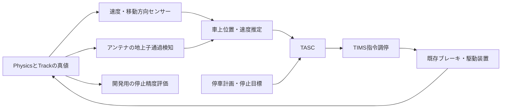

# BVEのTASC調査とNakatetsuへの適用案

調査日：2026-09-30。状態：調査・設計提案。TASCの実装や実走による停止精度の検証は今回の対象に含めない。

**採用を勧めるのは、停止目標・減速パターン・ノッチ選択を分け、走行結果をフィードバックする構造である。Nakatetsuでは、さらに経路と停止基準点、測定時刻、位置の不確かさ、指令の所有者、停車完了の条件を明示する。**

既存の [ATO・TASC実装方針](AtoTascImplementation.md) を補足する。既存書は2026-09-08時点の提案で、フォルダ案や実装状況に古い部分がある。本書の現状確認は調査時の作業ツリーを基準とする。後述する型・状態・閾値は、明記した既存コード以外は提案であり、確定済みの製品仕様ではない。

## 1. 「BVEのTASC」の調査範囲

BVEの標準プラグインAPIは、車両状態を受けてハンドル指令を返す仕組みを提供する。TASCの制御則・地上子番号・解除条件は各プラグインの仕様として調べる必要がある。今回は公開ソースまで確認できる **magicant/bve-autopilot** を主な比較対象にした。[BVE公式：プラグイン関数](https://bvets.net/jp/edit/formats/vehicle/atsfunctions.html)、[bve-autopilot](https://github.com/magicant/bve-autopilot)

| 確認対象 | 確認した内容と限界 |
| --- | --- |
| BVE公式の標準ATSプラグインAPI | `Elapse`、地上子受信、位置・速度・時刻、ブレーキ出力。BveEX等の拡張API全体についての制約とは区別する |
| bve-autopilotの解説・Wiki | 停止位置通知、パターン追従、低速処理、設定方式 |
| bve-autopilotのソース | `tasc.cpp`、`減速目標.cpp`、`減速パターン.cpp`、`制動力推定.cpp`、`加速度計.cpp`、`急動作抑制.cpp`を確認 |
| メトロ総合プラグインの作者公開仕様 | ATO/TASCと地上子互換の存在を確認。内部制御則を同一とはみなさない |

bve-autopilotのソースは、調査時のmasterであるコミット [`b1af67f1428e8fe7717ad7acea0c22f4beadf1ab`](https://github.com/magicant/bve-autopilot/tree/b1af67f1428e8fe7717ad7acea0c22f4beadf1ab)（コミット日時2025-12-13 UTC）を参照した。Wikiは別に更新される資料なので、コードと区別する。[メトロ総合プラグイン：ATO/TASC仕様](https://bveiweb.aikotoba.jp/bvetrainsim/plugin/mccp_for_route6-7/ato_tasc/ato_tasc.html)

以下で「BVE側」と書く場合も、共通APIの話か、bve-autopilot固有の話かを分けて記載する。実物のTASCの一般仕様へそのまま拡張しない。

## 2. BVE側でどう動くか

### 2.1 入力と出力

標準APIの `Elapse` は1フレームごとに呼ばれる。入力の `ATS_VEHICLESTATE` に位置[m]、速度[km/h]、時刻[ms]、BC圧[kPa]等があり、戻り値の `ATS_HANDLES` にブレーキ・力行等のノッチを入れる。地上子を越えると `SetBeaconData` が呼ばれる。[公式：関数](https://bvets.net/jp/edit/formats/vehicle/atsfunctions.html)、[公式：構造体](https://bvets.net/jp/edit/formats/vehicle/atsstructs.html)


プラグインは目標位置で車両座標を固定するのではなく、ブレーキ指令を通して運動を変える。ブレーキの立ち上がりが遅れれば、その間にも列車は進む。このため、残距離だけでなく速度と車両応答を使った閉ループ制御が必要になる。

注意：`ATS_BEACONDATA.Distance` は対応する**セクションまでの距離**であり、常に駅の停止位置までの距離という意味ではない。TASC用の距離が `Optional` に符号化される場合は、プラグイン固有仕様で復号する。[公式：構造体](https://bvets.net/jp/edit/formats/vehicle/atsstructs.html)

### 2.2 停止目標を知らせる地上子

bve-autopilotには相対式と絶対式がある。代表例は次の通り。[作者Wiki：地上子仕様](https://github.com/magicant/bve-autopilot/wiki/地上子仕様)

| 方式 | 種別 | 送る値 | 意味 |
| --- | --- | --- | --- |
| 相対式 | 1030 | 停止点までのm値×1000 | 地上子から何m先に止まるか |
| 絶対式 | 255 | 停止点の距離程[m] | 路線上のどこに止まるか |

相対式ではブレーキ開始より手前に通知し、接近後に再通知して距離情報を更新する配置が推奨される。1030・255は当該プラグインの規約であり、BVE全体のTASC標準番号ではない。同じ停止目標への両方式の混在も作者Wikiでは避けるよう指定されている。[地上子仕様](https://github.com/magicant/bve-autopilot/wiki/地上子仕様)

ソースでは、相対通知を受けた瞬間の位置を一点に決め打ちせず、直前位置と現在位置から停止目標が存在する区間を作る。複数通知の区間が重なれば絞り込む。重ならないときは受信した区間へ置き換える処理もある。これはフレーム間で通過を検知することへの対応として参考になる。[固定コミット：tasc.cpp](https://github.com/magicant/bve-autopilot/blob/b1af67f1428e8fe7717ad7acea0c22f4beadf1ab/bve-autopilot/tasc.cpp)

Nakatetsuでこの処理を応用するなら、食い違った通知で無条件に目標を置き換えず、駅・方向・経路・目標IDが一致するかを先に確認する。

### 2.3 パターンに徐々に近づける

bve-autopilotの解説では、期待速度と現在速度の差から要求減速度を補正する。基本形は `a_cmd = a_pattern + (v - v_pattern) / T`、説明上の `T` は2秒。実際の式には速度比の項があり、停止直前には別の補正も入る。低速処理、急な指令変化の抑制、停止時の緩めは、この公開実装の工夫として読む。[作者のアルゴリズム解説](https://github.com/magicant/bve-autopilot/blob/b1af67f1428e8fe7717ad7acea0c22f4beadf1ab/algorithm.md)

以下は理解とNakatetsu設計のための**単純化した計算例**で、公開実装の完全な再現式ではない。単位はすべてSI、減速度 `a` は正の大きさとする。

```text
d = 停止点までの符号付き残距離 [m]（手前で正）
v = 停止点へ向かう速度 [m/s]
a_p = 基準減速度 [m/s²]

v_pattern = sqrt(2 * a_p * d)             # d > 0 の通常接近域
a_required = v² / (2 * d)                # 同じく d > 0
a_command = a_p + (v - v_pattern) / T    # パターンへ徐々に戻す一例
```

例えば `a_p = 0.8 m/s²` の場合：

| 残距離 | パターン上の速度 |
| --- | --- |
| 100m | 約45.5km/h |
| 25m | 約22.8km/h |
| 1m | 約4.6km/h |

残り100mで50km/hなら、パターンより速いので制動を強める。40km/hなら弱める。TASC単独では速度不足を補うための力行は出さず、ブレーキを弱める範囲で調整する。

`d <= 0`、極低速、測定異常をこれらの式に入れない。`d` を小さな正数へ丸めるだけでは、通り過ぎたことを隠して巨大な減速度を要求する。オーバーラン、停止判定、保持ブレーキへ明示的に分岐する。

### 2.4 車両特性と停車後

bve-autopilotは、減速度からノッチへ変換する処理と、空気ブレーキが安定して働く条件で制動性能を推定する処理を持つ。推定ではBC圧や電流、速度変化などを参照しており、「どんな状況でも減速度だけから学習する」構造ではない。[固定コミット：制動力推定.cpp](https://github.com/magicant/bve-autopilot/blob/b1af67f1428e8fe7717ad7acea0c22f4beadf1ab/bve-autopilot/制動力推定.cpp)

停車後の保持・解除や前進インチングも機能として存在する。解除条件には設定があるので、ドアが閉まれば必ず同じ動作になると一般化しない。[作者README](https://github.com/magicant/bve-autopilot/blob/b1af67f1428e8fe7717ad7acea0c22f4beadf1ab/README.md)

## 3. Nakatetsuの現状と使える接続先

以下はローカルコードを確認した結果である。ATC関連には進行中の作業ツリーのファイルも含む。

| 現在のコード | 確認結果 | TASC実装時の扱い |
| --- | --- | --- |
| [TimsNotchContext](../../../Assets/Nakatetsu/Train/Equipment/Tims/Notch/Scripts/TimsNotchContext.cs) | `tascBrakeStep` と `atoPowerNotch` は既にある | 新しい同義フィールドを追加する前に既存入力の契約を完成させる |
| [TimsNotchLogic](../../../Assets/Nakatetsu/Train/Equipment/Tims/Notch/Scripts/TimsNotchLogic.cs) | 常用制動は `max(atcBrakeStep, manualBrakeStep)`。TASCは力行抑止にだけ参照される | 現状はTASC段を設定しても実制動へ合成されない。合成、入力有効性、指令理由を追加する |
| [TimsNotchController](../../../Assets/Nakatetsu/Train/Equipment/Tims/Notch/Scripts/TimsNotchController.cs) | 運転台・マスコンを収集。TASC装置からの入力収集はない | フィールドの存在だけでは車上装置との接続にならない |
| [TimsBrakeCalculator](../../../Assets/Nakatetsu/Train/Equipment/Tims/Brake/Scripts/TimsBrakeCalculator.cs) | `TryGetNearestBrakeStep` とノッチ間補間がある | 要求減速度から既存の細分化ステップへ変換できる |
| [TimsControlController](../../../Assets/Nakatetsu/Train/Equipment/Tims/Composition/Scripts/TimsControlController.cs) | 設定のkm/h/sをm/s²へ変換してブレーキ計算へ渡す | TASC内部はm/s²に統一し、二重変換しない |
| [SpeedSensorLogic](../../../Assets/Nakatetsu/Train/Equipment/SpeedSensor/Scripts/SpeedSensorLogic.cs) | `Math.Abs(signedPhysicalSpeedMps)` を測定値として出す | この値だけでは前進・後退を区別できない |
| [TimsSpeedController](../../../Assets/Nakatetsu/Train/Equipment/Tims/Speed/Scripts/TimsSpeedController.cs) | 最初の有効な車両速度を採用し、`Train.SpeedMps` / `Train.SpeedKmh` を公開 | 速度の有効性はあるが、TASC向けの測定時刻・移動方向は別途必要 |
| [TimsCommunicationController](../../../Assets/Nakatetsu/Train/Equipment/Tims/Communication/Scripts/TimsCommunicationController.cs) | 入力収集間隔のコード初期値は0.25秒。受信済み値で指令計算は毎tick行う | 計算周期と測定周期を別々に扱う。Scene設定により間隔は変わり得る |
| [TrainSimulationController](../../../Assets/Nakatetsu/Train/Simulation/Orchestration/Scripts/TrainSimulationController.cs) | 前ステップの物理状態を測定し、機器、物理、線路移動の順で更新 | 既存tickへ組み込み、TASC専用のUnity Updateを作らない |
| [TrainTrackPositionController](../../../Assets/Nakatetsu/Train/Simulation/TrackPosition/TrainTrackPositionController.cs) | EdgeとEdge内距離を持ち、車両上の任意オフセットで線路位置を取得できる | 地上子通過検知の物理側へ利用。TASCへ真値を直接渡し続けない |
| [TrackAtcLogic](../../../Assets/Nakatetsu/Track/Atc/Scripts/TrackAtcLogic.cs) | `Calculate` は空で、経路探索・停止限界計算は後続実装 | ATC Graphが存在することと、保安介入まで動くことを区別する |

専用TASCロジック、停止目標管理、地上子受信、車上位置推定は今回の検索範囲では未実装。物理側にはブレーキ保持、勾配、回生・空制の経路が既にあり、TASCがそれらを再実装する必要はない。

細分化ステップも完全な連続指令ではない。現在の変換はB1以降を補間し、B0とB1の間は補間しない。極低速でB0/B1を往復する可能性は、最小制動力、保持条件、ヒステリシスと併せて確認する。

## 4. 取り入れる点と独自に設計する点

| 論点 | BVEの調査から使える点 | Nakatetsuでの提案 |
| --- | --- | --- |
| 制御の分割 | 目標、パターン、ノッチ変換を分離 | 純粋C#のLogicとContextに分け、TIMSと物理の既存経路へ接続 |
| 地上子 | 接近前の通知と接近後の距離更新 | 型付きイベントにし、目標ID・方向・測定時刻を持たせる |
| 位置誤差 | 受信地点を区間として扱う発想 | 推定位置と不確かさを保持し、真値はシミュレーションと評価器が所有 |
| 減速度 | 車両応答を見ながら指令を補正 | TIMSの車種設定を初期値にし、測定値から必要な補正を行う |
| 停止直前 | 通常接近と極低速を分ける | 車種設定で末期制動を調整し、通り過ぎと保持を独立した状態にする |
| 停車後 | 保持と解除を別処理にする | TASC保持、ATC転動防止、手動ブレーキの所有者を分離 |
| 路線表現 | 一次元の残距離へ落として制御できる | 残距離の生成側がEdge列・方向・経路変更を扱う |
| 通過駅 | 停止対象を事前に選ぶ必要がある | 駅設備は共通に置き、列車の停車計画が目標を選択する |

この「独自」は新しい鉄道理論という意味ではなく、Nakatetsuの線路グラフ・機器分離・固定tickに合わせてプロジェクト側で契約を設計するという意味である。

### 4.1 停止目標と保安上の停止限界を分ける

`StationStopTarget` はホームの所定位置、ATCの停止限界は進行許可の終端である。例えばホーム停止点が100m先でも、ATCが60m先までしか許可していなければ保安側の要求を優先する。その手前停止を駅停車完了にしない。

将来のATOは両者の速度制約を同じ経路座標へ変換して参照できるが、所有者と解除条件は別に保つ。TASCは進路設定や停止限界の更新を行わない。

現在の [地上側ATC基本仕様](../../Track/Atc/TrackAtcGroundSpecification.md) は、地上から停止限界と順序付きATC Edge列を渡し、車上がGraphから速度制限・勾配を得る方針である。本提案もこの責務分担に合わせる。車上ATCとの座標契約・失効条件は未確定事項として残す。

### 4.2 停止する「車両上の点」を決める

現在の線路位置の基準は**0号車中心**である。ホームの停止標、列車先頭、地上子受信アンテナは別の点なので、オフセットを明示する。[車両上の線路位置](../../Track/Simulation/TrainTrackSampling.md)

提案する停止目標は、少なくとも次を持つ。

```text
StationStopTarget
  targetId / stationId / platformId
  graphRevision
  trackEdgeId / distanceOnEdgeM / approachDirection
  referencePointKind              # 列車先頭、指定アンテナ等
  applicableConsistProfileId       # 両数・編成仕様に対応する停止位置
  shortStopToleranceM / overrunToleranceM
```

両数が変われば使う停止点が変わり、折返せば先頭となる車両とアンテナが変わる。`frontFacesAtoB`、運転台選択、実際の移動方向を同義にしない。編成が後退しただけで車両順は反転しない。

残距離はUnityの直線距離や異なるEdgeのローカル距離の引き算で求めず、車上が把握した順序付き経路に沿って算出する。経路キーと版を持たせ、分岐変更で対象ホームへ到達できなくなったら目標を再検証する。将来の周回路ではEdge IDに加えて経路内の出現順も区別する。

### 4.3 真値・測定値・推定値を分離する

[物理量と測定値の方針](../../Architecture/PhysicalAndMeasuredValues.md) に従い、最初から境界を分ける。



初期センサーは誤差ゼロでもよい。ただしTASCが `TrainPhysicsContext.State` や物理Trackの現在位置を直接読む構成にはしない。車上地図から勾配を読む場合も、推定位置と受信した経路を使う。

位置推定には測定した**符号付き移動量または移動方向付き速度**が必要。現在の速度絶対値にレバーサーの向きを掛けるだけでは、坂道で意図と逆に転動したときに誤る。

推定位置には誤差上限を持たせる。例えば残距離推定が0.1mでも不確かさが±1mなら、±0.3m以内に停止したとは判定できない。定位置判定は推定した位置区間全体が許容域へ収まることを基本とする。真の停止誤差は開発用評価器だけが計算する。

地上子通過はアンテナの前tick位置から今回位置までの**通過した経路区間**で検知する。最寄りオブジェクト検索やColliderの接触だけに依存させない。複数地上子を1tickで通過したら順に処理し、経路変更、逆走、テレポート、再読込を通常の通過イベントと区別する。

### 4.4 測定時刻と制御周期を分ける

コード初期値の0.25秒間隔で受信する速度を20msごとに再計算しても、新しい測定にはならない。例えば5km/hで0.25秒に進む距離は約0.35mであり、停止精度に対して無視できない長さである。これは遅延だけで必ず0.35mずれるという意味ではなく、情報の古さを考慮すべき規模を示す。

TASC向け測定契約に以下を追加する案を推奨する。

```text
Measurement
  value / isValid
  sampledAtTick / sampleSequence
  directionValidity

PositionEstimate
  routeKey / routeRevision
  estimatedDistanceToStopM / uncertaintyM
  lastAcceptedBeaconId / lastCorrectionTick
```

同じ `sampleSequence` を繰り返し受けても新観測として加速度計算しない。新しい2測定の差を、その**測定間隔**で割り、フィルターを通す。古い速度が階段状に更新されるたびに20msで割ると、減速度推定が過大になる。

推奨する初期接続は、車上の速度センサーからTASCへ毎tickの測定スナップショットを供給する専用Adapterである。TIMSは監視・指令の通信に使う。これは物理真値を直接読む変更ではなく、車上のセンサー信号をどこへ配線するかの設計である。TIMS経由の0.25秒入力を再現するモードも後で比較できるようにする。

初期TASC計算は世界の固定tickで行う案とする。既存書の0.1秒案は固定値として引き継がず、周期を落とす場合もtickの整数倍で実行する。早送り、一時停止、手動1tickは同じ時間系を使う。[世界時計と固定tick](../../Architecture/WorldTick.md)

### 4.5 指令の所有者を残す

常用ブレーキの合成案は次の通り。すべて同じステップ尺度・範囲へ変換した後で比較する。

```text
serviceStep = max(manualStep, tascStep, atcStep, otherHoldStep)
emergencyRequested = 既存の非常要求の集約
tractionPermitted = 非常なし AND serviceStep == 0 AND その他の力行条件
```

各要求には `source / isActive / isValid / issuedAtTick / reason` を付ける。最大値だけを残すと、どの装置を解除すればよいか分からなくなる。TASCがB0になってもATCや手動の制動は継続する。TASCが有効で指令が欠落した場合は、「装置が正常にB0を出した状態」と区別する。

TASC単独モードは力行を要求しない。手動の強いブレーキは上書きできるが、それをTASC解除とみなすかは別条件にする。解除時に残っていた力行ノッチで突然加速しないよう、停止中の手動引継ぎ、力行0、引継ぎ後の保持要求を確認する案とする。

## 5. Nakatetsu向けの制御設計案

### 5.1 要求減速度と車両応答

最初は既存TIMSの減速度テーブルを使い、パターン追従で要求減速度を計算して `TryGetNearestBrakeStep` 相当へ渡す。最近傍ステップは要求値より弱くなる場合もあるため、停止余裕が不足するときの強い側への選択と、通常時のチャタリング抑制を区別する。

車両応答を扱う設定は、車種ごとに次を持たせる案とする。

- 指令から制動力が立ち上がるまでの遅れと、込め・緩めの応答。
- パターンの基準減速度、常用上限、最低保持ステップ。
- ノッチ変更の最小保持時間、上げ下げ別の閾値。
- 停止直前の切替速度、停止判定速度、判定継続時間。

説明用の概算として、速度 `v`、無制動相当の遅れ `τ`、その後の一定減速度 `a` なら、停止距離は `v * τ + v² / (2a)`。実際には残留制動や力の立ち上がりがあるので、これを正確な予測器とはしない。遅れの実測後、現在指令と候補指令から短時間の停止位置を予測する方式へ拡張できる。

勾配補正は符号と責務を固定する。進行方向の上りを正の勾配 `i` とした単純モデルでは、走行抵抗を省略した実減速度は `a_actual ≈ a_brake + g*i`。よって必要なブレーキ相当減速度は `a_brake ≈ a_desired - g*i` となり、下りで増える。Physicsは既に勾配力を計算するので、TASCが物理側へ同じ勾配力を再加算しない。フィードバックにも勾配分が含まれるため、補正を二重に数えない。

制動力学習は第2段階以降とする。回生・空制切替、指令変更直後、測定欠落、逆走、ATC/手動の介入中は、何による減速度か切り分けにくい。学習を停止する条件と、推定値の変化上限を先に定める。

### 5.2 状態機械

| 状態案 | 意味 | 主な遷移条件 |
| --- | --- | --- |
| Disabled | TASCを使用しない | 有効化でWaitingTarget |
| WaitingTarget | 目標の受信・選択待ち | 有効な目標と測定でArmed |
| Armed | 目標はあるが制動開始前 | 接近条件成立でApproach |
| Approach | 減速パターンへ追従 | 低速域でFinalBrake |
| FinalBrake | 停止直前の安定制御 | 停止条件成立でHolding、許容域外ならStopError |
| Holding | 定位置に停止し保持 | 明示的な出発・手動引継ぎ条件で保持解除 |
| StopError | 手前停止・過走など | 保持を継続し、位置修正または手動引継ぎ |
| Fault | 必須測定・目標整合性等の異常 | 運転中は所定の常用制動と力行抑止、復帰条件を確認 |

TASCが動作中に入力を失った場合、最後の有効な保持要求と設定した異常時常用制動の強い方を保ち、異常理由を出す案とする。実際の非常要求は既存の保安装置・入力欠損方針とも調停する。運転途中のFaultを自動でDisabledへ戻して制動を消さない。

停止完了は「目標点を通過した」だけでは成立しない。測定速度が閾値以下で一定時間続き、位置の推定区間が許容域に収まり、方向・目標IDが有効であることを必要とする。ゼロ速度だけでは、駅手前の信号停止まで定位置停止にしてしまう。

制御式の切替時は、前回の出力から連続的につなぎ、必要に応じてジャーク・ノッチ変更頻度を制限する。ただし保安介入を乗り心地制限で遅らせない。低速で一律に緩めるか一定制動を保つかは、車両モデルで比較して決める。

### 5.3 停車判定・ドア・出発の分離

次の3つを別の信号として扱う。

1. `StoppedInPosition`：TASCが定位置停止を認識した。
2. `DoorReleasePermitted`：停車位置、開扉側、対象ホーム等から開扉してよい。
3. `DeparturePermitted`：戸閉、運転方向、運転士操作、保安側の進行条件等がそろった。

TASC単独MVPでは自動開扉・自動出発を追加せず、状態を出力するところまでとする。停車計画の完了と次目標への移行も、単なる速度0や閉扉イベントだけで決めない。

既存ATC仕様では、駅停車後の0km/h現示は先へ進める進路成立で解除し、開扉中の転動防止Brはそれと独立して継続する。閉扉が解除するのは開扉由来の要求であり、TASC保持や手動制動まで消す条件にはしない。[地上側ATC基本仕様](../../Track/Atc/TrackAtcGroundSpecification.md)

インチングは後続機能とする。追加する場合は、手前停止、戸閉、進行方向、保安条件、運転士からの明示要求を確認する。オーバーラン時の自動後退は別仕様にし、TASCの通常停止処理から発動しない。

## 6. 配置と更新順の案

現行の `Equipment / Simulation / Integration` の境界に合わせる。以下の新規型・ディレクトリは配置案であり、今回生成していない。

```text
Train/Equipment/AutomaticOperation/Tasc/{Scripts,Tests}/
  TascContext / TascLogic / TascController
  TascPatternCalculator

Train/Equipment/PositionEstimation/{Scripts,Tests}/
  車上位置推定・測定の鮮度管理

Train/Equipment/Tims/AutomaticOperation/Scripts/
  TASC指令の入力Adapterと状態BusSource

Track/Operations/                       # 停止点・地上子の静的定義
Train/Simulation/                       # 物理的な地上子通過検知
Train/Integration/                     # 経路ID・測定・装置接続の組立て
Application/                           # 将来の停車計画・シナリオ設定
```

現在の `TimsCommunicationController` は速度公開から `TimsControlController` の指令計算まで続けて呼んでいる。TASCを通常Equipmentの列へ追加するだけでは、そのtickのNotch計算に間に合わない。次の順序になるよう、既存オーケストレーションに明示的な段階を設ける必要がある。

```text
tick開始
  1. 前tickの物理状態をセンサーが測定
  2. TIMS入力収集・測定値公開、前tickの地上子イベントを受信
  3. 車上位置推定と目標整合性を更新
  4. 車上ATC・TASCが各要求を計算
  5. TIMS Notchで調停 → Brake/Tractionで車両別指令を計算
  6. 既存Equipment・物理モデル → Physics → Track移動
  7. アンテナの通過区間から地上子イベントを生成し次tickへ保持
tick終了
```

地上子イベントは通過時刻と対応位置基準を持つ。受信を1tick遅らせても、通過後の移動を重複積算しないよう、イベント時刻から現在の測定時刻までを補償する。TASCは各tickで1回だけ進め、AdapterやBusSourceに独自の時間進行を持たせない。

## 7. 実装順と確認項目

### 最初の実装範囲

1. 停止基準点・方向付き停止目標・測定時刻の契約を作る。固定経路、1停止点、理想センサーから開始する。
2. `TascLogic` を純粋C#で作り、Approach / FinalBrake / Holding / 異常状態を扱う。
3. `tascBrakeStep` の入力経路と実ブレーキ合成を完成させる。ATC・手動・非常が優先できることを検証する。
4. 既存ブレーキ、Physics、Trackを通して停止させ、真値と推定値を別に記録する。
5. 地上子による補正、分岐・折返し、遅延・測定誤差を追加する。
6. 性能学習、インチング、ATOの駅間走行・自動出発へ拡張する。

ATCは実制御が未実装なので、最初のTASC単体試験は固定入力の保安要求で行える。これをもってATCと統合済みとはしない。

### 合否を決められる確認ケース

| ケース | 確認する結果 |
| --- | --- |
| TASCのみB段を要求 | 力行抑止だけでなく、TIMSの制動指令と実制動力が発生する |
| 手動／ATCがTASCより強い | 強い要求が採用され、TASC解除後も継続する |
| 平坦・上り・下り、複数進入速度・荷重 | 符号付き停止誤差と最大ジャークを記録し、設定した許容域へ入る |
| 同じノッチで回生能力低下、空制応答遅延 | 停止誤差と指令補正を観測し、能力不足を黙って成功にしない |
| 0.25秒受信、毎tick受信、測定欠落 | 重複サンプルで偽の加速度を作らず、欠落はゼロ速度と区別する |
| 地上子を1tickで複数通過、二重受信、誤方向受信 | 正しい順序・一回性・方向と目標の整合性を保つ |
| 分岐変更、折返し、テレポート | 古い目標・補正履歴を別の経路に適用しない |
| 坂で後退、運転台切替 | 実際の移動方向で距離を積算し、停止基準点を再選択する |
| 手前停止・オーバーラン | StopErrorと保持へ移り、自動で成功・後退・出発にしない |
| 停車中の開閉扉、出発進路設定 | ATC現示、ATC転動防止、TASC保持が各条件で独立して変化する |
| 通過列車と停車列車が同じホームを走る | 停車計画に従ってTASC目標の選択が変わる |
| 通常速度・早送り・手動tick・将来の保存復元 | 同じ初期値・入力列・tick数なら状態と指令列が一致する |

記録項目：tick、sampleSequence、測定経過時間、目標ID、経路版、残距離推定と不確かさ、測定速度、推定減速度、要求減速度、各装置の要求段、採用段と理由、BC圧、回生力、TASC状態。実位置・実速度・真の停止誤差は開発ログの別項目にする。

停止誤差の許容値、最大ジャーク、故障時の制動強度などは車種・ホーム仕様に合わせて決める。上記の数値例は合格値ではない。保存復元にはフィルター履歴、最後のサンプル番号、地上子受信履歴、保持タイマー、経路版、未処理イベントも必要になる。

## 8. 今回の結論

Nakatetsuには、細分化ブレーキ、回生・空制配分、物理運動、線路グラフ、固定tickという土台がある。まずTASCの要求を実際の制動へ通し、位置と速度を測定経由で戻す閉ループを完成させるのがよい。

BVEから得られる制御の工夫に加えて、**停止基準点と経路、観測時刻と不確かさ、停止目標と停止限界、保持要求の所有者**を明確にすると、このプロジェクトの分岐・折返し・複数列車・故障再現へ拡張しやすい。

本調査はソースと資料の比較であり、BVEプラグインの実走比較やNakatetsuの停止精度保証は行っていない。外部コードの転載・移植は行わず、実装を直接再利用する場合の参照先として、対象ソースが示す [LGPL-2.1以降のライセンス](https://github.com/magicant/bve-autopilot/blob/b1af67f1428e8fe7717ad7acea0c22f4beadf1ab/LICENSE) を記録する。
