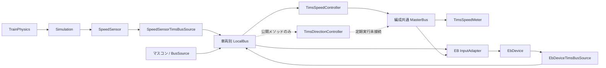

# 装置とTIMS Bus・タグの接続一覧

2026-09-15、同期した `main` / `origin/main` の `18bb80a3665e38676ae84a6f408e0a06bf86b717` を基準に、現行C#、追跡対象のScene・Prefab・車両定義を調査した。実行中のSceneを観測した記録ではない。テストや設計例だけにあるタグは含めない。

**速度の測定→LocalBus→MasterBus→速度計は更新経路まで接続済み。方向・ノッチ・力行・ブレーキのTIMS計算には公開メソッドがあるが、定期実行への接続がまだない。** 以下では「読み書きするコードがある」と「通常更新で値が供給される」を区別する。

## Busの読み方

- **LocalBus**：編成内の車両ごとに1つ。装置の `TrainEquipmentAssignment.AssignedCarIndex` が送信先を決める。前側はindex 0、後側は `CarCount - 1`。
- **MasterBus**：`TimsCommunicationController` が持つ編成共通のBus。LocalBusの内容が自動でコピーされるわけではなく、各TIMS Controllerが必要な値を読み、別のキーで公開する。
- 表の `Device/Item` は `new TimsTagKey("Device", "Item")` の略記。例えば `Train/SpeedKmh` と資料中の `Train.SpeedKmh` は同じ2要素のキーを指す。
- 「固定読取先なし」は、現行コードにそのキーを指定した利用先がないという意味。汎用表示部品への将来の設定は含めない。
- 同じキーでもLocalBusが違えば別の値。前後EBや各車速度センサーはキーに車両番号を付けず、Busのindexで区別する。別編成では別のCommunication ControllerとBusを使う。

## 装置から見た全体像

| 装置・機能 | 読むBusと情報 | 書くBusと情報 | 現在の接続状態 |
| --- | --- | --- | --- |
| マスコン `MasterController` | TIMSからの入力なし | 自車Local：`MasterController/*` 7項目 | 専用BusSourceを共通Prefabに配置済み |
| 運転台選択スイッチ `CabActivationSwitchController` | TIMSからの入力なし | 自車Local：`CabActivationSwitch/Position` | BusSource入りPrefabあり。ただしBuilderの専用フィールドからの生成は未接続 |
| 速度センサー `SpeedSensor` | Simulationから物理速度を受ける | 自車Local：`SpeedSensor/MeasuredSpeedMps` | Tc1・Tc2・M・Tに登録済み。専用BusSourceで送信 |
| 速度集約 `TimsSpeedController` | 全車Local：測定速度 | Master：`Train/*` 3項目 | 通信収集後に自動実行 |
| EB `EbDevice` | 自車Local：マスコン4項目、Master：有効運転台 | 自車Local：`EB/*` 3項目 | 入力Adapter・BusSourceをTc1・Tc2のEB Prefabに配置済み。有効運転台の供給は未接続 |
| 方向判定 `TimsDirectionController` | 前後Local：選択スイッチ・逆転器 | Master：`Direction/*` 3項目 | 公開メソッドあり。Scene／Prefab配置・定期実行なし |
| ノッチ解決 `TimsNotchController` | Local：力行・ブレーキ位置、Master：有効運転台 | Master：`Notch/*` 6項目 | 入力収集・公開メソッドあり。Scene／Prefab配置・定期実行なし |
| 力行装置 `VvvfController` | Master：`Traction/TargetTractionForcesN` | 自車Local：`Traction/*` 状態4項目 | 指令AdapterはPrefabに配置済み。状態BusSourceは配置なし |
| 力行計算 `TimsTractionController` | Bus入力収集なし。外部からContextを設定する | Master：`Traction/TargetTractionForcesN` | 公開メソッドあり。Scene／Prefab配置・定期実行なし |
| ブレーキ装置 `BrakeControlDevice` | Master：`Brake/TargetAirBrakeForcesN` | 現行の専用状態タグなし | 指令Adapterを共通Prefabに配置済み |
| 制動配分 `TimsBrakeController` | Bus入力収集なし。外部からContextを設定する | Master：`Brake/*` 2項目 | 公開メソッドあり。Scene／Prefab配置・定期実行なし |
| 速度計 `TimsSpeedMeter` | Master：編成速度・ATC表示情報 | なし | Prototype/Tims Sceneに設定済み。ATC情報の送信元は未実装 |
| 汎用ランプ `TimsBoolIndicator` | 設定したMasterまたはLocalのBool | なし | Prefabのキーは未設定。特定装置との接続なし |

実線も装置の生成・車両割り当て・親TrainRootの設定が前提。EB入力のMasterBus参照は実装済みだが、方向判定の定期実行がない現状では、有効運転台タグが別途供給されない限りEBは監視を開始しない。

## LocalBusのタグ：16項目

表の読取先は実装上の参照先。方向・ノッチControllerの定期実行が未接続である点は上表のとおり。

### マスコン

送信元：[MasterControllerTimsBusSource](../../../Assets/Nakatetsu/Train/Equipment/Tims/Operation/MasterController/Scripts/MasterControllerTimsBusSource.cs) → 所属車両のLocalBus。

| TimsTagKey | 型・意味 | 固定読取先 |
| --- | --- | --- |
| `MasterController/PowerPosition` | Int：力行位置 | `TimsNotchController`、自車の `EbDeviceTimsInputAdapter` |
| `MasterController/BrakePosition` | Int：ブレーキ位置 | `TimsNotchController`、自車のEB入力Adapter |
| `MasterController/ServiceBrakePosition` | Int：常用範囲に制限したブレーキ位置 | なし |
| `MasterController/ReverserPosition` | Int：Reverse=-1、Neutral=0、Forward=1 | 前後の `TimsDirectionController`、自車のEB入力Adapter |
| `MasterController/IsNeutral` | Bool：マスコン中立 | なし |
| `MasterController/IsEmergency` | Bool：マスコンの非常位置 | なし |
| `MasterController/IsInputEnabled` | Bool：操作入力有効 | 自車のEB入力Adapter |

ノッチControllerは各車の位置を収集し、MasterBusの有効運転台indexに対応する入力を選ぶ。`MasterController/IsEmergency` はEB装置の無操作による非常要求とは別の値。

### 運転台選択・速度センサー・EB

| TimsTagKey | 型・単位 | LocalBusへの送信元 | 固定読取先 |
| --- | --- | --- | --- |
| `CabActivationSwitch/Position` | Int：Rear=-1、Off=0、Front=1 | `CabActivationSwitchTimsBusSource` ← 選択スイッチ | `TimsDirectionController`（前後Local） |
| `SpeedSensor/MeasuredSpeedMps` | Float：非負、m/s | `SpeedSensorTimsBusSource` ← 速度センサー | `TimsSpeedController`（各車Local） |
| `EB/IsEmergencyBrakeRequested` | Bool：無操作による非常要求 | `EbDeviceTimsBusSource` ← EB Output | なし |
| `EB/InactivitySeconds` | Float：無操作時間、s | 同上 | なし |
| `EB/RemainingSeconds` | Float：作動までの時間、s | 同上 | なし |

EBは自車のマスコン4項目とMasterBusの有効運転台を読む。自車が有効運転台側・入力有効・必要情報を取得できる場合だけ監視し、既定60秒の無操作で要求を出す。力行・ブレーキ・逆転器の変化で計時をリセットする。**速度による監視条件はまだない。** 監視対象外や入力欠損では計時と要求をリセットするため、EB出力だけでは通信の健全性を判別できない。

速度測定が無効ならLocalの速度タグを削除する。EBは初回計算前には未公開で、無効な送信元／EBのタグは次の収集で削除する。詳細：[速度測定](SpeedMeasurement.md)、[EB状態公開](EbStatus.md)。

送信元コード：[選択スイッチ](../../../Assets/Nakatetsu/Train/Equipment/Tims/Operation/CabActivationSwitch/CabActivationSwitchTimsBusSource.cs)、[速度](../../../Assets/Nakatetsu/Train/Equipment/Tims/Speed/Scripts/SpeedSensorTimsBusSource.cs)、[EB](../../../Assets/Nakatetsu/Train/Equipment/Tims/Safety/Eb/Scripts/EbDeviceTimsBusSource.cs)。

### 力行装置の状態

送信元：[TimsTractionBusSource](../../../Assets/Nakatetsu/Train/Equipment/Tims/Traction/Scripts/TimsTractionBusSource.cs) が同じGameObjectの `ITractionEquipment` を読む。現行Scene／PrefabにこのBusSourceは配置されていない。

| TimsTagKey | 型・単位 | 固定読取先 |
| --- | --- | --- |
| `Traction/IsAvailable` | Bool：装置が利用可能か | なし |
| `Traction/MotorCount` | Int：モーター数 | なし |
| `Traction/RatedPowerW` | Float：定格出力、W | なし |
| `Traction/ActualTractionForceN` | Float：実牽引力、N | なし |

`TimsTractionController` はこれらのLocalタグをまだ入力収集していない。BusSourceを配置するだけでは力行計算へ自動接続されない。

## MasterBusのタグ：公開処理あり15項目

### 方向・有効運転台

送信元：[TimsDirectionController.CalculateAndPublish()](../../../Assets/Nakatetsu/Train/Equipment/Tims/Operation/Direction/Scripts/TimsDirectionController.cs)。呼ぶと前後LocalBusを読んで計算・公開するが、通常更新からの呼び出しはない。

| TimsTagKey | 型・意味 | 固定読取先 |
| --- | --- | --- |
| `Direction/ActivatedCabPosition` | Int：Rear=-1、None=0、Front=1 | `EbDeviceTimsInputAdapter`、`TimsNotchController` |
| `Direction/ReverserPosition` | Int：選択した運転台の逆転器位置 | なし |
| `Direction/ConsistDirectionSign` | Int：編成基準の方向、-1 / 0 / 1 | なし |

EBの有効運転台判定はFrontならindex 0、Rearなら最後尾。None・欠損・型不一致・不正値では監視しない。

### ノッチ

送信元：[TimsNotchController](../../../Assets/Nakatetsu/Train/Equipment/Tims/Notch/Scripts/TimsNotchController.cs)。`CollectInput()` → `CalculateAndPublish()` の順に外部から呼ぶ必要がある。

| TimsTagKey | 型・意味 | 固定読取先 |
| --- | --- | --- |
| `Notch/IsEmergencyBrakeRequested` | Bool：ノッチ解決結果の非常要求 | なし |
| `Notch/ResolvedPowerNotch` | Int：解決済み力行ノッチ | なし |
| `Notch/ResolvedBrakeStep` | Int：解決済みブレーキ段（substep設定に依存） | なし |
| `Notch/ManualBrakeStepLabel` | String：手動ブレーキ表示 | なし |
| `Notch/BrakeStepLabel` | String：解決済みブレーキ表示 | なし |
| `Notch/ResolvedNotchLabel` | String：解決済みノッチ表示 | なし |

現行の力行・ブレーキControllerはこれらを読み込まない。EB Localの非常要求からこの非常要求へ集約する処理もない。

### 編成速度

送信元：[TimsSpeedController](../../../Assets/Nakatetsu/Train/Equipment/Tims/Speed/Scripts/TimsSpeedController.cs)。通信Controllerが実行時に同じGameObjectへ確保し、LocalBus収集後に計算・公開する。

| TimsTagKey | 型・単位 | 固定読取先 |
| --- | --- | --- |
| `Train/SpeedMps` | Float：非負、m/s | なし（EB・ATC・力行の入力接続は今後） |
| `Train/SpeedKmh` | Float：非負、km/h | `TimsSpeedMeter` |
| `Train/HasValidSpeed` | Bool：有効な測定速度あり | なし（速度計は速度タグの取得成否を見る） |

車両index順で最初の有効なLocal測定値を採用する。有効運転台とは独立。全車取得不能なら速度2タグを削除し `HasValidSpeed=false`、有効な停車なら速度0かつ `true`。無効値・欠損と停車を区別する。

### 力行・空気ブレーキ指令

| TimsTagKey | 型・単位 | MasterBusへの送信元 | 固定読取先 |
| --- | --- | --- | --- |
| `Traction/TargetTractionForcesN` | Float[]：牽引力指令、N | `TimsTractionController` | `TimsTractionCommandAdapter` → `VvvfController` |
| `Brake/TargetAirBrakeForcesN` | Float[]：車両別空制力指令、N | `TimsBrakeController` | `BrakeControlDeviceTimsAdapter` → `BrakeControlDevice`。Controller自身にも取得用メソッドあり |
| `Brake/IsEmergency` | Bool：制動配分結果の非常状態 | `TimsBrakeController` | なし |

両Controllerは外部から設定されたContextで `CalculateAndPublish()` を実行する。Busから入力を揃える処理と定期実行は未接続。指令を出さない計算結果では指令配列タグを削除する。

両入力AdapterはMaster配列を **`AssignedCarIndex` で引く**。ただし牽引力の公開配列は現状 `Input.units` と同じ装置順の `unitTargetForcesN` をそのままコピーする。装置順と車両順が一致する保証はないため、接続時には車両indexへの対応付けが必要。例えばM車だけを詰めた配列は車両indexでは読めない。

`EB/IsEmergencyBrakeRequested`（Local）、`Notch/IsEmergencyBrakeRequested`（Master）、`Brake/IsEmergency`（Master）は別々のタグであり、現状は一連の非常ブレーキ経路として接続されていない。

コード：[力行Controller](../../../Assets/Nakatetsu/Train/Equipment/Tims/Traction/Scripts/TimsTractionController.cs)、[力行Adapter](../../../Assets/Nakatetsu/Train/Equipment/Tims/Traction/Scripts/TimsTractionCommandAdapter.cs)、[制動Controller](../../../Assets/Nakatetsu/Train/Equipment/Tims/Brake/Scripts/TimsBrakeController.cs)、[ブレーキAdapter](../../../Assets/Nakatetsu/Train/Equipment/Tims/Brake/Scripts/BrakeControlDeviceTimsAdapter.cs)。

## 表示側だけに存在するキー・設定

[TimsSpeedMeter](../../../Assets/Nakatetsu/Train/Equipment/Tims/Display/SpeedMeter/Scripts/TimsSpeedMeter.cs) はキーをInspectorで変更できる。追跡対象の [Prototype/Tims Scene](../../../Assets/Scenes/Prototype/Tims.unity) では以下が設定されている。

| Bus | TimsTagKey | 読取型・単位 | 送信元 |
| --- | --- | --- | --- |
| Master | `Train/SpeedKmh` | FloatまたはInt、km/h | 上記の速度Controller（Floatで公開） |
| Master | `ATC/PatternAllowSpeedKmh` | FloatまたはInt、km/h | 現行コードに公開処理なし |
| Master | `ATC/HasValidPattern` | Bool | 現行コードに公開処理なし |

ATC有効性を要求する設定も有効。ATCの2キーは「送信実装済み31項目」には数えない。

[TimsBoolIndicator](../../../Assets/Nakatetsu/Train/Equipment/Tims/Display/Indicators/Scripts/TimsBoolIndicator.cs) は `target` でMaster／Localを選び、Localなら `localCarIndex` を使う。`deviceName`・`itemName` のBoolを読むが、共通Prefabではキーが空でTIMS参照も未設定。EBランプなどとしての接続はまだない。

## いつ更新されるか

通常の [TrainSimulationController](../../../Assets/Nakatetsu/Train/Simulation/Orchestration/Scripts/TrainSimulationController.cs) と [TimsCommunicationController](../../../Assets/Nakatetsu/Train/Equipment/Tims/Communication/Scripts/TimsCommunicationController.cs) の経路は次のとおり。

1. 前ステップで確定したPhysics Outputを速度センサー群へ入力し、測定を計算・反映する。
2. `CollectInputSources()` → `CollectSources()` で編成配下の `ITimsBusSource` を収集し、割り当てられた各車LocalBusへ書く。
3. `TimsSpeedController.CalculateAndPublish()` がLocal測定値を選び、Master速度を公開する。
4. EB・VVVF・ブレーキ等の装置群を、全体の入力収集→計算→反映の順に進める。
5. 物理モデルとPhysicsを更新する。表示部品はBusの値を読む。

速度は同じ測定ステップ内にLocal→Masterへ反映される。EB状態の送信はEB計算より前なので、**前ステップのEB Outputが公開される**。低レベルの `CollectSources()` だけでは速度のMaster集約は実行されない。

方向・ノッチ・力行・制動配分Controllerはこの更新列に入っていない。またBusは値を保持する入れ物で、全キー共通のタイムアウトや受信時刻による失効処理はない。欠損・無効時の削除やリセットは個別実装の契約を確認する。

## 接続を進めるときの確認箇所

| 箇所 | 現状と必要な接続 |
| --- | --- |
| 運転台スイッチの生成 | `CarDefinitionAsset.cabActivationSwitchPrefab` はあるが、[TrainEquipmentBuilder](../../../Assets/Nakatetsu/Train/Equipment/Shared/Scripts/TrainEquipmentBuilder.cs) はこの欄を生成していない。スイッチ生成と車両割り当てが必要 |
| 方向→EB・ノッチ | 方向Controllerを配置し、Local収集後かつ利用側の入力収集前に更新する経路が必要 |
| ノッチ→力行・制動配分 | 計算入力の収集と実行順の接続が必要。キーを定義しただけでは下流に伝わらない |
| 力行装置の状態送信 | VVVF Prefab等への `TimsTractionBusSource` 配置と、利用側の入力収集が必要 |
| 車両別指令 | 力行配列の装置順／車両順を合わせてから指令経路を接続する |
| EBの実制動・表示 | Localの要求を制動指令へ反映する処理、予告警報・表示への接続は未実装 |
| 測定速度の利用先 | EB・ATC・力行はMaster速度をまだ読まない。VVVFへのSimulationからの物理速度Setterは暫定接続として残る |
| その他の状態表示 | ドア・圧力・荷重等は、この調査対象では固定タグの送受信経路なし。設計資料の表示例と現行実装を区別する |

新しいタグや接続を追加したら、送信元・受信先・Bus・型／単位・欠損時動作・更新順と、Prefab／Sceneへの配置状況をこの一覧にも反映する。
