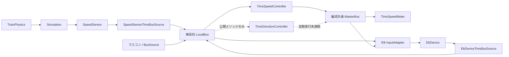

# 装置とTIMS Bus・タグの接続一覧

2026-09-15、同期した `main` / `origin/main` の `18bb80a3665e38676ae84a6f408e0a06bf86b717` を基準に、現行C#、追跡対象のScene・Prefab・車両定義を調査した。実行中のSceneを観測した記録ではない。テストや設計例だけにあるタグは含めない。

2026-10-03追記：各車LocalBusへのマスコンキー挿入状態の送信を追加し、該当タグと項目数を更新した。

**速度の測定→LocalBus→MasterBus→速度計は更新経路まで接続済み。方向・ノッチ・力行・ブレーキのTIMS計算には公開メソッドがあるが、定期実行への接続がまだない。** 以下では「読み書きするコードがある」と「通常更新で値が供給される」を区別する。

## Busの読み方

- **LocalBus**：編成内の車両ごとに1つ。装置の `TrainEquipmentAssignment.AssignedCarIndex` が送信先を決める。前側はindex 0、後側は `CarCount - 1`。
- **MasterBus**：`TimsCommunicationController` が持つ編成共通のBus。LocalBusの内容が自動でコピーされるわけではなく、各TIMS Controllerが必要な値を読み、別のキーで公開する。
- 機器情報の収集周期は、各車のLocalBusが`localCollectionIntervalSeconds`、編成共通機器のMasterBusが`masterCollectionIntervalSeconds`。初期値は各0.25秒で、別々にシミュレーション時間を計時する。TIMS内部の計算・公開は毎tick続ける。
- 表の `Device/Item` は `new TimsTagKey("Device", "Item")` の略記。例えば `Train/SpeedKmh` と資料中の `Train.SpeedKmh` は同じ2要素のキーを指す。
- 「固定読取先なし」は、現行コードにそのキーを指定した利用先がないという意味。汎用表示部品への将来の設定は含めない。
- 同じキーでもLocalBusが違えば別の値。前後EBや各車速度センサーはキーに車両番号を付けず、Busのindexで区別する。別編成では別のCommunication ControllerとBusを使う。

## 装置から見た全体像

| 装置・機能 | 読むBusと情報 | 書くBusと情報 | 現在の接続状態 |
| --- | --- | --- | --- |
| マスコン `MasterController` | TIMSからの入力なし | 自車Local：`MasterController/*` 8項目 | 専用BusSourceを共通Prefabに配置済み |
| 運転台選択スイッチ `CabActivationSwitchController` | TIMSからの入力なし | 自車Local：`CabActivationSwitch/Position` | BusSource入りPrefabあり。ただしBuilderの専用フィールドからの生成は未接続 |
| 速度センサー `SpeedSensor` | Simulationから物理速度を受ける | 自車Local：`SpeedSensor/MeasuredSpeedMps` | Tc1・Tc2・M・Tに登録済み。専用BusSourceで送信 |
| 速度集約 `TimsSpeedController` | 全車Local：測定速度 | Master：`Train/*` 3項目 | 通信収集後に自動実行 |
| EB `EbDevice` | 自車Local：マスコン4項目、Master：有効運転台 | 自車Local：`EB/*` 4項目 | 入力Adapter・BusSourceをTc1・Tc2のEB Prefabに配置済み。有効運転台の供給は未接続 |
| 方向判定 `TimsDirectionController` | 前後Local：選択スイッチ・逆転器 | Master：`Direction/*` 3項目 | 公開メソッドあり。Scene／Prefab配置・定期実行なし |
| ノッチ解決 `TimsNotchController` | Local：力行・ブレーキ位置、Master：有効運転台 | Master：`Notch/*` 6項目 | 入力収集・公開メソッドあり。Scene／Prefab配置・定期実行なし |
| 力行装置 `VvvfController` | Master：`Traction/TargetTractionForcesN` | 自車Local：`Traction/*` 状態4項目 | 指令AdapterはPrefabに配置済み。状態BusSourceは配置なし |
| 力行計算 `TimsTractionController` | Bus入力収集なし。外部からContextを設定する | Master：`Traction/TargetTractionForcesN` | 公開メソッドあり。Scene／Prefab配置・定期実行なし |
| ブレーキ装置 `BrakeControlDevice` | Master：`Brake/TargetAirBrakeForcesN` | 現行の専用状態タグなし | 指令Adapterを共通Prefabに配置済み |
| 制動配分 `TimsBrakeController` | Bus入力収集なし。外部からContextを設定する | Master：`Brake/*` 2項目 | 公開メソッドあり。Scene／Prefab配置・定期実行なし |
| 車上ATC表示 `TrainAtcTimsDisplayAdapter` | 車上ATCの計算結果 | Master：`ATC/*` 表示情報 | ATC Prefabに配置済み。Equipmentの出力段階で公開 |
| 速度計 `TimsSpeedMeter` | Master：編成速度・ATC表示情報 | なし | 三角表示は車上ATCの常用パターン速度に接続済み |
| 汎用ランプ `TimsBoolIndicator` | 設定したMasterまたはLocalのBool | なし | モニターPrefabのATC電源・有効・故障・ORPは接続済み |

```mermaid
flowchart LR
    Physics[TrainPhysics] --> Simulation[Simulation]
    Simulation --> Sensor[SpeedSensor]
    Sensor --> SpeedSource[SpeedSensorTimsBusSource]
    SpeedSource --> Local[車両別 LocalBus]
    Handle[マスコン / BusSource] --> Local
    Local --> Speed[TimsSpeedController]
    Speed --> Master[編成共通 MasterBus]
    Master --> Meter[TimsSpeedMeter]
    Local --> EBInput[EB InputAdapter]
    Master --> EBInput
    EBInput --> EB[EbDevice]
    EB --> EBSource[EbDeviceTimsBusSource]
    EBSource --> Local
    Local -. 公開メソッドのみ .-> Direction[TimsDirectionController]
    Direction -. 定期実行未接続 .-> Master
```

実線も装置の生成・車両割り当て・親TrainRootの設定が前提。EB入力のMasterBus参照は実装済みだが、方向判定の定期実行がない現状では、有効運転台タグが別途供給されない限りEBは監視を開始しない。

## LocalBusのタグ：17項目

表の読取先は実装上の参照先。方向・ノッチControllerの定期実行が未接続である点は上表のとおり。

### マスコン

送信元：[MasterControllerTimsBusSource](../../../Assets/Nakatetsu/Train/Equipment/Tims/Operation/MasterController/Scripts/MasterControllerTimsBusSource.cs) → 所属車両のLocalBus。

| TimsTagKey | 型・意味 | 固定読取先 |
| --- | --- | --- |
| `MasterController/PowerPosition` | Int：力行位置 | `TimsNotchController`、自車の `EbDeviceTimsInputAdapter` |
| `MasterController/BrakePosition` | Int：ブレーキ位置 | `TimsNotchController`、自車のEB入力Adapter |
| `MasterController/ServiceBrakePosition` | Int：常用範囲に制限したブレーキ位置 | なし |
| `MasterController/ReverserPosition` | Int：Reverse=-1、Neutral=0、Forward=1 | 前後の `TimsDirectionController`、自車のEB入力Adapter |
| `MasterController/IsNeutral` | Bool：マスコン中立 | なし |
| `MasterController/IsEmergency` | Bool：マスコンの非常位置 | なし |
| `MasterController/IsInputEnabled` | Bool：操作入力有効 | 自車のEB入力Adapter |
| `MasterController/IsKeyInserted` | Bool：マスコンキー挿入状態 | `TimsNotchDisplay`（有効運転台のLocal） |

ノッチControllerは各車の位置を収集し、MasterBusの有効運転台indexに対応する入力を選ぶ。`MasterController/IsEmergency` はEB装置の無操作による非常要求とは別の値。

### 運転台選択・速度センサー・EB

| TimsTagKey | 型・単位 | LocalBusへの送信元 | 固定読取先 |
| --- | --- | --- | --- |
| `CabActivationSwitch/Position` | Int：Rear=-1、Off=0、Front=1 | `CabActivationSwitchTimsBusSource` ← 選択スイッチ | `TimsDirectionController`（前後Local） |
| `SpeedSensor/MeasuredSpeedMps` | Float：非負、m/s | `SpeedSensorTimsBusSource` ← 速度センサー | `TimsSpeedController`（各車Local） |
| `EB/IsBuzzerRequested` | Bool | `EbDeviceTimsBusSource` ← EB装置 | タグの固定読取先なし。CabAudioは同じ車両の装置Outputを直接読む |
| `EB/IsEmergencyBrakeRequested` | Bool：無操作による非常要求 | `EbDeviceTimsBusSource` ← EB Output | なし |
| `EB/InactivitySeconds` | Float：無操作時間、s | 同上 | なし |
| `EB/RemainingSeconds` | Float：作動までの時間、s | 同上 | なし |

EBは自車のマスコン4項目とMasterBusの有効運転台を読む。自車が有効運転台側・入力有効・必要情報を取得できる場合だけ監視し、既定60秒の無操作で要求を出す。力行・ブレーキ・逆転器の変化で計時をリセットする。**速度による監視条件はまだない。** 監視対象外や入力欠損では計時と要求をリセットするため、EB出力だけでは通信の健全性を判別できない。

速度測定が無効ならLocalの速度タグを削除する。EBは初回計算前には未公開で、無効な送信元／EBのタグは次の収集で削除する。詳細：[速度測定](SpeedMeasurement.md)、[EB状態公開](EbStatus.md)。

送信元コード：[選択スイッチ](../../../Assets/Nakatetsu/Train/Equipment/Tims/Operation/CabActivationSwitch/CabActivationSwitchTimsBusSource.cs)、[速度](../../../Assets/Nakatetsu/Train/Equipment/Tims/Speed/Scripts/SpeedSensorTimsBusSource.cs)、[EB](../../../Assets/Nakatetsu/Train/Equipment/Tims/Safety/Eb/Scripts/EbDeviceTimsBusSource.cs)。

### 力行装置の状態

送信元：[TimsTractionBusSource](../../../Assets/Nakatetsu/Train/Equipment/Tims/Traction/Scripts/TimsTractionBusSource.cs) が同じGameObjectの `ITractionEquipment` を読む。現行Scene／PrefabにこのBusSourceは配置されていない。

| TimsTagKey | 型・単位 | 固定読取先 |
| --- | --- | --- |
| `Traction/IsAvailable` | Bool：装置が利用可能か | なし |
| `Traction/MotorCount` | Int：モーター数 | なし |
| `Traction/RatedPowerW` | Float：定格出力、W | なし |
| `Traction/ActualTractionForceN` | Float：実牽引力、N | なし |

`TimsTractionController` はこれらのLocalタグをまだ入力収集していない。BusSourceを配置するだけでは力行計算へ自動接続されない。

## MasterBusのタグ：公開処理あり15項目

### 方向・有効運転台

送信元：[TimsDirectionController.CalculateAndPublish()](../../../Assets/Nakatetsu/Train/Equipment/Tims/Operation/Direction/Scripts/TimsDirectionController.cs)。呼ぶと前後LocalBusを読んで計算・公開するが、通常更新からの呼び出しはない。

| TimsTagKey | 型・意味 | 固定読取先 |
| --- | --- | --- |
| `Direction/ActivatedCabPosition` | Int：Rear=-1、None=0、Front=1 | `EbDeviceTimsInputAdapter`、`TimsNotchController`、`TimsNotchDisplay` |
| `Direction/ReverserPosition` | Int：選択した運転台の逆転器位置 | なし |
| `Direction/ConsistDirectionSign` | Int：編成基準の方向、-1 / 0 / 1 | なし |

EBの有効運転台判定はFrontならindex 0、Rearなら最後尾。None・欠損・型不一致・不正値では監視しない。

### ノッチ

送信元：[TimsNotchController](../../../Assets/Nakatetsu/Train/Equipment/Tims/Notch/Scripts/TimsNotchController.cs)。`CollectInput()` → `CalculateAndPublish()` の順に外部から呼ぶ必要がある。

| TimsTagKey | 型・意味 | 固定読取先 |
| --- | --- | --- |
| `Notch/IsEmergencyBrakeRequested` | Bool：ノッチ解決結果の非常要求 | なし |
| `Notch/ResolvedPowerNotch` | Int：解決済み力行ノッチ | なし |
| `Notch/ResolvedBrakeStep` | Int：解決済みブレーキ段（substep設定に依存） | なし |
| `Notch/ManualBrakeStepLabel` | String：手動ブレーキ表示 | なし |
| `Notch/BrakeStepLabel` | String：解決済みブレーキ表示 | なし |
| `Notch/ResolvedNotchLabel` | String：解決済みノッチ表示 | なし |

現行の力行・ブレーキControllerはこれらを読み込まない。EB Localの非常要求からこの非常要求へ集約する処理もない。

### 編成速度

送信元：[TimsSpeedController](../../../Assets/Nakatetsu/Train/Equipment/Tims/Speed/Scripts/TimsSpeedController.cs)。通信Controllerが実行時に同じGameObjectへ確保し、LocalBus収集後に計算・公開する。

| TimsTagKey | 型・単位 | 固定読取先 |
| --- | --- | --- |
| `Train/SpeedMps` | Float：非負、m/s | なし（EB・ATC・力行の入力接続は今後） |
| `Train/SpeedKmh` | Float：非負、km/h | `TimsSpeedMeter` |
| `Train/HasValidSpeed` | Bool：有効な測定速度あり | なし（速度計は速度タグの取得成否を見る） |

車両index順で最初の有効なLocal測定値を採用する。有効運転台とは独立。全車取得不能なら速度2タグを削除し `HasValidSpeed=false`、有効な停車なら速度0かつ `true`。無効値・欠損と停車を区別する。

### 常用ブレーキ設定

`TimsRoot`が`ITimsMasterBusSource`として、既存のMaster収集周期で公開する。`TrainAtcBrakeSettingsInputAdapter`が同じ編成のMasterBusから読み、ATCのInputへコピーする。未設定・不正設定・TimsRoot無効化時は3つのタグを削除する。

| TimsTagKey | 型・単位 | 内容 |
| --- | --- | --- |
| `Brake/TargetDecelerationsMps2` | FloatArray、m/s² | B1から常用最大まで、通常ノッチごとの設定減速度 |
| `Brake/SubstepCount` | Int | 通常ノッチ間の刻み数 |
| `Brake/MaximumServiceBrakeStep` | Int | 常用最大の刻み段。B1=1、B7・4刻みなら25 |

これは設定値の転送であり、ATCからTIMSへのブレーキ要求はまだ接続しない。

### 力行・空気ブレーキ指令

| TimsTagKey | 型・単位 | MasterBusへの送信元 | 固定読取先 |
| --- | --- | --- | --- |
| `Traction/TargetTractionForcesN` | Float[]：牽引力指令、N | `TimsTractionController` | `TimsTractionCommandAdapter` → `VvvfController` |
| `Brake/TargetAirBrakeForcesN` | Float[]：車両別空制力指令、N | `TimsBrakeController` | `BrakeControlDeviceTimsAdapter` → `BrakeControlDevice`。Controller自身にも取得用メソッドあり |
| `Brake/IsEmergency` | Bool：制動配分結果の非常状態 | `TimsBrakeController` | なし |

両Controllerは外部から設定されたContextで `CalculateAndPublish()` を実行する。Busから入力を揃える処理と定期実行は未接続。指令を出さない計算結果では指令配列タグを削除する。

両入力AdapterはMaster配列を **`AssignedCarIndex` で引く**。ただし牽引力の公開配列は現状 `Input.units` と同じ装置順の `unitTargetForcesN` をそのままコピーする。装置順と車両順が一致する保証はないため、接続時には車両indexへの対応付けが必要。例えばM車だけを詰めた配列は車両indexでは読めない。

`EB/IsEmergencyBrakeRequested`（Local）、`Notch/IsEmergencyBrakeRequested`（Master）、`Brake/IsEmergency`（Master）は別々のタグであり、現状は一連の非常ブレーキ経路として接続されていない。

コード：[力行Controller](../../../Assets/Nakatetsu/Train/Equipment/Tims/Traction/Scripts/TimsTractionController.cs)、[力行Adapter](../../../Assets/Nakatetsu/Train/Equipment/Tims/Traction/Scripts/TimsTractionCommandAdapter.cs)、[制動Controller](../../../Assets/Nakatetsu/Train/Equipment/Tims/Brake/Scripts/TimsBrakeController.cs)、[ブレーキAdapter](../../../Assets/Nakatetsu/Train/Equipment/Tims/Brake/Scripts/BrakeControlDeviceTimsAdapter.cs)。

## 表示で使うキー・設定

[TimsSpeedMeter](../../../Assets/Nakatetsu/Train/Equipment/Tims/Display/SpeedMeter/Scripts/TimsSpeedMeter.cs) はキーをInspectorで変更できる。追跡対象の [Prototype/Tims Scene](../../../Assets/Scenes/Prototype/Tims.unity) では以下が設定されている。

| Bus | TimsTagKey | 読取型・単位 | 送信元 |
| --- | --- | --- | --- |
| Master | `Train/SpeedKmh` | FloatまたはInt、km/h | 上記の速度Controller（Floatで公開） |
| Master | `ATC/PatternAllowSpeedKmh` | Float、km/h | `TrainAtcTimsDisplayAdapter`。通常は現在位置の常用パターン速度。ORP表示中は0km/h |
| Master | `ATC/HasValidPattern` | Bool | `TrainAtcTimsDisplayAdapter`。現在位置のパターンを取得できたか |

三角表示は`HasValidPattern=true`の場合だけ点灯し、設定した刻み幅（既定5km/h）で低い方へ切り捨てる。42km/h・43km/hは40km/h現示とする。無信号・不正電文・方向不明・パターン計算失敗・キー切では速度タグを削除し、三角表示を消灯する。有効な0km/hは、無信号と区別して0km/hの三角を点灯する。

ATC表示の公開は、`TrainAtcTimsDisplayAdapter`を`ITimsMasterBusSource`としてTIMSが収集するときに行う。AdapterはATCの最新の計算結果を読み、同じ編成のMasterBusへ書き込む。通常の収集はEquipment計算より前なので、前tickまでに確定した値が対象となる。車両LocalBusを経由しない。

| MasterのTimsTagKey | 型・単位 | 内容・読取先 |
| --- | --- | --- |
| `ATC/IsPowerOn` | Bool | 有効運転台のキー入。「ATC電源」ランプ |
| `ATC/IsEnabled` | Bool | ATCの有効状態。「ATC」ランプ |
| `ATC/IsHealthy` | Bool | 既存のATC正常判定 |
| `ATC/HasFault` | Bool | 電源入かつ正常判定false。「故　障」ランプ |
| `ATC/IsNormalBrakeRequired` | Bool | ATCの`State.brake.isNormalRequired`。常用要求・停止保持の状態。ATC常用ランプへ割り当てる項目 |
| `ATC/IsOrpActive` | Bool | 有効なパターンがあり、Restrictedかつ非常パターンの予告・降下区間内、かつ非常目標速度が0m/s。現在速度は条件に含めない。ORPのOn／Off画像 |
| `ATC/IsPatternApproaching` | Bool | 常用パターンの予告区間内、かつ現在の測定速度の大きさがパターン目標速度以上 |
| `ATC/Signal` | Int | `TrainAtcSignal`。ATC無効は`None=0`。有効で現在位置の常用パターン速度か目標速度が0なら`Red=1`、それ以外は`Green=2`。`TimsAtcSignal`が読んで表示を切り替える |
| `ATC/EmergencyPatternAllowSpeedKmh` | Float、km/h | 現在位置の非常パターン速度。確認用 |
| `ATC/NormalSpeedPatternMps` | FloatArray、m/s | 常用速度パターン全体 |
| `ATC/EmergencySpeedPatternMps` | FloatArray、m/s | 非常速度パターン全体 |
| `ATC/PatternAtcEdgeIds` | StringArray | パターンを構成するATC Edge IDの順序 |
| `ATC/SamplingIntervalM` | Float、m | パターンのサンプル間隔 |
| `ATC/PathLengthM` | Float、m | パターン全体の経路長 |
| `ATC/DistanceOnPathM` | Float、m | 有効運転台側受信機の現在path内距離 |

収集時にパターンを取得できなければ、`HasValidPattern`・`IsOrpActive`・`IsPatternApproaching`をfalseにし、パターンの数値・配列タグを削除する。ATCの無効化は次回収集時に表示を消し、表示Adapterの無効化は収集を待たずに電源・有効・故障表示も消す。これらの表示タグはTIMSの制動計算には使用しない。常用段と非常要求は`TimsNotchController`がATCの`Output.brake`から毎tick直接読み、手動ノッチと合成する。ATC常用・非常・開放のランプは未接続。

`Signal`はパターン不成立でも公開する。ATCが有効でパターンを取得できなければ、速度の初期値0として`Red`にする。ATC無効、表示Adapter無効では`None`に戻し、前回の現示を残さない。更新周期は既存のMaster収集周期に従う。

`TimsAtcSignal`はMasterBusの`ATC/Signal`を読み、Inspectorで割り当てた`Red Object`・`Green Object`・`None Object`のうち該当するものだけを表示する。TIMS未接続・無効、タグ欠損・型不一致・不正値、表示Componentの無効化では`None Object`を表示する。`TimsMonitorOutput`の初期化時には同じ編成のTIMS参照を渡す。

[TimsBoolIndicator](../../../Assets/Nakatetsu/Train/Equipment/Tims/Display/Indicators/Scripts/TimsBoolIndicator.cs) は `target` でMaster／Localを選び、Localなら `localCarIndex` を使う。`deviceName`・`itemName` のBoolを読む。単体Prefabのキーは空だが、モニターPrefabでは上記のATC表示を設定済み。モニター初期化時には生成済みのランプにも同じ編成のTIMS参照を渡す。ORPは既存のOn／Off画像のGameObjectを切り替え、画像の色を変更しない。

## いつ更新されるか

通常の [TrainSimulationController](../../../Assets/Nakatetsu/Train/Simulation/Orchestration/Scripts/TrainSimulationController.cs) と [TimsCommunicationController](../../../Assets/Nakatetsu/Train/Equipment/Tims/Communication/Scripts/TimsCommunicationController.cs) の経路は次のとおり。

1. 前ステップで確定したPhysics Outputを速度センサー群へ入力し、測定を計算・反映する。
2. `CollectInputSources(deltaTimeSeconds)`で各収集周期を確認し、各車の`ITimsBusSource`はLocalBusへ、共通機器の`ITimsMasterBusSource`はMasterBusへ書く。初回は即時、以後はそれぞれ既定0.25秒ごとに収集する。
3. `TimsSpeedController.CalculateAndPublish()` がLocal測定値を選び、Master速度を公開する。
4. EB・VVVF・ブレーキ等の装置群を、全体の入力収集→計算→反映の順に進める。
5. 物理モデルとPhysicsを更新する。表示部品はBusの値を読む。

収集した速度は同じステップ内にLocal→Masterへ反映される。収集待ちのtickでは前回の測定値を使う。EB状態の送信はEB計算より前なので、**前ステップのEB Outputが公開される**。ATC表示も共通機器の収集時点で前tickまでに確定した値を使う。低レベルの `CollectSources()` や `CollectMasterSources()` だけではTIMS内部の計算は実行されない。

`TimsControlController`を配置した場合は、手順3の後に方向・ノッチ・力行・制動配分Controllerを毎tick実行する。ノッチ計算には前tickのATCブレーキ指令も取り込む。詳細は[制御パイプライン](ControlPipeline.md)を参照。またBusは値を保持する入れ物で、全キー共通のタイムアウトや受信時刻による失効処理はない。欠損・無効時の削除やリセットは個別実装の契約を確認する。

## 接続を進めるときの確認箇所

| 箇所 | 現状と必要な接続 |
| --- | --- |
| 運転台スイッチの生成 | `CarDefinitionAsset.cabActivationSwitchPrefab` はあるが、[TrainEquipmentBuilder](../../../Assets/Nakatetsu/Train/Equipment/Shared/Scripts/TrainEquipmentBuilder.cs) はこの欄を生成していない。スイッチ生成と車両割り当てが必要 |
| 方向→EB・ノッチ | 方向Controllerを配置し、Local収集後かつ利用側の入力収集前に更新する経路が必要 |
| ノッチ→力行・制動配分 | 計算入力の収集と実行順の接続が必要。キーを定義しただけでは下流に伝わらない |
| 力行装置の状態送信 | VVVF Prefab等への `TimsTractionBusSource` 配置と、利用側の入力収集が必要 |
| 車両別指令 | 力行配列の装置順／車両順を合わせてから指令経路を接続する |
| EBの実制動・表示 | Localの要求を制動指令へ反映する処理、予告警報・表示への接続は未実装 |
| 測定速度の利用先 | EB・ATC・力行はMaster速度をまだ読まない。VVVFへのSimulationからの物理速度Setterは暫定接続として残る |
| その他の状態表示 | ドア・圧力・荷重等は、この調査対象では固定タグの送受信経路なし。設計資料の表示例と現行実装を区別する |

新しいタグや接続を追加したら、送信元・受信先・Bus・型／単位・欠損時動作・更新順と、Prefab／Sceneへの配置状況をこの一覧にも反映する。
