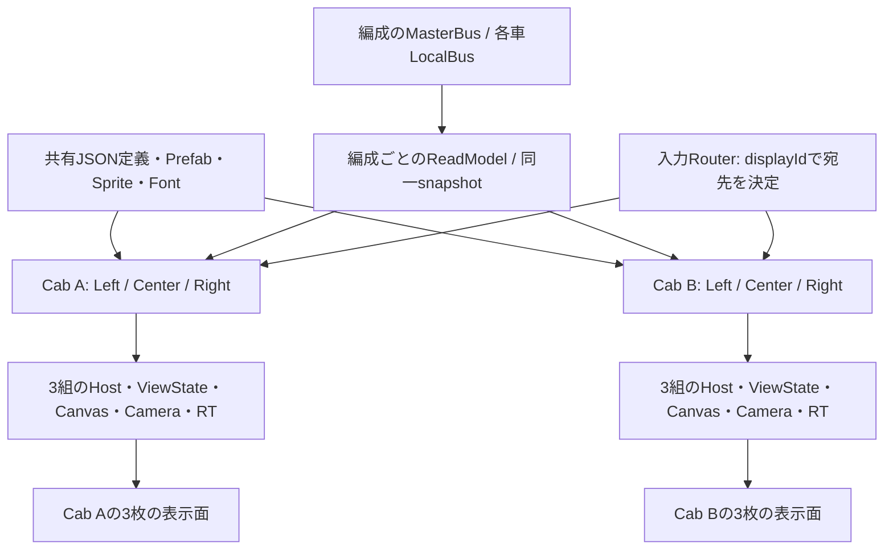

# TIMS：前後運転台・各3画面の描画設計案

調査日：2026-09-15。設計のみで、Runtime・Scene・Prefabは変更していない。

## 1. 結論と前提

**編成のTIMS情報は共有し、画面の実行インスタンスは6個作る。各画面が自分のページ状態・uGUI Canvas・Camera・RenderTexture・入力先を持つ構成を推奨する。**

想定するのは、1つのUnityアプリ内の3D運転台にある前後各3枚の表示面である。実機の外部モニター6台への出力や、別PCとのネットワーク同期は今回の範囲に含めない。将来それらが必要なら、後述の表示面と入力Adapterを追加する。

- 前側の左画面でページを変えても、残り5画面のページ・戻る履歴・選択車両は変わらない。
- 同じ車両の同じTIMS値を表示している画面には、共通の観測結果が反映される。
- 後側の運転台へ移動しても、それぞれの画面の操作状態を保持する。
- 運転台の有効／無効と、画面の閲覧・ページ操作の可否を分ける。車両制御を加える場合だけ、制御側で有効運転台などの条件を判定する。
- 既存の [JSON画面設計](JsonScreenArchitecture.md) のuGUI・1536 × 1024・ページ定義を継続する。本書は、そのHostを6個どう配置・接続するかを具体化する。

「独立」の単位はページ定義でもTIMS通信端末でもなく、**物理的な画面1枚**である。同じJSONを6枚に表示しても、状態とViewは別インスタンスにする。

## 2. 調査した実装

### 2.1 調査基準

| 対象 | 基準 |
| --- | --- |
| 新プロジェクト | `origin/main` とローカル `main` をfast-forwardで同期した `9a2691ce6cd131da7434e6369a9bee62574447dd` |
| 作業ブランチ | `codex/docs-tims-multi-display` |
| 旧プロジェクト | [TD-ATC](https://github.com/neko3141592/TD-ATC/tree/0913d6eeb74f4743664b3603de2564110fe86b07)、公開 `main` の `0913d6eeb74f4743664b3603de2564110fe86b07` |
| 現行環境 | Unity `6000.4.0f1`、URP `17.4.0`、uGUI `2.0.0`、Input System `1.19.0`（ProjectSettings / Packagesに基づく） |

旧リポジトリのC#・Scene・Prefab・RenderTexture・Materialを読み取った。過去の [移植記録](../../Migration/TimsLogicMigration.md) にある旧環境の未追跡ファイルまでは公開Gitから再現できないため、本書の旧側の記述は上記コミットの追跡済みファイルに限定する。

### 2.2 旧側から継承できるものと、複製だけでは足りない点

旧 [Main.unity](https://github.com/neko3141592/TD-ATC/blob/0913d6eeb74f4743664b3603de2564110fe86b07/Assets/Scenes/Main.unity) は3台の正投影カメラを持ち、それぞれ別レイヤーと別RTへ描画している。Scene内の `CabMonitorRenderLimiter` の設定まで追うと次の構成だった。

| カメラ | culling mask | 出力（Assets/RenderTextures以下） | 解像度 | 描画間隔 |
| --- | --- | --- | --- | --- |
| `CabMonitorCamera` | 256（layer 8） | `RT_CabMonitor` | 768 × 512 | 0.3秒 |
| `CabMonitorCamera2` | 512（layer 9） | `RT_CabMonitor2` | 1536 × 1024 | 0.2秒 |
| `CabMonitorCamera3` | 1024（layer 10） | `RT_CabMonitor3` | 768 × 512 | 0.3秒 |

各RTを同名のMaterialが参照し、[1000_Tc1.prefab](https://github.com/neko3141592/TD-ATC/blob/0913d6eeb74f4743664b3603de2564110fe86b07/Assets/Prefabs/Train/Visuals/1000_Tc1.prefab) から3つのMaterialへのGUID参照がある。**このPrefabをそのまま複製しても、参照先RTは同じなので同一映像になる。** 前後独立には実行時RTの割り当てを変える必要がある。

旧コードの対応は次のとおり。

| 旧実装 | 今回への示唆 |
| --- | --- |
| [CabMonitorRenderLimiter.cs](https://github.com/neko3141592/TD-ATC/blob/0913d6eeb74f4743664b3603de2564110fe86b07/Assets/Scripts/UI/CabMonitorRenderLimiter.cs) | Cameraを無効化し、個別タイマーで `Camera.Render()`。描画間引きの考え方は継承できるが、初期値0.05秒とSceneの実設定は異なる。URPへの接続は再設計する |
| [TimsBoundValueDisplay.cs](https://github.com/neko3141592/TD-ATC/blob/0913d6eeb74f4743664b3603de2564110fe86b07/Assets/Scripts/UI/Components/TimsBoundValueDisplay.cs) | MasterBus／LocalCarBus、タグ、型、書式、欠損表示を分ける考え方を継承する。毎Updateの参照探索と全体検索fallbackは移植しない |
| [TimsBoundBarGraphGroup.cs](https://github.com/neko3141592/TD-ATC/blob/0913d6eeb74f4743664b3603de2564110fe86b07/Assets/Scripts/UI/Components/TimsBoundBarGraphGroup.cs) | MasterBus配列と車両別LocalBusからグラフを作る用途を、共通ReadModel＋再利用部品へ移す |

読んだ `Assets/Scripts` にはRTの画面UVをUI入力へ変換する処理が見つからなかった。旧側の描画経路は参考になるが、6画面のページ管理・タッチ入力基盤が既にあるとは扱わない。

### 2.3 現行側の接続点

- [Tims.unity](../../../Assets/Scenes/Prototype/Tims.unity) は `TimsMonitorCanvas`、Screen Space - Camera、基準1536 × 1024を持つ。カメラの `targetTexture` は未設定で、6画面の描画Hostにはなっていない。
- [TimsCommunicationController](../../../Assets/Nakatetsu/Train/Equipment/Tims/Communication/Scripts/TimsCommunicationController.cs) は `MasterBus` と `TryGetLocalBus(carIndex)` を提供する。現在は `CollectSources()` による `ITimsBusSource` のLocalBus収集も実装済み。
- [TimsNotchController](../../../Assets/Nakatetsu/Train/Equipment/Tims/Notch/Scripts/TimsNotchController.cs) は `Notch/ResolvedNotchLabel` などをMasterBusへ公開する。初期の実データ表示に使いやすいが、Sceneでの初期化・計算・公開順の接続確認は必要。
- [TimsBoolIndicator](../../../Assets/Nakatetsu/Train/Equipment/Tims/Display/Indicators/Scripts/TimsBoolIndicator.cs) はBusを直接読む。欠損をOFF色へ落としているため、複数画面化時には値の有効性を受けるViewへ分ける。
- [TimsSpeedMeter](../../../Assets/Nakatetsu/Train/Equipment/Tims/Display/SpeedMeter/Scripts/TimsSpeedMeter.cs) は `FindAnyObjectByType` のfallbackを持つ。明示注入へ変えないと複数編成で誤接続する。既定の `Train/SpeedKmh` などは、読むコードの存在だけでは送信元の実装を保証しない。
- [TimsBusState](../../../Assets/Nakatetsu/Train/Equipment/Tims/Bus/Scripts/TimsBusState.cs) にrevision・受信時刻はなく、配列値のgetterはcloneする。画面6枚が個別に全配列をpollingする構成は避ける。
- 表示コードは既存の `Display/Nakatetsu.Train.Presentation.asmdef` 配下に追加できる。車両・TIMSのLogicへUI型を持ち込まない。

表示する速度・圧力などは [物理値と測定値の方針](../../Architecture/PhysicalAndMeasuredValues.md) に従い、TIMSに公開された測定値を読む。送信元未実装の値をPhysicsの真値で暗黙に補わない。

## 3. 所有権と識別子



| 所有単位 | 所有するもの |
| --- | --- |
| 車種定義として共有 | 検証済みページJSON、部品Registry、Prefab、Font、Sprite、Theme、初期ページ設定 |
| 編成ごとに1つ | TIMS接続、読み取りsnapshot、表示データの差分キャッシュ、将来のCommand Gateway |
| 運転台ごと | 物理的なcabId、設置車両、向き、画面一覧。ページ状態は持たない |
| 画面ごとに6つ | `TimsScreenHost`、Navigator、ViewState、選択車両、スクロール位置、モーダル、Canvas、Camera、RT、描画期限 |
| 入力系統ごと | pointerId、hover／press／drag先、フォーカス中のdisplayId |

識別子は `(trainInstanceId, cabId, slot)` とする。`cabId` は固定の `A/B`、`slot` は各運転席から見た `Left/Center/Right`。名称例は `train01/cabA/left`。前後切替や後退でIDを書き換えない。`screenId` / `pageId` は表示内容のIDであり、物理画面のIDには流用しない。

Cabの設置車両は編成生成時に解決し、`cabCarIndex` として注入する。画面の `selectedCarIndex` はそれとは別の値である。後側から編成図を逆順に描く場合も、表示順だけを変え、Busの車両indexは変えない。運転台の切替で同じボタンが別の物理車両を指さないようにする。

初期配置案は左右とも「左：運転情報、中央：編成モニター、右：機器情報」。これは初期ページ設定であり、画面の役割をコードで固定しない。全6枚でページ変更を可能にする。

## 4. 描画方式

### 4.1 比較と選択

| 方式 | 利点 | 今回の判断 |
| --- | --- | --- |
| 画面ごとのuGUI＋Camera＋RT | 固定座標、既存資産、画面単位の解像度・更新周期、3D表示と拡大表示を共用できる | 採用案 |
| 運転台にWorld Space Canvasを直接置く | RT入力の座標変換が不要で、構成を小さくしやすい | 代替案。ページ状態の独立は同じく必要。画面だけの描画間引きや映像共有の要件ではRT方式が扱いやすい |
| 1枚の大きなRTを6領域に分割 | カメラ数を減らせる可能性がある | 初期には採用しない。更新・入力・解像度を個別管理しづらい |
| 1台のCameraを切り替えて6枚のRTへ順次描画 | カメラを共有できる | 計測後の最適化候補。Canvas切替とレイアウト再構築の複雑さが先に増える |
| UI Toolkit | 別のUI制作基盤として選択可能 | 既存uGUI部品を使う今回のために全面移行する理由は小さい |

カメラからRTへ出力し、そのテクスチャをMaterialで表示する経路は [Unity 6.4のURP公式手順](https://docs.unity3d.com/6000.4/Documentation/Manual/urp/rendering-to-a-render-texture.html) に沿う。

### 4.2 画面1枚の構成

```text
TimsDisplayInstance (displayId / cabCarIndex / 初期ページ)
├── ScreenHost (Navigator / ViewState / Binding)
├── RenderCamera (URP Base / targetTexture = この画面専用RT)
└── Canvas (Screen Space - Camera / worldCamera = RenderCamera)
    └── DesignRoot (1536 × 1024)
        └── CurrentPage (部品Prefabから生成)

CabScreenSurface (運転台の表示面)
├── Renderer + この画面専用Materialインスタンス
└── 入力用Collider + displayIdへの参照
```

最初は **1画面1カメラ・1RT、計6組**。RTは共有アセットをそのまま参照せず、Host生成時に生成する。Materialも画面単位で生成してRTを割り当て、共有Material assetのテクスチャを書き換えない。破棄時にはCameraと表示面の参照を外し、所有するRTとMaterialを解放する。

カメラの `worldCamera` 設定だけを描画分離の保証にしない。最初の1編成では6個の専用GameObjectレイヤーを割り当て、各Cameraが対応するCanvasだけを描く。生成された子部品にもレイヤーを適用し、車窓カメラは6レイヤーを除外する。表示面のMeshは通常の車両側レイヤーに置く。

複数編成へ広げる場合は、レイヤーを編成数ぶん消費しない。6レイヤーを再利用し、CanvasとCameraの描画用領域を編成ごとに空間分離してfrustum／clip範囲内に他編成のUIが入らないようにする。これは追加検証項目であり、1編成6画面の初期実装だけで保証したことにはしない。

RTはすべて同じ3:2比率を使う。論理解像度1536 × 1024に対し、初期検証では実RTも1536 × 1024にそろえる。遠距離用768 × 512は視認性を確認してから導入する。画面面材にはUnlit系を使い、UIカメラのポストプロセス・影・不要な追加テクスチャ生成を無効にする。最終的な車窓カメラの露出・トーンマップによる色変化は別途目視確認する。

MipMapなし、MSAA 1を開始点とする。uGUIの `Mask` を使う場合はstencilを持つdepth/stencil形式を用意する。旧RTの一部がdepthなしだからといって全画面へコピーしない。RGBA8のカラー面だけなら1536 × 1024は6 MiB、6枚で36 MiB。depth/stencil・中間RT・ドライバー分は別途必要で、これは総VRAM量ではない。

### 4.3 描画タイミング

初期検証では可視画面を通常のURPカメラループで描画し、入力と分離を先に検証する。UIカメラはBase Cameraとし、Camera Stackは不要。RTへ出力するカメラが画面出力カメラより先に処理される通常経路を使う。

間引き段階では描画Backendを分離する。旧 `Camera.Render()` をそのまま移植せず、URPの `UniversalRenderPipeline.SingleCameraRequest` と `RenderPipeline.SubmitRenderRequest` を候補とし、`SupportsRenderRequest` を確認する。公式例のフレーム末尾から描く方式では、車窓に反映されるのは次フレームになることを遅延予算に含める。通常のCamera描画と手動requestを重ねて二重描画しない。[URP公式のRender Request手順](https://docs.unity3d.com/6000.4/Documentation/Manual/urp/User-Render-Requests.html)

| 画面状態 | 初期の更新目安（未計測の仮値） |
| --- | --- |
| 操作中・ページ遷移・押下・警報状態の変化 | 次に描画可能なフレームで更新。操作応答を周期待ちさせない |
| 可視の速度計など | 最大30～60 Hz。測定値の更新と針の表示補間を分ける |
| 可視の数値・機器一覧 | 最大10～20 Hz、差分があるときに描画 |
| どの利用画面からも見えていない | RT描画と重いView更新を停止。ページ状態と編成ReadModelは保持 |
| 再表示 | 最新snapshotでViewを更新し、RTを描いてから表示・入力を再開 |

「非表示」は無効運転台と同義ではない。後側でもカメラや拡大窓から見えていれば描画する。描画用Camera自身の可視判定で常時可視と誤認しないよう、利用側の車窓カメラ・拡大窓から可視性を集約する。

データが同値でも、点滅・針の補間・UI入力・staleへの遷移で画面は変化する。Bus revisionだけを描画条件にしない。Simulationの時間進行は既存の最上位Controllerだけが担当し、画面の停止・30 Hz描画によってTIMS通信や列車計算を止めない。

## 5. 入力を6画面へ正しく届ける

RTは映像であって、表示面をクリックしただけで元CanvasのButtonへ入力が届くわけではない。`TimsDisplayInputRouter` を1つ設け、画面を特定してから座標を変換する。

1. 車窓カメラからpointer位置へRayを飛ばす。手前の遮蔽物も判定し、奥の画面を貫通操作しない。
2. ヒットした `CabScreenSurface` から `displayId` と表示領域のUVを得る。
3. 表示面のUV反転・回転・tiling/offset・letterboxを考慮し、RT内の正規化座標へ変換する。余白は入力対象外。
4. その画面専用のraycast AdapterだけへRT pixel座標を渡す。結果がそのHost配下であることを確認する。
5. pointer down/up/click、hover、drag、scrollを通常のUIイベントとして配送する。

表示面に単純な矩形Colliderを置き、ローカル平面上の位置からUVを求める方式を初期案とする。MeshのUVを利用する場合、`RaycastHit.textureCoord` はMeshColliderを要求し、ビルドではRead/Write設定にも注意が必要である。[UnityのtextureCoord仕様](https://docs.unity3d.com/6000.4/Documentation/ScriptReference/RaycastHit-textureCoord.html)

補正後のUVを `(u, v)`（左下原点）とすると、RT上の入力は `(u × rtWidth, v × rtHeight)`、JSON上の論理座標は `(u × 1536, (1 − v) × 1024)`。この2つを混同しない。uGUIのGraphicRaycasterにはCanvasのeventCameraに対応するpixel座標を使う。現行パッケージのGraphicRaycasterにはdisplay index判定もあるため、変換Adapterで扱い、異なるGame Viewサイズ・RT解像度で検証する。

EventSystemは6個複製しない。画面用の入力経路を1つにし、通常Input ModuleがRTのCanvasへ元のOS画面座標でもイベントを送ってしまう二重配送を防ぐ。実装はRT用raycasterの呼び出しをRouterに限定するか、画面Surfaceを認識するInput Moduleで一元処理する。単に `EventSystem.RaycastAll` へ6枚の内部Canvasを登録するだけの構成にはしない。

pointerごとにpress先のdisplayIdと対象部品を保持する。押したまま別画面へ移動しても、別画面でclickが成立しないようにする。ページ破棄・電源断・運転台視点の切替時にはpress／dragをcancelする。キーボード・ゲームパッド操作は明示的にフォーカスした1画面へ届け、Automatic Navigationで別Canvasへ移動させない。将来複数タッチを扱う場合もpointerIdごとに同じルールを使う。

2Dの拡大表示は同じRTをRawImageへ表示し、同じdisplayIdへ入力を戻す。拡大したことで新しいページ状態は作らない。独立した別端末が必要になった場合だけ新しいdisplayIdを発行する。

## 6. 表示データと操作状態

編成ごとのReadModelが、TIMSの公開処理が完了した時点の値を一度読み取る。同じ表示更新バッチの6画面には同じsnapshotを渡す。UIの途中で車両ごとにBusを読み直して、新旧ステップが混在しないようにする。

初期は現行Busの公開APIと値の比較を使い、必要なタグだけを集約する。配列のcloneと書式変換は画面ごとに繰り返さず、ReadModel側で共有する。ただし現行APIで最初から0 B/frameになるとは主張せず、Profilerで確認する。snapshotをUIから変更できない公開契約にする。

**値の変更時刻と、通信の受信時刻は別である。** 停車中の速度0など、同値を受信し続けているタグをstaleにしてはいけない。差分比較で作れるrevisionは表示最適化用であり、受信鮮度の代わりにはならない。受信時刻／受信sequenceの契約がない現段階では「鮮度不明」とし、`staleAfterMs` 判定は受信情報の実装後に有効化する。画面のpolling時刻で鮮度を偽装しない。

ViewStateは表示インスタンスごとに作る。最小項目はcurrentPage、history、selectedCarIndex、scroll、modal、focus、表示のdirtyフラグ。読めない値は `--` または通信状態として示し、0・falseや他の編成の値で埋めない。運転台の設置車両を参照する `cabCar` と、操作で選んだ `selectedCar` はバインド上でも区別する。

既存JSONの `navigate` は、イベント発生元HostのNavigatorだけに適用する。JSONに6枚分のページ定義を複製したり、ページJSONへRT・Camera・cabIdを書いたりしない。物理配置・初期ページは別の表示設定で定義する。

将来、車両操作を付けるときは既存案のCommand Gatewayを使い、発生元displayId・固定cabId・対象車両・requestIdを渡す。画面の操作履歴は独立でも、実車両の結果は全画面へ反映される。同時操作の競合はGatewayが解決し、後から返った結果はrequestIdと発生元へ対応付ける。ページ切替だけを実装する最初の段階では、この制御基盤の完成を前提にしない。

## 7. 実装の配置と順序

新規コードの配置案は既存 `Assets/Nakatetsu/Train/Equipment/Tims/Display` 配下とする。以下は提案する型名であり、現時点で実装済みではない。

| 機能 | 配置案 | 担当 |
| --- | --- | --- |
| 画面の識別・状態・ページ | `Screen/{Scripts,Prefabs,Tests}` | `TimsScreenHost`、`TimsNavigator`、画面ごとのContext |
| Canvas／Camera／RT／面材 | `Rendering/{Scripts,Prefabs,Tests}` | `TimsDisplayRenderer`、`CabScreenSurface`、描画Scheduler |
| ポインター変換・配送 | `Input/{Scripts,Tests}` | `TimsDisplayInputRouter`、座標変換Logic |
| TIMS値の読取契約・バインド | `Binding/{Interfaces,Scripts,Tests}` | `ITimsReadModel`、TIMS Adapter、差分更新 |
| 表示設定・配置定義 | `Configuration/{Scripts,Data}` | cab／slot／初期ページ／解像度 |

車種固有のページJSON・配置アセットは [既存JSON案](JsonScreenArchitecture.md) のContent配置に従う。コードからURPやInput SystemのAPIを直接使う段階で必要なasmdef参照を追加し、Presentationより下位のAssemblyから逆参照を作らない。未使用の空フォルダは先に作らない。

1. **2画面で独立性を確認する。** ダミーReadModelと固定Prefabの2ページでHostを2つ作り、Camera／RT／Material／入力経路を分離する。同じpageIdから片方だけページ変更できるところまで通す。
2. **前後3画面、計6画面へ拡張する。** 固定cabId・slotと表示面を接続し、運転台切替で状態を保持する。6枚を並べるデバッグ表示で取り違えを見つける。
3. **現行TIMSへ接続する。** まず公開済みのノッチ値と車両別の既存タグを読む。送信元が未実装の速度・ATC値は欠損表示を確認し、テスト用データと実データを区別する。
4. **ページ定義をJSON化する。** 既存案の最小componentとValidatorから始める。6画面の独立性を確認したHostをそのまま使う。
5. **計測して描画を間引く。** 可視判定、dirty描画、解像度切替、URP Render Requestを順に加える。

## 8. 受け入れ基準と未検証事項

| 確認 | 合格条件 |
| --- | --- |
| RTと面材の独立性 | 6枚に異なるテスト色・displayIdを表示でき、RTインスタンスも6個異なる。1枚のページ変更で残り5枚が変わらない |
| 操作状態 | 6枚で別のページ・選択車両を保持し、前後移動後も戻る履歴が一致する |
| 入力座標 | 6枚の四隅・中央で狙った部品だけが反応する。768 × 512／1536 × 1024、Game View比率変更、後側の向き、拡大表示でずれない |
| 入力の継続 | 別画面へdrag、画面外release、長押し中のページ破棄、視点切替で誤click・押下残りがない |
| 共有データ | 同一タグは同じsnapshotの値を表示する。LocalBusの選択は他画面へ漏れない |
| 鮮度 | 同値の受信継続と受信停止を区別する。受信情報未実装時はstale判定を捏造しない |
| 欠損 | 未接続・型不一致・タグ削除で `--` 等を表示し、正常な0／falseと区別する |
| ライフサイクル | 非表示・再表示・編成破棄・ページ往復を繰り返してRT・Material・購読が増え続けない |
| 性能 | 同じ条件で3枚／6枚、可視／非表示のCPU・GPU・GC・RTメモリ・クリック応答をProfilerで比較し、結果を残す |

この文書で確認したのはソース・YAML・パッケージ実装・公式仕様との整合までである。Unityで6画面を生成しての描画・入力・性能テストは未実施。特にURPの手動描画とCanvas更新順、Mask、色、ポインター座標は小さい試作で確認する。

ページ構成・物理画面サイズ・操作時の目標fpsは仮設定として始められる。最初の判断点は、上記の2画面試作で**別のページを表示し、それぞれのButtonだけを確実に操作できるか**である。
